**BỘ GIÁO DỤC VÀ ĐÀO TẠO BỘ NÔNG NGHIỆP VÀ PTNT**

**TRƯỜNG ĐẠI HỌC THỦY LỢI**

**BÀI TẬP LỚN**

**PHÁT TRIỂN DỰ ÁN PHẦN MỀM**

**Đề Tài:**

**Xây Dựng CLI Agent Harness Fantasticcode**

Nhóm thực hiện: Nhóm 3 - 65KTPM

Giảng viên hướng dẫn: TS. Cù Việt Dũng

*Hà Nội, 2026*

**MỤC LỤC**

# **LỜI NÓI ĐẦU**

Trong bối cảnh trí tuệ nhân tạo ngày càng được ứng dụng vào hoạt động phát triển phần mềm, các công cụ hỗ trợ lập trình không chỉ cần trả lời câu hỏi mà còn cần ghi nhớ ngữ cảnh, hỗ trợ thao tác trên dự án và phù hợp với quy trình làm việc của lập trình viên. Vì vậy, nhóm chúng em lựa chọn đề tài **fantasticcode** để xây dựng một công cụ agent chạy bằng dòng lệnh, có thể dùng trong demo, học tập và thử nghiệm quy trình làm việc với AI.

Tài liệu này được tổ chức theo hướng tách bạch giữa yêu cầu sản phẩm và chi tiết triển khai. Các phần I đến V tập trung vào góc nhìn khách hàng, kế hoạch dự án, thiết kế mức khái niệm, kiểm thử và đóng gói ở mức sản phẩm. Phần VI giải thích các mẫu thiết kế GoF được áp dụng. Phần VII trình bày riêng chi tiết kỹ thuật, công nghệ sử dụng và kiến trúc cài đặt.

Mặc dù nhóm đã cố gắng hoàn thiện sản phẩm và tài liệu, do giới hạn về thời gian và kinh nghiệm, bài làm khó tránh khỏi thiếu sót. Nhóm chúng em kính mong nhận được góp ý và chỉ dẫn thêm từ thầy để đề tài được hoàn thiện hơn.

Chúng em xin trân trọng cảm ơn!

# **I. PHÂN TÍCH YÊU CẦU KHÁCH HÀNG**

## **1. Bản kế hoạch quản lý yêu cầu (RMP)**

### **1.1. Giới thiệu**

Tài liệu Kế hoạch Quản lý Yêu cầu này xác định cách nhóm thu thập, phân tích, đặc tả, theo dõi và kiểm soát yêu cầu của dự án **fantasticcode**. Ở mức sản phẩm, hệ thống hướng tới một công cụ hỗ trợ người dùng làm việc với agent AI thông qua dòng lệnh, có khả năng duy trì ngữ cảnh làm việc và hỗ trợ thao tác an toàn trong thư mục dự án.

Tài liệu đóng vai trò là cơ sở để:

##### 1. Định hướng hoạt động thu thập, phân tích, đặc tả và quản lý yêu cầu hệ thống;
##### 2. Đảm bảo các yêu cầu được xác định rõ ràng, nhất quán và có khả năng truy xuất nguồn gốc;
##### 3. Hỗ trợ kiểm soát thay đổi yêu cầu trong suốt vòng đời phát triển hệ thống;
##### 4. Làm tài liệu tham chiếu cho các giai đoạn thiết kế, phát triển, kiểm thử và đóng gói hệ thống.

### **1.2. Công cụ sử dụng và các kiểu yêu cầu**

| **STT** | **Công cụ** | **Mục đích sử dụng** |
| --- | --- | --- |
| 1 | Tài liệu nhóm | Ghi nhận yêu cầu, quyết định thiết kế và nội dung báo cáo. |
| 2 | Công cụ mô hình hóa | Minh họa use case, activity, sequence và kế hoạch dự án. |
| 3 | Công cụ quản lý phiên bản | Theo dõi thay đổi và hỗ trợ review tài liệu. |
| 4 | Kênh trao đổi nhóm | Thống nhất phạm vi, phân công và xử lý phản hồi. |
| 5 | Công cụ kiểm thử | Kiểm tra chất lượng trước khi bàn giao. |

| **Loại yêu cầu** | **Loại tài liệu** | **Mô tả** |
| --- | --- | --- |
| Yêu cầu của các bên liên quan (STRQ) | Yêu cầu của các bên liên quan (STR) | Mô tả nhu cầu của người dùng, nhóm phát triển và giảng viên đối với hệ thống. |
| Yêu cầu tính năng (FEAT) | Tài liệu tầm nhìn (VIS) | Mô tả các chức năng tổng quát như chạy tác vụ, chọn mô hình, quản lý phiên làm việc và quan sát kết quả. |
| Ca sử dụng (UC) / Kịch bản (SC) | Đặc tả ca sử dụng (UCS) | Mô tả các luồng sử dụng chính từ góc nhìn người dùng. |
| Yêu cầu bổ sung (SUPL) | Đặc tả bổ sung (SS) | Mô tả yêu cầu phi chức năng như an toàn, độ tin cậy, khả năng mở rộng và khả năng kiểm thử. |

### **1.3. Các nhân tố tham gia dự án phần mềm**

Dự án chỉ có **một team duy nhất**. Các thành viên cùng tham gia phân tích, thiết kế, lập trình, kiểm thử và viết tài liệu; tuy nhiên mỗi thành viên phụ trách sâu một nhóm nội dung và mẫu thiết kế khác nhau.

| **Team** | **Vai trò** | **Số lượng** | **Nhiệm vụ chính** |
| --- | --- | --- | --- |
| Team Fantasticcode | Phân tích, thiết kế, lập trình, kiểm thử, tài liệu | 5 | Xây dựng sản phẩm, kiểm chứng chức năng, giải thích design pattern và hoàn thiện báo cáo. |
| **Tổng** |  | **5** |  |

### **1.4. Bảng liên lạc với các nhân tố chính (Stakeholder)**

| **STT** | **Nhân tố chính** | **Vai trò trong dự án** | **Đơn vị** | **Trách nhiệm chính** | **Hình thức liên lạc** |
| --- | --- | --- | --- | --- | --- |
| 1 | Giảng viên hướng dẫn | Người định hướng và đánh giá | Bộ môn | Góp ý về phạm vi, tài liệu và mức độ phù hợp của design pattern | Trao đổi trực tiếp, báo cáo |
| 2 | Nhóm phát triển | Đơn vị thực hiện | Nhóm 3 - 65KTPM | Phân tích, thiết kế, cài đặt, kiểm thử và viết tài liệu | Trao đổi nhóm, review tài liệu |
| 3 | Người dùng dòng lệnh | Người sử dụng chính | Lập trình viên / sinh viên | Chạy tác vụ agent, quản lý phiên làm việc và xem kết quả | Hướng dẫn sử dụng, demo |
| 4 | Dịch vụ mô hình AI | Hệ thống ngoài | Nhà cung cấp mô hình | Cung cấp khả năng sinh phản hồi cho agent | Tài liệu nhà cung cấp |

## **2. Tài liệu yêu cầu người dùng (STRQ)**

### **2.1. Mục đích**

Tài liệu này mô tả nhu cầu chính đối với **fantasticcode**: một công cụ agent nhỏ gọn, chạy bằng dòng lệnh, có thể dùng để đặt yêu cầu, nhận kết quả, tiếp tục ngữ cảnh làm việc và minh họa design pattern trong một sản phẩm gần với thực tế.

### **2.2. Phạm vi**

Phạm vi STR tập trung vào yêu cầu mức người dùng và mức hệ thống. Sản phẩm không hướng tới giao diện chat trực quan hay nền tảng cộng tác phức tạp, mà ưu tiên khả năng chạy bằng tham số, dễ lặp lại trong demo và phù hợp với quy trình của lập trình viên.

### **2.3. Yêu cầu thu thập từ Stakeholder**

| **Stakeholder** | **Phương pháp thu thập yêu cầu** | **Yêu cầu (STRQ)** |
| --- | --- | --- |
| Giảng viên hướng dẫn | Trao đổi đề tài | STRQ 1: Cần một hệ thống nhỏ gọn nhưng thể hiện được nhiều design pattern trong kiến trúc thực tế. STRQ 2: Tài liệu phải giải thích được pattern và liên hệ với trách nhiệm trong sản phẩm. |
| Người dùng dòng lệnh | Phân tích nhu cầu sử dụng | STRQ 3: Người dùng cần gửi yêu cầu cho agent và lựa chọn cách chạy phù hợp. STRQ 4: Người dùng cần tiếp tục phiên làm việc cũ hoặc mở nhánh thử nghiệm mới. |
| Nhóm phát triển | Phân tích phạm vi sản phẩm | STRQ 5: Hệ thống cần hỗ trợ agent thao tác với thư mục làm việc một cách có kiểm soát. STRQ 6: Các thao tác có rủi ro phải được giới hạn bởi chính sách an toàn. |
| Người demo / người vận hành | Quan sát quá trình demo | STRQ 7: Hệ thống cần có cơ chế cấu hình, quan sát kết quả và kiểm tra chất lượng trước khi trình bày. |

## **3. Tài liệu đặc trưng (VIS)**

### **3.1. Mục đích**

Tài liệu tầm nhìn định nghĩa mục tiêu và phạm vi của **fantasticcode**. Hệ thống được xây dựng như một minh họa thực tế cho việc áp dụng design pattern trong một công cụ agent: mỗi pattern không chỉ được nhắc tên, mà được gắn với một vấn đề thật của sản phẩm.

### **3.2. Phạm vi**

Trong phạm vi:

#### 1. Công cụ chạy bằng dòng lệnh, không yêu cầu giao diện tương tác phức tạp.
#### 2. Hỗ trợ người dùng lựa chọn mô hình AI và cấu hình tác nhân phù hợp với tác vụ.
#### 3. Hỗ trợ tạo mới, tiếp tục, mở lại, phân nhánh và liệt kê phiên làm việc.
#### 4. Hỗ trợ agent thao tác với thư mục làm việc trong giới hạn an toàn.
#### 5. Hỗ trợ ghi nhận tiến trình, kết quả và thông tin phục vụ kiểm tra.
#### 6. Hỗ trợ kiểm thử và đóng gói để phục vụ demo hoặc bàn giao.

Ngoài phạm vi:

#### 1. Không xây dựng giao diện web.
#### 2. Không xây dựng giao diện terminal tương tác dạng toàn màn hình.
#### 3. Không triển khai nền tảng nhiều agent phân tán.
#### 4. Không thay thế hệ thống sandbox cấp hệ điều hành.

### **3.3. Tính năng hệ thống**

| **Yêu cầu (STRQ)** | **Kỹ thuật xác định FEAT** | **Tính năng (FEAT)** |
| --- | --- | --- |
| STRQ 1, STRQ 2 | Phân tách và làm rõ | FEAT 1.1: Hệ thống có tài liệu giải thích design pattern. FEAT 1.2: Mỗi pattern được gắn với vấn đề sản phẩm cụ thể. |
| STRQ 3 | Phân tách | FEAT 2.1: Người dùng gửi yêu cầu cho agent. FEAT 2.2: Người dùng lựa chọn mô hình và kiểu agent phù hợp. |
| STRQ 4 | Làm cho đầy đủ | FEAT 3.1: Người dùng tiếp tục phiên làm việc gần nhất. FEAT 3.2: Người dùng mở lại phiên làm việc theo mã. FEAT 3.3: Người dùng tạo nhánh thử nghiệm từ phiên cũ. |
| STRQ 5, STRQ 6 | Phân tách và ràng buộc | FEAT 4.1: Agent có thể đọc, chỉnh sửa hoặc hỗ trợ xử lý nội dung trong thư mục làm việc. FEAT 4.2: Hành động có rủi ro được kiểm tra trước khi thực hiện. |
| STRQ 7 | Làm rõ | FEAT 5.1: Hệ thống có cấu hình vận hành. FEAT 5.2: Hệ thống có thông tin quan sát để phục vụ demo, debug và đánh giá. |

### **3.4. Ràng buộc và yêu cầu chất lượng**

#### ***3.4.1. Ràng buộc***

##### 1. Hệ thống phải chạy được trên máy cá nhân của người dùng.
##### 2. Người dùng phải tự cấu hình quyền truy cập tới dịch vụ mô hình AI.
##### 3. Dữ liệu phiên làm việc được lưu cục bộ trong phạm vi dự án đang sử dụng.
##### 4. Các thao tác trên tệp chỉ được thực hiện trong thư mục làm việc đã chọn.
##### 5. Sản phẩm phải phù hợp cho demo môn học và có thể trình bày rõ design pattern.

#### ***3.4.2. Yêu cầu chất lượng***

##### 1. Khả năng bảo trì: Các trách nhiệm chính phải được tách rõ để dễ giải thích và sửa đổi.
##### 2. Khả năng mở rộng: Có thể bổ sung mô hình, agent hoặc công cụ mới mà không phá vỡ luồng sử dụng chính.
##### 3. An toàn: Các thao tác có khả năng ảnh hưởng đến thư mục làm việc phải được kiểm soát.
##### 4. Khả năng kiểm thử: Các luồng quan trọng phải có tiêu chí kiểm tra rõ ràng.
##### 5. Khả năng script hóa: Công cụ phải phù hợp với terminal, script và môi trường demo.

## **4. Tài liệu UseCase (UCS)**

### **4.1. Mục đích**

Tài liệu Use Case mô tả các tương tác chính giữa người dùng dòng lệnh và hệ thống ở mức sản phẩm. Đây là căn cứ để xác định phạm vi chức năng, tiêu chí kiểm thử và nội dung demo.

### **4.2. Phạm vi**

Tài liệu này tập trung đặc tả các use case thuộc phạm vi của dự án:

- Chạy một yêu cầu mới.
- Tiếp tục phiên làm việc gần nhất.
- Mở lại phiên làm việc theo mã.
- Tạo nhánh từ phiên làm việc cũ.
- Liệt kê các phiên đã lưu.

### **4.3. Sơ đồ UseCase**

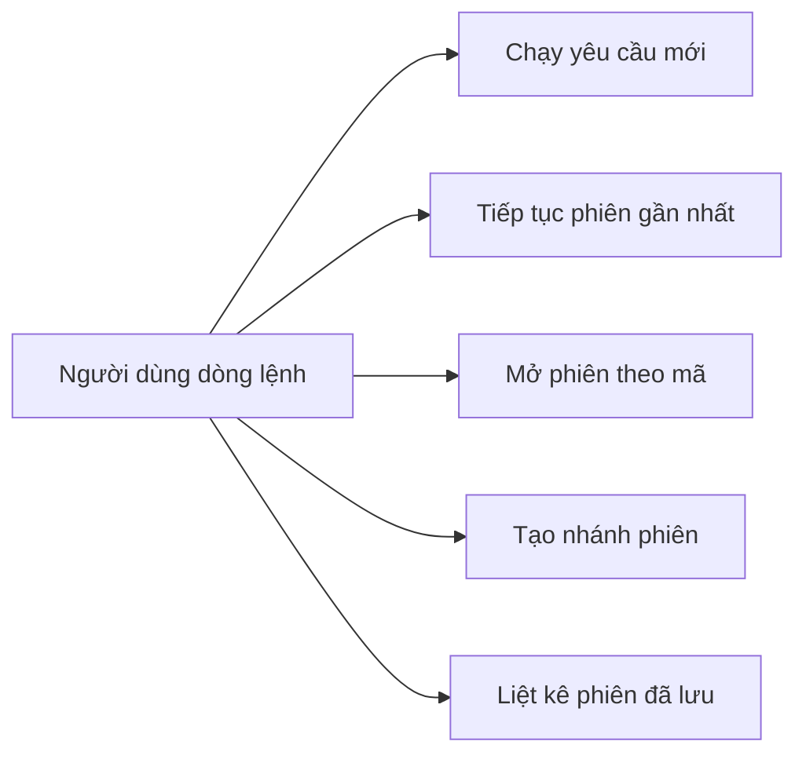

## **5. Kịch bản use case (UCS)**

**5.1. Đặc tả use case: Chạy yêu cầu mới**

| **Tên use case** | **Chạy yêu cầu mới** |
| --- | --- |
| Tác nhân chính | Người dùng dòng lệnh |
| Mục đích | Khởi tạo một phiên làm việc mới, gửi yêu cầu tới agent và nhận kết quả cuối cùng. |
| Mức độ ưu tiên | Bắt buộc |
| Điều kiện kích hoạt | Người dùng nhập một yêu cầu mới cùng thông tin lựa chọn mô hình hoặc agent. |
| Điều kiện tiên quyết | Cấu hình truy cập mô hình hợp lệ và thư mục làm việc tồn tại. |
| Điều kiện thành công | Hệ thống trả kết quả, ghi nhận phiên làm việc và sẵn sàng cho lần tiếp theo. |
| Điều kiện thất bại | Thiếu thông tin bắt buộc, cấu hình không hợp lệ hoặc mô hình không phản hồi. |
| Luồng sự kiện chính | 1. Người dùng nhập yêu cầu. 2. Hệ thống kiểm tra yêu cầu. 3. Hệ thống chuẩn bị phiên làm việc. 4. Agent xử lý yêu cầu. 5. Hệ thống trả kết quả và lưu trạng thái. |
| Luồng thay thế | Người dùng có thể truyền yêu cầu qua luồng nhập tự động thay vì nhập trực tiếp trong tham số. |

**5.2. Đặc tả use case: Tiếp tục phiên làm việc gần nhất**

| **Tên use case** | **Tiếp tục phiên làm việc gần nhất** |
| --- | --- |
| Tác nhân chính | Người dùng dòng lệnh |
| Mục đích | Tiếp tục ngữ cảnh gần nhất mà không cần nhớ mã phiên. |
| Mức độ ưu tiên | Bắt buộc |
| Điều kiện kích hoạt | Người dùng yêu cầu hệ thống tiếp tục phiên gần nhất. |
| Điều kiện tiên quyết | Đã từng có phiên làm việc được lưu trong phạm vi dự án. |
| Điều kiện thành công | Yêu cầu mới được nối vào ngữ cảnh cũ và kết quả được lưu lại. |
| Điều kiện thất bại | Không tồn tại phiên gần nhất hoặc phiên cũ không thể đọc được. |
| Luồng sự kiện chính | 1. Người dùng chọn chế độ tiếp tục. 2. Hệ thống tìm phiên gần nhất. 3. Agent xử lý yêu cầu mới trên ngữ cảnh cũ. 4. Hệ thống cập nhật phiên. |

**5.3. Đặc tả use case: Mở phiên làm việc theo mã**

| **Tên use case** | **Mở phiên làm việc theo mã** |
| --- | --- |
| Tác nhân chính | Người dùng dòng lệnh |
| Mục đích | Tiếp tục một phiên cụ thể khi người dùng biết mã phiên. |
| Mức độ ưu tiên | Bắt buộc |
| Điều kiện kích hoạt | Người dùng cung cấp mã phiên cần mở. |
| Điều kiện tiên quyết | Mã phiên hợp lệ và phiên tồn tại. |
| Điều kiện thành công | Hệ thống mở đúng phiên và xử lý yêu cầu mới. |
| Điều kiện thất bại | Mã phiên sai, phiên không tồn tại hoặc dữ liệu phiên không đọc được. |
| Luồng sự kiện chính | 1. Người dùng cung cấp mã phiên. 2. Hệ thống kiểm tra mã phiên. 3. Hệ thống khôi phục ngữ cảnh. 4. Agent xử lý yêu cầu mới. 5. Hệ thống cập nhật phiên. |

**5.4. Đặc tả use case: Tạo nhánh từ phiên cũ**

| **Tên use case** | **Tạo nhánh từ phiên cũ** |
| --- | --- |
| Tác nhân chính | Người dùng dòng lệnh |
| Mục đích | Tạo một hướng thử nghiệm mới từ phiên cũ mà không làm thay đổi lịch sử ban đầu. |
| Mức độ ưu tiên | Bắt buộc |
| Điều kiện kích hoạt | Người dùng yêu cầu tạo nhánh từ phiên gần nhất hoặc phiên cụ thể. |
| Điều kiện tiên quyết | Phiên nguồn tồn tại và có thể khôi phục. |
| Điều kiện thành công | Một phiên mới được tạo với quan hệ tham chiếu tới phiên nguồn. |
| Điều kiện thất bại | Không có phiên nguồn, mã phiên sai hoặc dữ liệu phiên nguồn không hợp lệ. |
| Luồng sự kiện chính | 1. Người dùng chọn nguồn tạo nhánh. 2. Hệ thống khôi phục phiên nguồn. 3. Hệ thống tạo phiên mới từ dữ liệu cũ. 4. Agent xử lý yêu cầu trên nhánh mới. |

**5.5. Đặc tả use case: Liệt kê các phiên đã lưu**

| **Tên use case** | **Liệt kê các phiên đã lưu** |
| --- | --- |
| Tác nhân chính | Người dùng dòng lệnh |
| Mục đích | Giúp người dùng xem các phiên đã có để tiếp tục hoặc tạo nhánh. |
| Mức độ ưu tiên | Nên có |
| Điều kiện kích hoạt | Người dùng yêu cầu xem danh sách phiên. |
| Điều kiện tiên quyết | Thư mục làm việc có thể truy cập được. |
| Điều kiện thành công | Hệ thống hiển thị danh sách phiên ở mức tóm tắt. |
| Điều kiện thất bại | Không thể đọc dữ liệu phiên hoặc yêu cầu liệt kê bị kết hợp sai với chế độ chạy agent. |
| Luồng sự kiện chính | 1. Người dùng yêu cầu liệt kê phiên. 2. Hệ thống đọc danh sách phiên. 3. Hệ thống hiển thị thông tin tóm tắt và kết thúc. |

## **6. Các yêu cầu phi chức năng**

### **6.1. Mục đích**

Tài liệu yêu cầu phi chức năng mô tả các tiêu chí chất lượng mà **fantasticcode** cần đạt để có thể vận hành ổn định, an toàn và dễ bảo trì.

### **6.2. Phạm vi**

Yêu cầu phi chức năng áp dụng cho toàn bộ sản phẩm: trải nghiệm dòng lệnh, quản lý phiên làm việc, thao tác với thư mục dự án, khả năng quan sát, kiểm thử và tài liệu.

### **6.3. Chi tiết các yêu cầu phi chức năng**

| **Nhóm yêu cầu** | **Yêu cầu** | **Mô tả** |
| --- | --- | --- |
| Khả dụng | Chạy cục bộ | Hệ thống phải chạy được trên máy của người dùng mà không cần máy chủ riêng. |
| Hiệu năng | Phản hồi hợp lý | Các bước chuẩn bị trước khi gọi mô hình không được gây chậm đáng kể. |
| Độ tin cậy | Duy trì phiên | Phiên làm việc phải có thể lưu, mở lại và phân nhánh một cách ổn định. |
| An toàn tệp | Giới hạn phạm vi thao tác | Các thao tác trên tệp phải bị giới hạn trong thư mục làm việc được chọn. |
| Bảo mật | Bảo vệ thông tin truy cập | Thông tin truy cập dịch vụ bên ngoài không được đưa trực tiếp vào tài liệu hoặc mã nguồn công khai. |
| Khả năng quan sát | Theo dõi quá trình chạy | Hệ thống cần có thông tin giúp người dùng hiểu tác vụ đã chạy như thế nào. |
| Khả năng kiểm thử | Tự động hóa kiểm tra | Các luồng chính phải có kiểm thử để phục vụ bàn giao và demo. |

# **II. LẬP KẾ HOẠCH DỰ ÁN**

## **1. Bảng phân chia công việc**

| **MSSV** | **Họ và tên** | **Công việc phụ trách chính** | **Pattern giải thích** |
| --- | --- | --- | --- |
| 2321160070 | Nguyễn Hồng Phúc | Quản lý dự án, tài liệu và luồng quan sát | Facade, Observer |
| 2321170631 | Ngô Quang Tùng | Tích hợp mô hình và cấu hình sản phẩm | Adapter, Factory Method |
| 2321170443 | Nguyễn Hải Ninh | Công cụ agent và chính sách an toàn | Command, Chain of Responsibility |
| 2321060422 | Ngô Đức Nam Khánh | Phiên làm việc và phân nhánh ngữ cảnh | Memento, Prototype |
| 2321030285 | Hoàng Tùng | Hành vi lựa chọn phiên và vòng đời xử lý | Strategy, State |

## **2. Giới thiệu**

### **2.1. Mục tiêu dự án**

Mục tiêu của dự án là xây dựng một công cụ agent dòng lệnh nhỏ gọn, có thể dùng trong demo môn học, đồng thời minh họa cách design pattern hỗ trợ tổ chức một sản phẩm thực tế.

Các mục tiêu chính:

- Hỗ trợ người dùng gửi yêu cầu cho agent từ terminal hoặc script.
- Cho phép lựa chọn mô hình và kiểu agent phù hợp với nhiệm vụ.
- Cho phép tiếp tục, mở lại và phân nhánh phiên làm việc.
- Hỗ trợ agent thao tác với thư mục dự án trong giới hạn an toàn.
- Có tài liệu giải thích design pattern, kiểm thử và cách đóng gói sản phẩm.

### **2.2. Phạm vi dự án**

#### 2.2.1. Phạm vi trong dự án

- Phân tích yêu cầu và use case của công cụ agent dòng lệnh.
- Thiết kế luồng xử lý sản phẩm và trải nghiệm người dùng.
- Xây dựng cơ chế quản lý phiên làm việc.
- Xây dựng nhóm công cụ hỗ trợ agent thao tác trong thư mục dự án.
- Kiểm thử, đóng gói, viết tài liệu và chuẩn bị demo.

#### 2.2.2. Phạm vi ngoài dự án

- Giao diện web.
- Giao diện terminal tương tác dạng toàn màn hình.
- Hệ thống nhiều người dùng hoặc phân quyền tài khoản.
- Đồng bộ phiên làm việc qua cloud.
- Sandbox cấp hệ điều hành hoặc container.

## **3. Tổ chức dự án**

### **3.1. Cơ cấu tổ chức**

**Nhà đầu tư:** Khoa Công nghệ thông tin - Trường Đại học Thủy Lợi

**Quản lý dự án:** Nguyễn Hồng Phúc

**Nhóm phát triển dự án:** Team Fantasticcode

- Nguyễn Hồng Phúc
- Ngô Quang Tùng
- Nguyễn Hải Ninh
- Ngô Đức Nam Khánh
- Hoàng Tùng

### **3.2. Vai trò và trách nhiệm**

| **Vai trò** | **Trách nhiệm** |
| --- | --- |
| Quản lý và lập kế hoạch dự án | Lập kế hoạch, theo dõi tiến độ, điều phối phần pattern và tài liệu. |
| Phân tích yêu cầu | Chuyển nhu cầu người dùng thành tài liệu STR/VIS/UCS. |
| Thiết kế hệ thống | Thiết kế luồng sản phẩm, mô hình dữ liệu mức khái niệm và mapping design pattern. |
| Lập trình viên | Hiện thực các chức năng chính theo phạm vi đã thống nhất. |
| Kiểm thử | Thiết kế test, kiểm tra luồng chính, luồng lỗi và tiêu chí bàn giao. |
| Viết tài liệu | Cập nhật tài liệu yêu cầu, thiết kế, pattern, sử dụng và triển khai. |

### **3.3. Phạm vi tài nguyên**

- Nhân sự: 5 thành viên trong một team.
- Tài nguyên học thuật: kiến thức về phát triển dự án phần mềm, design pattern và kiểm thử.
- Tài nguyên vận hành: máy cá nhân của nhóm và môi trường demo cục bộ.
- Tài nguyên tài liệu: báo cáo phát triển dự án, hướng dẫn sử dụng và tài liệu thiết kế.

## **4. Phân tích rủi ro**

### **4.1. Bảng phân tích rủi ro**

| **STT** | **Rủi ro** | **Xác suất** | **Tác động** | **Giải pháp** |
| --- | --- | --- | --- | --- |
| 1 | Hiểu sai phạm vi sản phẩm | Trung bình | Cao | Chốt phạm vi theo use case và cập nhật tài liệu khi có thay đổi. |
| 2 | Kết nối dịch vụ mô hình bên ngoài không ổn định | Trung bình | Trung bình | Có kịch bản kiểm thử thay thế và thông báo lỗi rõ ràng cho người dùng. |
| 3 | Tác vụ agent gây ảnh hưởng ngoài ý muốn tới thư mục dự án | Trung bình | Nghiêm trọng | Giới hạn phạm vi thao tác và kiểm tra rủi ro trước khi thực hiện. |
| 4 | Dữ liệu phiên làm việc không được duy trì đúng | Thấp | Cao | Kiểm thử kỹ luồng tạo mới, tiếp tục, mở lại và phân nhánh phiên. |
| 5 | Design pattern bị mô tả hình thức | Trung bình | Cao | Gắn từng pattern với vấn đề sản phẩm và ví dụ cài đặt cụ thể ở phần VI, VII. |
| 6 | Thiếu kiểm thử cho luồng quan trọng | Trung bình | Trung bình | Lập danh sách test theo use case và kiểm tra trước khi bàn giao. |
| 7 | Tài liệu quá kỹ thuật ở phần yêu cầu | Trung bình | Trung bình | Tách chi tiết triển khai sang phần VII, giữ I-V ở mức sản phẩm. |

### **4.2. Công thức tính độ rủi ro**

- Áp dụng phân tích rủi ro định tính: R = P x I.

Gán điểm cho Xác suất (P):

- Cao: 3 điểm
- Trung bình: 2 điểm
- Thấp: 1 điểm

**Gán điểm cho Tác động (I):**

- Thảm khốc: 4 điểm
- Nghiêm trọng: 3 điểm
- Trung bình: 2 điểm
- Thấp: 1 điểm

### **4.3. Bảng tính toán cụ thể**

| **STT** | **Rủi ro** | **P** | **I** | **Độ rủi ro (R)** | **Phân loại** |
| --- | --- | --- | --- | --- | --- |
| 1 | Hiểu sai phạm vi | 2 | 3 | 6 | Rủi ro cao |
| 2 | Dịch vụ mô hình không ổn định | 2 | 2 | 4 | Trung bình |
| 3 | Tác vụ ảnh hưởng ngoài ý muốn | 2 | 3 | 6 | Rủi ro cao |
| 4 | Sai dữ liệu phiên | 1 | 3 | 3 | Thấp/Trung bình |
| 5 | Pattern hình thức | 2 | 3 | 6 | Rủi ro cao |
| 6 | Thiếu test quan trọng | 2 | 2 | 4 | Trung bình |
| 7 | Tài liệu quá kỹ thuật | 2 | 2 | 4 | Trung bình |

### **4.4. Cơ sở xác định các tham số thời gian**

#### ***4.4.1 Bảng chuyển đổi rủi ro thành thời gian dự phòng***

| **Điểm Rủi ro (R)** | **Mức rủi ro** | **Dự phòng thời gian đề xuất** | **Ghi chú** |
| --- | --- | --- | --- |
| 1 - 2 | Thấp | +10% đến 20% | Theo dõi bình thường. |
| 3 - 5 | Trung bình | +30% đến 50% | Cần thêm thời gian kiểm thử và sửa lỗi. |
| 6 - 9 | Cao / Rất cao | +60% đến 80% | Cần dự phòng cho phạm vi, an toàn thao tác và tài liệu. |

#### ***4.4.2. Bảng các yếu tố thuận lợi***

| **STT** | **Yếu tố thuận lợi** | **Mô tả** | **Giảm thời gian** | **Áp dụng cho** |
| --- | --- | --- | --- | --- |
| 1 | Dự án nhỏ, phạm vi rõ | Không có giao diện phức tạp, tập trung vào công cụ dòng lệnh. | Giảm 20% | Phân tích, lập trình |
| 2 | Pattern đã được phân công | Mỗi thành viên phụ trách nhóm pattern cụ thể. | Giảm 15% | Thiết kế, tài liệu |
| 3 | Có thể kiểm thử tự động | Các luồng chính có thể lặp lại trong môi trường cục bộ. | Giảm 30% | Lập trình, kiểm thử |
| 4 | Không cần máy chủ riêng | Sản phẩm phục vụ demo cục bộ nên giảm chi phí triển khai. | Giảm 15% | Triển khai, demo |

## **5. Lập lịch dự án sử dụng phương pháp PERT/CPM**

### **5.1. Công thức liên kết rủi ro**

#### ***5.1.1. Tìm hiểu yêu cầu và lập kế hoạch dự án (tm = 4 ngày)***

- to: 3 ngày nếu yêu cầu ổn định.
- tm: 4 ngày.
- tp: 6 ngày nếu phải chỉnh phạm vi tài liệu nhiều lần.

te = (3 + 4 x 4 + 6) / 6 = 4.17 ngày

#### ***5.1.2. Phân tích, đặc tả và thiết kế mức sản phẩm (tm = 6 ngày)***

- to: 4 ngày nếu use case rõ ràng.
- tm: 6 ngày.
- tp: 10 ngày nếu phải thay đổi phạm vi hoặc bổ sung nhiều luồng sản phẩm.

te = (4 + 4 x 6 + 10) / 6 = 6.33 ngày

#### ***5.1.3. Lập trình và tích hợp chức năng (tm = 12 ngày)***

- to: 8 ngày nếu các thành phần độc lập rõ.
- tm: 12 ngày.
- tp: 18 ngày nếu phát sinh lỗi tích hợp hoặc thay đổi yêu cầu.

te = (8 + 4 x 12 + 18) / 6 = 12.33 ngày

#### ***5.1.4. Kiểm thử (tm = 5 ngày)***

- to: 3 ngày nếu các luồng chính ổn định.
- tm: 5 ngày.
- tp: 8 ngày nếu phát sinh lỗi ở nhiều use case.

te = (3 + 4 x 5 + 8) / 6 = 5.17 ngày

#### ***5.1.5. Đóng gói, demo và viết tài liệu (tm = 4 ngày)***

- to: 3 ngày.
- tm: 4 ngày.
- tp: 7 ngày nếu phải chỉnh tài liệu theo phản hồi.

te = (3 + 4 x 4 + 7) / 6 = 4.33 ngày

### **5.2. Bảng danh mục công việc**

| **STT** | **Công việc** | **Thời gian (ngày)** | **Phụ thuộc** | **ES** | **EF** | **LS** | **LF** | **Slack** |
| --- | --- | --- | --- | --- | --- | --- | --- | --- |
| 1.1 | Thu thập yêu cầu và xác định phạm vi | 2 | - | 0 | 2 | 0 | 2 | 0 |
| 1.2 | Lập kế hoạch và phân công pattern | 2 | 1.1 | 2 | 4 | 2 | 4 | 0 |
| 2.1 | Thiết kế use case sản phẩm | 2 | 1.2 | 4 | 6 | 4 | 6 | 0 |
| 2.2 | Thiết kế mô hình xử lý mức khái niệm | 2 | 2.1 | 6 | 8 | 6 | 8 | 0 |
| 2.3 | Thiết kế quản lý phiên làm việc | 2 | 2.1 | 7 | 8 | 9 | 10 | 2 |
| 3.1 | Cài đặt khung chạy dòng lệnh | 2 | 2.2 | 8 | 10 | 8 | 10 | 0 |
| 3.2 | Cài đặt tích hợp mô hình | 3 | 3.1 | 11 | 13 | 11 | 13 | 0 |
| 3.3 | Cài đặt quản lý phiên | 3 | 2.3, 3.1 | 11 | 13 | 11 | 13 | 0 |
| 3.4 | Cài đặt công cụ và chính sách an toàn | 3 | 3.1 | 13 | 15 | 13 | 15 | 0 |
| 3.5 | Tích hợp luồng chạy agent | 3 | 3.2, 3.3, 3.4 | 15 | 18 | 15 | 18 | 0 |
| 4.1 | Viết test theo use case | 3 | 3.5 | 18 | 21 | 18 | 21 | 0 |
| 4.2 | Kiểm thử tích hợp và sửa lỗi | 2 | 4.1 | 21 | 23 | 21 | 23 | 0 |
| 5.1 | Đóng gói và cập nhật hướng dẫn | 2 | 4.2 | 23 | 25 | 23 | 25 | 0 |
| 5.2 | Hoàn thiện development doc | 2 | 5.1 | 25 | 27 | 25 | 27 | 0 |

### **5.3. Sơ đồ Gantt**

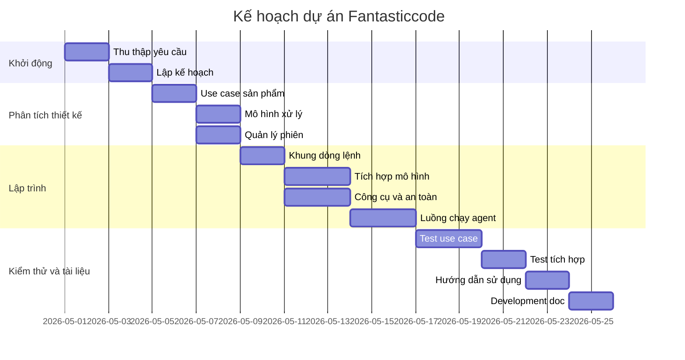

### **5.4. Đường găng**

```mermaid
flowchart LR
    A["1.1 Yêu cầu"] --> B["1.2 Kế hoạch"]
    B --> C["2.1 Use case"]
    C --> D["2.2 Mô hình xử lý"]
    D --> E["3.1 Khung dòng lệnh"]
    E --> F["3.4 Công cụ và an toàn"]
    F --> G["3.2 Tích hợp mô hình"]
    G --> H["3.5 Luồng chạy agent"]
    H --> I["4.1 Test use case"]
    I --> J["4.2 Test tích hợp"]
    J --> K["5.1 Hướng dẫn"]
    K --> L["5.2 Development doc"]
```

# **III. PHÂN TÍCH VÀ THIẾT KẾ HỆ THỐNG**

## **1. Biểu đồ hoạt động**

### **1.1. Biểu đồ hoạt động UC: Chạy yêu cầu mới**

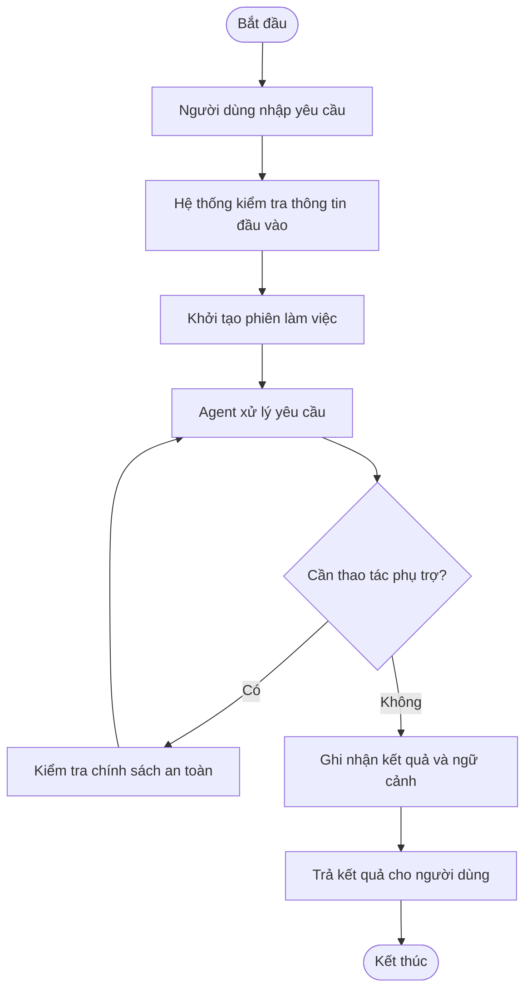

### **1.2. Biểu đồ hoạt động UC: Tiếp tục phiên gần nhất**

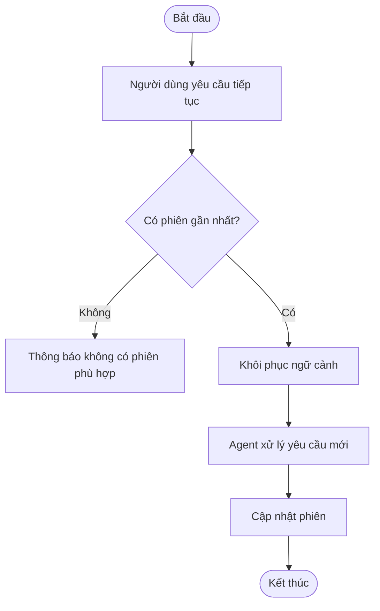

### **1.3. Biểu đồ hoạt động UC: Mở phiên theo mã**

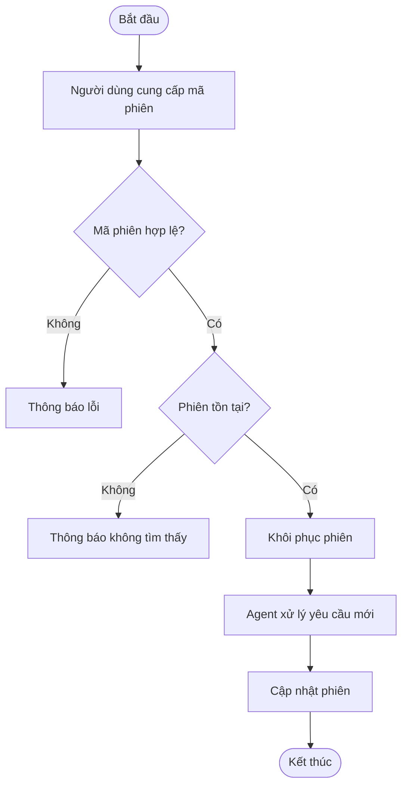

### **1.4. Biểu đồ hoạt động UC: Tạo nhánh phiên**

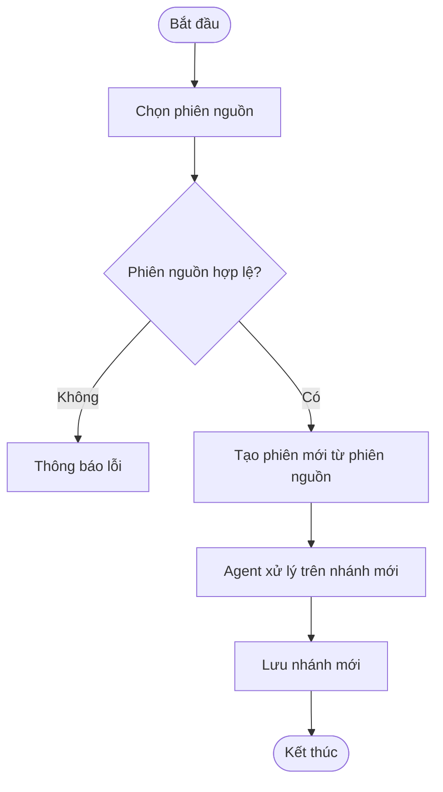

### **1.5. Biểu đồ hoạt động UC: Liệt kê phiên đã lưu**

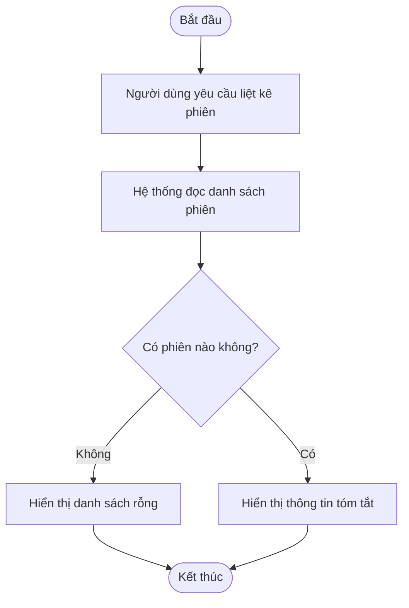

## **2. Biểu đồ tuần tự**

### **2.1. Biểu đồ tuần tự use case: Chạy agent**

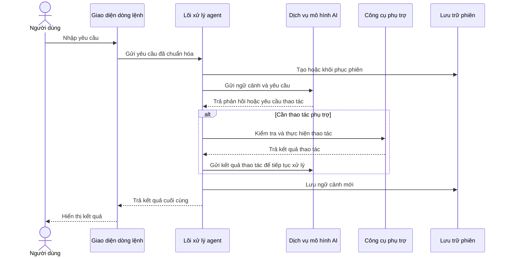

### **2.2. Biểu đồ tuần tự use case: Tạo nhánh phiên**

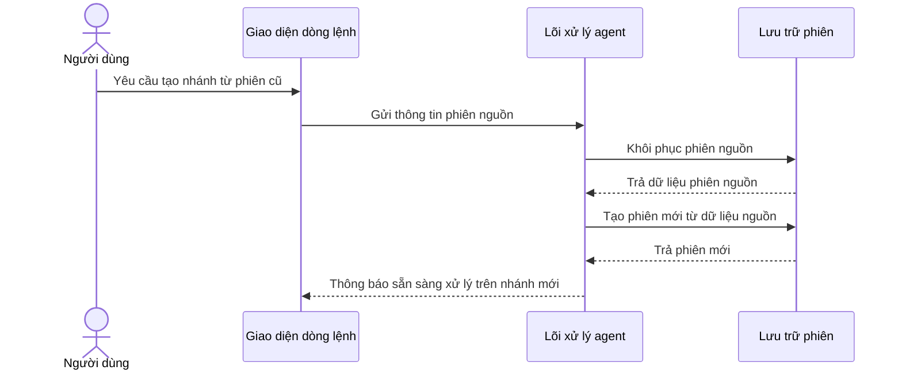

## **3. Thiết kế dữ liệu mức khái niệm**

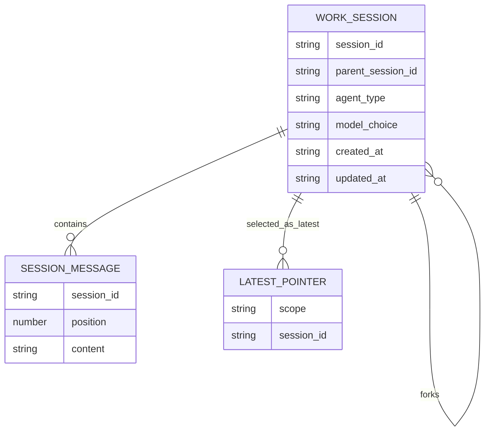

### **3.1. Thực thể chính**

- **Phiên làm việc:** đại diện cho một luồng hội thoại hoặc tác vụ agent.
- **Thông điệp phiên:** lưu các bước trao đổi trong phiên theo thứ tự.
- **Con trỏ phiên gần nhất:** giúp hệ thống biết phiên nào cần tiếp tục khi người dùng không nhập mã cụ thể.
- **Cấu hình agent:** mô tả kiểu hành vi mà agent sẽ sử dụng cho tác vụ.
- **Cấu hình mô hình:** mô tả lựa chọn mô hình AI ở mức sản phẩm.

### **3.2. Mối liên hệ dữ liệu**

| **Mối liên hệ** | **Kiểu liên kết** | **Mô tả** |
| --- | --- | --- |
| Phiên làm việc - Thông điệp phiên | 1 - N | Một phiên chứa nhiều thông điệp theo thứ tự. |
| Phiên làm việc - Phiên làm việc | 1 - N | Một phiên nguồn có thể sinh nhiều phiên nhánh. |
| Con trỏ phiên gần nhất - Phiên làm việc | N - 1 | Mỗi phạm vi làm việc có thể trỏ tới một phiên gần nhất. |

### **3.3. Mô hình thành phần mức khái niệm**

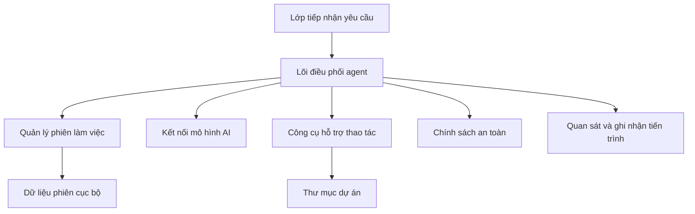

# **IV. KIỂM THỬ**

## **1. Mục tiêu kiểm thử**

Hoạt động kiểm thử trong dự án **fantasticcode** được thực hiện nhằm bảo đảm sản phẩm đáp ứng đúng yêu cầu người dùng, vận hành ổn định và không gây tác động ngoài ý muốn tới thư mục làm việc.

Các mục tiêu chính gồm:

- Phát hiện lỗi trong quá trình tiếp nhận yêu cầu, lựa chọn chế độ chạy và trả kết quả.
- Đảm bảo phiên làm việc có thể tạo mới, tiếp tục, mở lại, phân nhánh và liệt kê.
- Đảm bảo thao tác phụ trợ của agent được kiểm soát bởi chính sách an toàn.
- Đảm bảo kết quả có thể quan sát và hỗ trợ debug khi demo.
- Đảm bảo các design pattern được áp dụng đúng vai trò, không chỉ mô tả hình thức.

## **2. Các nguyên tắc cơ bản của kiểm thử**

### 1. Kiểm thử chỉ ra sự hiện diện của lỗi: Kiểm thử giúp phát hiện lỗi trong sản phẩm, nhưng không khẳng định phần mềm tuyệt đối không có lỗi.
### 2. Kiểm thử toàn bộ là không thể: Nhóm tập trung vào các luồng quan trọng như chạy yêu cầu mới, tiếp tục phiên, tạo nhánh và kiểm soát thao tác rủi ro.
### 3. Kiểm thử càng sớm càng tốt: Các chức năng được kiểm tra ngay khi hoàn thành để giảm chi phí sửa lỗi.
### 4. Sự tập trung của lỗi: Lỗi thường tập trung ở luồng tích hợp với mô hình AI, quản lý phiên và chính sách an toàn.
### 5. Nghịch lý thuốc trừ sâu: Bộ test cần được cập nhật khi bổ sung chức năng hoặc thay đổi phạm vi sản phẩm.
### 6. Kiểm thử phụ thuộc vào ngữ cảnh: Kiểm thử công cụ dòng lệnh khác kiểm thử web app vì trọng tâm là tham số, dữ liệu cục bộ và tương tác với thư mục làm việc.
### 7. Sự sai lầm về việc không có lỗi: Một công cụ chạy được nhưng không an toàn hoặc không chứng minh được pattern vẫn chưa đạt yêu cầu dự án.

## **3. Quy trình kiểm thử**

Quy trình kiểm thử của dự án gồm các bước:

- Lập kế hoạch kiểm thử: xác định use case, rủi ro và tiêu chí chấp nhận.
- Thiết kế test case: viết kịch bản cho luồng đúng, luồng thay thế và luồng lỗi.
- Thực thi kiểm thử: chạy bộ kiểm thử tự động và kiểm tra thủ công các luồng demo quan trọng.
- Đánh giá chất lượng tổng thể: kiểm tra xem sản phẩm có sẵn sàng đóng gói và trình bày không.
- Tổng hợp kết quả: ghi nhận lỗi, sửa lỗi và cập nhật tài liệu liên quan.

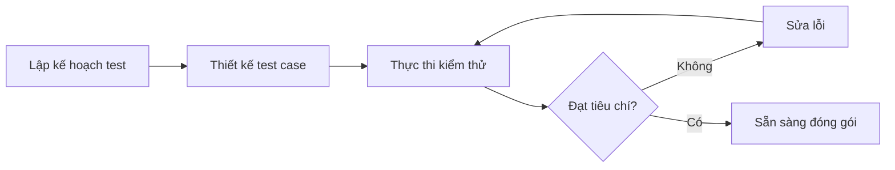

## **4. Các phương pháp kiểm thử**

- Kiểm thử hộp đen: kiểm tra chức năng dựa trên đầu vào, kết quả và thông báo lỗi.
- Kiểm thử hộp trắng: kiểm tra logic nội bộ ở các phần có rủi ro cao.
- Kiểm thử tích hợp: kiểm tra các thành phần chính hoạt động cùng nhau.
- Kiểm thử đầu cuối: mô phỏng một lượt sử dụng hoàn chỉnh từ yêu cầu đầu vào tới kết quả cuối cùng.
- Kiểm thử hồi quy: đảm bảo thay đổi mới không làm hỏng luồng đã ổn định.

## **5. Phạm vi kiểm thử (Scope)**

| **Khu vực** | **Phạm vi chức năng kiểm thử chính** |
| --- | --- |
| Giao diện dòng lệnh | Kiểm tra cách người dùng nhập yêu cầu, chọn chế độ chạy và nhận thông báo lỗi. |
| Quản lý phiên | Kiểm tra tạo mới, tiếp tục, mở lại, phân nhánh và liệt kê phiên. |
| Tích hợp mô hình AI | Kiểm tra hệ thống xử lý phản hồi thành công, phản hồi lỗi và yêu cầu thao tác phụ trợ. |
| Công cụ phụ trợ | Kiểm tra thao tác trong thư mục làm việc và chính sách an toàn. |
| Quan sát hệ thống | Kiểm tra thông tin tiến trình, log và khả năng debug. |
| Design pattern | Kiểm tra pattern được gắn với trách nhiệm thật và có thể giải thích bằng module cụ thể. |

## **6. Tài liệu tham chiếu**

- Tài liệu yêu cầu và use case trong phần I.
- Kế hoạch dự án trong phần II.
- Thiết kế mức khái niệm trong phần III.
- Giải thích pattern trong phần VI.
- Chi tiết triển khai trong phần VII.

## **7. Công cụ kiểm thử (Tools)**

Ở mức sản phẩm, nhóm sử dụng bộ kiểm thử tự động, kiểm thử thủ công khi demo và kiểm tra tài liệu trước khi bàn giao. Tên công cụ, lệnh chạy và cấu trúc test cụ thể được trình bày trong phần VII để tránh làm phần kiểm thử sản phẩm trở nên quá kỹ thuật.

## **8. Tiêu chuẩn kiểm thử**

| Điều kiện bắt đầu thực hiện test | Chức năng đã hoàn thành ở mức có thể chạy được, yêu cầu và tiêu chí chấp nhận đã rõ ràng. |
| --- | --- |
| Khi nào thì dừng test | Các test trong phạm vi đã được thực thi, lỗi nghiêm trọng đã được sửa, các rủi ro còn lại đã được ghi nhận. |
| Tiêu chuẩn test thành công | Các use case chính hoạt động đúng, không phát sinh lỗi nghiêm trọng và sản phẩm sẵn sàng demo. |

## **9. Kịch bản kiểm thử**

| **ID** | **Khu vực** | **Mô tả kiểm thử** | **Kết quả mong đợi** |
| --- | --- | --- | --- |
| TC_PRODUCT_01 | Chạy yêu cầu mới | Người dùng gửi một yêu cầu mới cho agent | Hệ thống trả kết quả và lưu phiên làm việc. |
| TC_PRODUCT_02 | Tiếp tục phiên | Người dùng tiếp tục phiên gần nhất | Hệ thống dùng đúng ngữ cảnh cũ và cập nhật phiên. |
| TC_PRODUCT_03 | Mở phiên theo mã | Người dùng mở một phiên cụ thể | Hệ thống khôi phục đúng phiên và xử lý yêu cầu mới. |
| TC_PRODUCT_04 | Tạo nhánh phiên | Người dùng tạo nhánh từ phiên cũ | Phiên mới độc lập với phiên nguồn. |
| TC_PRODUCT_05 | Liệt kê phiên | Người dùng xem danh sách phiên đã lưu | Hệ thống hiển thị danh sách tóm tắt. |
| TC_PRODUCT_06 | An toàn thao tác | Agent yêu cầu thao tác có rủi ro | Hệ thống chặn hoặc giới hạn theo chính sách. |
| TC_PRODUCT_07 | Quan sát kết quả | Người dùng bật chế độ theo dõi khi demo | Hệ thống ghi nhận đủ thông tin để truy vết. |
| TC_PRODUCT_08 | Pattern | Người đánh giá kiểm tra phần giải thích pattern | Mỗi pattern có vai trò và vấn đề giải quyết rõ ràng. |

# **V. Đóng gói**

## **1. Triển khai hệ thống**

### **1.1. Mục đích tài liệu**

Phần này trình bày cách đóng gói và vận hành **fantasticcode** ở mức sản phẩm. Mục tiêu là giúp người dùng hiểu sản phẩm cần được chuẩn bị như thế nào trước khi demo hoặc bàn giao, không đi sâu vào lệnh kỹ thuật cụ thể.

### **1.2. Thông tin cơ bản**

Tên hệ thống: **fantasticcode**

Tên mô tả: **Công cụ agent dòng lệnh có thể script hóa**

Hệ thống được phát triển trong khuôn khổ bài tập lớn môn “Phát triển Dự án Phần mềm” của nhóm 3, Khoa Công nghệ Thông tin, Trường Đại học Thủy Lợi.

#### **1.2.1. Mục tiêu chính của hệ thống**

- Cho phép người dùng chạy agent bằng dòng lệnh.
- Cho phép lựa chọn mô hình và kiểu agent cho từng tác vụ.
- Cho phép tiếp tục, mở lại và phân nhánh phiên làm việc.
- Cho phép agent thao tác trong thư mục làm việc với chính sách an toàn.
- Minh họa các design pattern GoF trong một sản phẩm có thể chạy được.

#### **1.2.2 Đối tượng sử dụng**

- Sinh viên học design pattern và kiến trúc phần mềm.
- Lập trình viên muốn thử công cụ agent có thể script hóa.
- Người đánh giá muốn xem cách pattern được áp dụng vào sản phẩm thực tế.

#### **1.2.3. Môi trường vận hành ở mức sản phẩm**

- Chạy trên máy cá nhân hoặc môi trường demo cục bộ.
- Không yêu cầu máy chủ riêng cho phạm vi đồ án.
- Cần cấu hình quyền truy cập tới dịch vụ mô hình AI nếu chạy với mô hình thật.
- Dữ liệu phiên và thông tin quan sát được lưu trong phạm vi dự án của người dùng.

### **1.3. Mô hình vận hành**

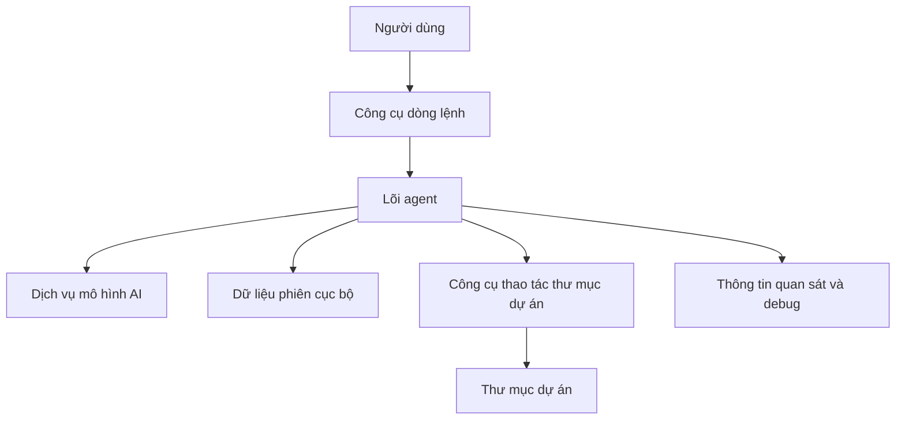

Mô hình vận hành của hệ thống gồm một tiến trình dòng lệnh. Khi người dùng chạy tác vụ, hệ thống đọc yêu cầu, chuẩn bị ngữ cảnh, gọi mô hình AI, thực hiện thao tác phụ trợ nếu được phép, lưu phiên làm việc và trả kết quả cuối cùng.

### **1.4. Vai trò từng thành phần hệ thống ở mức sản phẩm**

| **Thành phần** | **Vai trò** |
| --- | --- |
| Công cụ dòng lệnh | Tiếp nhận yêu cầu và tham số vận hành từ người dùng. |
| Lõi agent | Điều phối quá trình chuẩn bị, gọi mô hình, xử lý thao tác và trả kết quả. |
| Quản lý phiên | Lưu và khôi phục ngữ cảnh làm việc. |
| Kết nối mô hình AI | Gửi yêu cầu tới dịch vụ mô hình và nhận phản hồi. |
| Công cụ phụ trợ | Hỗ trợ agent thao tác với thư mục dự án. |
| Chính sách an toàn | Kiểm soát các thao tác có rủi ro. |
| Quan sát hệ thống | Ghi nhận tiến trình, kết quả và lỗi phục vụ demo/debug. |

### **1.5. Kết quả sau triển khai**

Sau khi đóng gói thành công, người dùng có thể chạy **fantasticcode** như một công cụ dòng lệnh cục bộ. Sản phẩm có thể tạo phiên làm việc mới, tiếp tục phiên cũ, tạo nhánh thử nghiệm, thao tác có kiểm soát trong thư mục dự án và ghi nhận thông tin cần thiết để phục vụ demo.

### **1.6. Tự động hóa quy trình bàn giao**

Trong phạm vi đồ án, hệ thống chưa bắt buộc triển khai lên cloud. Tuy nhiên, quy trình kiểm tra và đóng gói có thể được tự động hóa để đảm bảo mỗi lần bàn giao đều trải qua các bước kiểm tra chất lượng giống nhau.

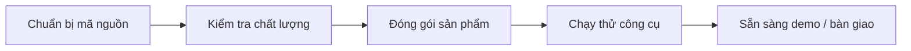

## **2. Hướng dẫn sử dụng hệ thống**

### 2.1 Mục tiêu

Tài liệu hướng dẫn sử dụng giúp người dùng hiểu cách chuẩn bị, cấu hình và chạy **fantasticcode** cho các tác vụ agent cơ bản: chạy yêu cầu mới, tiếp tục phiên, tạo nhánh phiên, chọn kiểu agent, bật theo dõi và liệt kê phiên đã lưu.

### **2.2 Đối tượng sử dụng**

Hệ thống được thiết kế cho các nhóm người dùng sau:

#### 1. Sinh viên cần demo design pattern.
#### 2. Lập trình viên muốn dùng công cụ agent có thể script hóa.
#### 3. Người kiểm thử cần chạy luồng sản phẩm và đánh giá kết quả.

### 2.3 Môi trường vận hành

Thông tin môi trường ở mức người dùng:

#### 1. Máy tính cá nhân hoặc môi trường demo có khả năng chạy công cụ dòng lệnh.
#### 2. Quyền truy cập tới thư mục dự án cần làm việc.
#### 3. Cấu hình truy cập tới dịch vụ mô hình AI khi cần chạy với mô hình thật.
#### 4. Quyền ghi dữ liệu cục bộ để lưu phiên và thông tin quan sát.

### **2.4 Tài khoản sử dụng thử**

Hệ thống không sử dụng tài khoản đăng nhập riêng. Người dùng vận hành công cụ thông qua môi trường cục bộ và cấu hình truy cập dịch vụ mô hình AI. Chi tiết tên biến môi trường, tệp cấu hình và lệnh chạy được trình bày trong phần VII.

### **2.5 Quy trình chạy hệ thống**

Người dùng thực hiện các bước ở mức sản phẩm như sau:

#### 1. Chuẩn bị môi trường chạy công cụ.
#### 2. Cấu hình dịch vụ mô hình AI nếu cần.
#### 3. Mở thư mục dự án cần làm việc.
#### 4. Chạy yêu cầu mới hoặc chọn một phiên đã có.
#### 5. Xem kết quả, kiểm tra thông tin phiên và tiếp tục nếu cần.

### 2.6 Tổng quan giao diện hệ thống

Hệ thống không có giao diện đồ họa. Giao diện chính là terminal, gồm các thành phần:

#### 1. Dòng lệnh đầu vào:

- Người dùng truyền yêu cầu và lựa chọn chế độ chạy.

#### 2. Kết quả đầu ra:

- Hệ thống in câu trả lời cuối cùng của agent.

#### 3. Thông tin quan sát:

- Hệ thống có thể ghi nhận sự kiện, lỗi và tiến trình phục vụ kiểm tra.

#### 4. Dữ liệu cục bộ:

- Hệ thống lưu phiên làm việc và thông tin cần thiết trong phạm vi dự án.

### 2.7 Hướng dẫn sử dụng theo từng chức năng

#### 2.7.1 Chức năng chạy yêu cầu mới

Chức năng này tạo một phiên làm việc mới, gửi yêu cầu tới agent và trả kết quả cho người dùng.

#### 2.7.2 Chức năng tiếp tục phiên gần nhất

Chức năng này giúp người dùng tiếp tục ngữ cảnh làm việc gần nhất mà không cần nhớ mã phiên.

#### 2.7.3 Chức năng mở phiên theo mã

Chức năng này giúp người dùng quay lại một phiên cụ thể đã lưu trước đó.

#### 2.7.4 Chức năng tạo nhánh phiên

Chức năng này giúp người dùng thử một hướng xử lý khác từ phiên cũ mà không làm thay đổi lịch sử ban đầu.

#### 2.7.5 Chức năng chọn kiểu agent

Chức năng này giúp người dùng lựa chọn kiểu hành vi phù hợp với tác vụ, ví dụ viết mã, rà soát hoặc giải thích.

#### 2.7.6 Chức năng theo dõi/debug

Chức năng này giúp người dùng kiểm tra tiến trình chạy, lỗi và thông tin phục vụ demo.

### 2.10. Kết luận

Hệ thống **fantasticcode** đáp ứng mục tiêu xây dựng một công cụ agent dòng lệnh nhỏ gọn, có thể script hóa, hỗ trợ phiên làm việc, thao tác an toàn trong thư mục dự án, kiểm thử và minh họa nhiều GoF pattern trong cùng một sản phẩm.

# **VI. CÁC MẪU THIẾT KẾ GOF ĐƯỢC ÁP DỤNG**

Phần này tách riêng các mẫu thiết kế GoF khỏi phần phân tích thiết kế hệ thống để trình bày rõ hơn từng mẫu được áp dụng ở đâu, áp dụng như thế nào và mẫu đó giải quyết vấn đề gì trong **fantasticcode**. Mục tiêu không phải liệt kê pattern theo lý thuyết, mà chứng minh mỗi pattern gắn với một vấn đề thật của CLI agent harness.

## **1. Tổng quan phân bổ pattern trong nhóm**

| **Pattern** | **Trạng thái** | **Vị trí trong hệ thống** | **Thành viên phụ trách giải thích** |
| --- | --- | --- | --- |
| Facade | Đã cài đặt | `AgentHarness` | Nguyễn Hồng Phúc |
| Observer | Đã cài đặt | `AgentEventBus`, `ConsoleSink`, `TranscriptSink`, `DebugLogSink` | Nguyễn Hồng Phúc |
| State | Đã cài đặt | `RunnerStateMachine` và các state object | Hoàng Tùng |
| Adapter | Đã cài đặt | `OpenAIProviderAdapter`, `AnthropicProviderAdapter`, `AgentConfigAdapter` | Ngô Quang Tùng |
| Factory Method | Đã cài đặt | `ProviderFactory`, `ProviderFactoryRegistry` | Ngô Quang Tùng |
| Command | Đã cài đặt | `ReadTool`, `EditTool`, `ApplyPatchTool`, `BashTool` | Nguyễn Hải Ninh |
| Chain of Responsibility | Đã cài đặt | `PreflightPipeline`, `ToolPolicyPipeline` | Nguyễn Hải Ninh |
| Memento | Đã cài đặt | `SessionStore.save/load` | Ngô Đức Nam Khánh |
| Prototype | Đã cài đặt | `SessionStore.fork` và clone cấu hình agent mở rộng | Ngô Đức Nam Khánh |
| Strategy | Đã cài đặt | `SessionSelectionStrategy` | Hoàng Tùng |

## **2. Sơ đồ tổng quan vị trí các pattern**

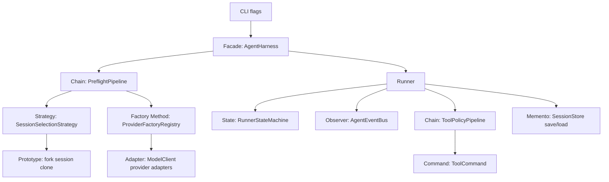

## **3. Các pattern đã cài đặt trong hệ thống**

### **3.1. Facade Pattern (Mẫu thiết kế Mặt tiền)**

**a. Vấn đề được giải quyết:**
Quá trình khởi chạy một agent không hề đơn giản. Nó đòi hỏi phải: đọc file cấu hình, chuẩn bị preflight, resolve provider/model, kết nối database SQLite để load session, tiêm các tools, và gắn các bộ lắng nghe sự kiện (Event Bus). Nếu đặt toàn bộ khối logic khổng lồ này vào file giao diện dòng lệnh (`cli.ts`), mã nguồn sẽ phình to, rối rắm và vi phạm nghiêm trọng nguyên lý Single Responsibility. 

**b. Phân tích kiến trúc và Ánh xạ vai trò chi tiết:**

*Vai trò 1: Facade (Mặt tiền)*
`AgentHarness` đóng vai trò là một giao diện duy nhất, che giấu đi toàn bộ sự phức tạp của hệ thống nội bộ. Nó tự động tạo ngữ cảnh và phối hợp các thành phần con.
```typescript
// File: src/harness.ts
export class AgentHarness {
  constructor(
    settings: HarnessSettings,
    private readonly preflight = new PreflightPipeline(),
    private readonly runner = createRunner(),
  ) {
    this.settings = loadRuntimeConfig({ workspaceRoot: settings.workspaceRoot, overrides: settings });
  }

  // Phương thức mặt tiền, che giấu mọi thao tác phức tạp
  async run(request: RunRequest): Promise<RunResult> {
    const contextInput = { request, workspaceRoot: ... }; // Gom tham số
    
    // Giao tiếp với các thành phần hệ thống nội bộ (Subsystems)
    const prepared = await this.preflight.prepare(createPreflightContext(contextInput));
    return this.runner.run(prepared);
  }
}
```

*Vai trò 2: Subsystems (Các hệ thống con phức tạp)*
Là các thành phần nằm bên dưới mà Facade đang quản lý như `PreflightPipeline`, `Runner`, `loadRuntimeConfig`. Lớp gọi từ bên ngoài không cần biết đến sự tồn tại của chúng.

*Vai trò 3: Client (Nơi gọi)*
Giao diện dòng lệnh (`cli.ts`) đóng vai trò Client. Nó chỉ việc "bấm nút" `run()` trên mặt tiền mà không cần quan tâm đằng sau mặt tiền đó hoạt động ra sao.
```typescript
// File: src/cli.ts
// Lớp Client trở nên cực kỳ tinh gọn
const harness = await createHarness(settings);
const result = await harness.run({ prompt, ...options });
```

**c. Kết quả đạt được:**
Giảm sự phụ thuộc (Loose Coupling) giữa tầng giao diện (CLI) và tầng nghiệp vụ (Runner, Config). Mã nguồn dễ bảo trì hơn, và hoàn toàn có thể tái sử dụng `AgentHarness` cho một giao diện đồ họa (GUI) trong tương lai thay vì chỉ dùng cho CLI.

### **3.2. Observer Pattern (Mẫu thiết kế Quan sát viên)**

**a. Vấn đề được giải quyết:**
Khi Runner đang chạy, nó cần in log ra màn hình console, ghi lại toàn bộ lịch sử trò chuyện (transcript) vào file, và ghi log debug. Nếu Runner gọi trực tiếp các hàm ghi file/in console này, nó sẽ vi phạm nguyên lý thiết kế vì "việc chạy mô hình" và "việc in chữ ra màn hình" là 2 trách nhiệm khác nhau. Nếu một ngày muốn thêm gửi thông báo qua Slack, ta lại phải sửa code của Runner.

**b. Phân tích kiến trúc và Ánh xạ vai trò chi tiết:**

*Vai trò 1: Subject (Chủ thể phát sự kiện)*
`AgentEventBus` là đối tượng trung tâm quản lý danh sách những kẻ tò mò muốn biết (Observers) và thông báo (Publish) cho họ khi có việc xảy ra.
```typescript
// File: src/events.ts
export class AgentEventBus {
  private readonly handlers = new Set<AgentEventHandler>(); // Lưu danh sách Observer

  // Cho phép Observer đăng ký nhận tin
  subscribe(handler: AgentEventHandler): () => void {
    this.handlers.add(handler);
    return () => this.handlers.delete(handler);
  }

  // Phát loa thông báo cho mọi Observer
  async publish(event: AgentEvent): Promise<void> {
    for (const handler of this.handlers) {
      await handler(event);
    }
  }
}
```

*Vai trò 2: Observer (Quan sát viên)*
Bất kỳ thành phần nào muốn nghe ngóng thông tin. Dự án định nghĩa Interface `AgentEventSink` bắt buộc các Observer phải có hàm `handle()`.
```typescript
// File: src/events.ts
export interface AgentEventSink {
  handle(event: AgentEvent): void | Promise<void>;
}
```

*Vai trò 3: Concrete Observer (Các quan sát viên cụ thể)*
Các lớp như `ConsoleSink`, `TranscriptSink`, `DebugLogSink` đăng ký nghe và tự xử lý sự kiện theo cách riêng của chúng.
```typescript
// File: src/events.ts
export class ConsoleSink implements AgentEventSink {
  handle(event: AgentEvent): void {
    switch (event.type) {
      case "run:started":
        this.write(`run started: ${event.sessionId}\n`); return;
      case "tool:completed":
        this.write(`tool completed: ${event.name}\n`); return;
    }
  }
}

export class TranscriptSink implements AgentEventSink {
  async handle(event: AgentEvent): Promise<void> {
    // Tự động ghi ra file thay vì in console
    await appendFile(path, `${JSON.stringify(event)}\n`, "utf8");
  }
}
```

**c. Kết quả đạt được:**
Thỏa mãn **Nguyên lý Đóng/Mở (OCP)**. Khi muốn thêm tính năng bắn sự kiện lên Slack, ta chỉ cần tạo một lớp `SlackSink` (implements `AgentEventSink`) và gắn vào EventBus. Mã nguồn cốt lõi của Runner không hề hay biết và cũng không cần bị chỉnh sửa.

### **3.3. State Pattern (Mẫu thiết kế Trạng thái)**

**a. Vấn đề được giải quyết:**
Vòng đời chạy của một Agent đi qua nhiều giai đoạn: Khởi tạo -> Chuẩn bị (Resolving) -> Chạy (Running) -> Đợi công cụ (WaitingForTool) -> Lưu trữ (Persisting) -> Hoàn thành. Việc chuyển từ trạng thái này sang trạng thái khác có những quy định nghiêm ngặt (VD: Không thể từ `initialized` nhảy thẳng tới `completed`). Nếu dùng biến boolean (như `isRunning`, `isDone`) và nhồi một đống lệnh `if/else`, code sẽ đầy lỗ hổng và rủi ro chuyển sai trạng thái.

**b. Phân tích kiến trúc và Ánh xạ vai trò chi tiết:**

*Vai trò 1: State (Giao diện Trạng thái chung)*
Quy định mọi trạng thái đều phải có tên và có quyền quyết định chuyển sang trạng thái nào tiếp theo (`transitionTo`).
```typescript
// File: src/state-machine.ts
export interface RunnerState {
  readonly name: RunnerStateName;
  enter(ctx: RunnerStateContext): void;
  transitionTo(next: RunnerStateName): RunnerState; // Hàm quyết định chuyển trạng thái
}
```

*Vai trò 2: Concrete State (Các trạng thái cụ thể)*
Mỗi trạng thái tự ôm logic chặn/cho phép của riêng nó, không quan tâm trạng thái khác.
```typescript
// File: src/state-machine.ts
// Trạng thái Đang Chạy
class RunningState extends BaseRunnerState {
  readonly name = "running";

  transitionTo(next: RunnerStateName): RunnerState {
    if (next === "waitingForTool") return new WaitingForToolState();
    if (next === "persisting") return new PersistingState();
    if (next === "failed") return new FailedState();
    return this.invalidTransition(next); // Chặn đứng mọi sự luân chuyển trái phép khác
  }
}
```

*Vai trò 3: Context (Ngữ cảnh máy trạng thái)*
Lớp `RunnerStateMachine` làm nhiệm vụ chứa trạng thái hiện tại và đại diện cho hệ thống ra lệnh chuyển trạng thái.
```typescript
// File: src/state-machine.ts
export class RunnerStateMachine {
  private current: RunnerState = new InitializedState(); // Trạng thái mặc định

  transitionTo(next: RunnerStateName): void {
    // Uỷ quyền quyết định cho chính trạng thái hiện tại
    this.current = this.current.transitionTo(next);
    this.current.enter(this);
  }
}
```

**c. Kết quả đạt được:**
Toàn bộ logic chặn luồng (`if/else`) phức tạp được tháo gỡ khỏi Runner và tản đều vào các class State. Khi cần thêm một trạng thái mới (Ví dụ: `Paused`), chỉ cần tạo một class `PausedState` và định nghĩa quy tắc cho nó, giảm thiểu rủi ro sinh ra bug (lỗi) do logic mâu thuẫn.

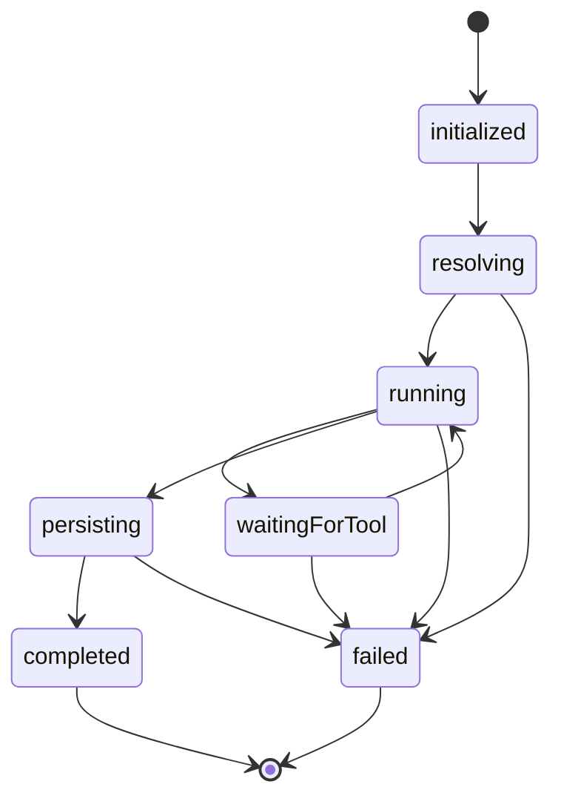

### **3.4. Adapter Pattern (Mẫu thiết kế chuyển đổi)**

**a. Vấn đề được giải quyết:**
Hệ thống cần giao tiếp với hai nguồn dữ liệu hoàn toàn khác biệt so với chuẩn nội bộ:
1. Thư viện kết nối API (SDK) của các hãng AI (OpenAI, Anthropic). Mỗi hãng có cấu trúc hàm, kiểu tham số, và cách trả về kết quả khác nhau.
2. Cấu hình Agent thô rải rác (file JSON chứa metadata và file Markdown chứa prompt).
Nếu không sử dụng mẫu thiết kế này, lõi chương trình (Runner) sẽ phải chứa hàng loạt câu lệnh `if/else` để rẽ nhánh xử lý cho từng loại dữ liệu, khiến hệ thống cực kỳ khó mở rộng, vi phạm nghiêm trọng nguyên lý thiết kế và không thể bảo trì.

**b. Phân tích kiến trúc và Ánh xạ vai trò chi tiết:**

#### Trường hợp 1: Chuyển đổi SDK của các Provider AI (OpenAI, Anthropic)

*Vai trò 1: Target (Giao diện đích)*
Đây là chuẩn chung mà lõi hệ thống dự án định nghĩa. Lõi dự án chỉ biết gọi hàm `complete` có trong interface này.
```typescript
// File: src/contracts.ts
export interface ModelClient {
  complete(request: ModelRequest): Promise<ModelResponse>;
}
```

*Vai trò 2: Adaptee (Kẻ bị chuyển đổi)*
Đây là thư viện (SDK) do hãng OpenAI viết. Nó có cấu trúc hàm (`create`) và kiểu dữ liệu tham số hoàn toàn khác với `ModelClient`.
```typescript
// File: src/provider.ts
import OpenAI from "openai";

interface OpenAIClientLike {
  chat: {
    completions: {
      create(params: ChatCompletionCreateParamsNonStreaming): Promise<ChatCompletion>;
    };
  };
}
```

*Vai trò 3: Adapter (Người chuyển đổi)*
Lớp đứng giữa thực thi Target và bọc lấy Adaptee để phiên dịch yêu cầu.
```typescript
// File: src/provider.ts
export class OpenAIProviderAdapter implements ModelClient {
  private readonly client: OpenAIClientLike; // Adaptee

  constructor(config: ProviderAdapterConfig, client?: OpenAIClientLike) {
    this.client = client ?? new OpenAI({ apiKey: config.apiKey, baseURL: config.baseURL });
  }

  async complete(request: ModelRequest): Promise<ModelResponse> {
    // 1. Chuyển đổi Request (Input) sang chuẩn của OpenAI
    const completion = await this.client.chat.completions.create({
      model: request.model,
      messages: request.messages.map(toOpenAIMessage), 
      tools: request.tools.map(toOpenAITool),          
      stream: false,
    });
    
    // 2. Chuyển đổi Response (Output) từ OpenAI về chuẩn của hệ thống
    return normalizeOpenAIChatCompletion(completion);
  }
}
```

#### Trường hợp 2: Chuyển đổi cấu hình Agent

*Vai trò 1: Target*
Đối tượng nội bộ đã được chuẩn hóa để hệ thống chạy.
```typescript
// File: src/contracts.ts
export interface AgentPreset {
  name: string;
  description?: string;
  systemPrompt: string; // Chuỗi nội dung hoàn chỉnh
  enabledTools: string[];
  model?: string;
}
```

*Vai trò 2: Adaptee*
Cấu trúc file JSON thô, không chứa nội dung prompt mà chỉ chứa đường dẫn file ngoại vi.
```typescript
// File: src/agent.ts
export interface AgentConfig {
  description?: string;
  extends?: string;
  promptFile?: string; // Chỉ là đường dẫn chỉ đến file Markdown
  enabledTools?: string[];
  model?: string;
}
```

*Vai trò 3: Adapter*
```typescript
// File: src/agent.ts
export class AgentConfigAdapter {
  load(configs: Record<string, AgentConfig>): AgentPreset[] {
     return Object.keys(configs).map((name) => this.build(name, configs, building, built));
  }

  private build(...) {
    const preset: AgentPreset = {
      name,
      // ...
      // Adapter thực hiện đọc file ngoại vi và nhét vào thuộc tính của Target
      systemPrompt: promptFile === undefined ? base?.systemPrompt ?? "" : readFileSync(this.resolvePromptPath(promptFile), "utf8").trim(),
      enabledTools: [...enabledTools],
    };
    return preset;
  }
}
```

**c. Kết quả đạt được:**
Mẫu thiết kế thỏa mãn **Nguyên lý Đảo ngược Phụ thuộc (Dependency Inversion)**. Lõi cấp cao không phụ thuộc vào SDK cấp thấp, cả hai giao tiếp qua Abstraction. Hệ thống giờ đây làm việc dựa trên một "Hợp đồng chung".

### **3.5. Factory Method Pattern (Mẫu thiết kế Nhà máy tạo đối tượng)**

**a. Vấn đề được giải quyết:**
Việc khởi tạo các Adapter (như `OpenAIProviderAdapter`) đòi hỏi phải có logic phân giải cấu hình (Tên hãng AI, API Key, Base URL). Nếu đặt logic này ở mọi nơi cần gọi AI, nó sẽ tạo ra sự lặp lại mã nguồn (Code Smell) và rải rác lệnh `new` khắp nơi.

**b. Phân tích kiến trúc và Ánh xạ vai trò chi tiết:**

*Vai trò 1: Product (Sản phẩm trừu tượng)*
Sản phẩm mà nhà máy tạo ra chính là `ModelClient` (đồng thời là Target của Adapter).
```typescript
// File: src/contracts.ts
export interface ModelClient {
  complete(request: ModelRequest): Promise<ModelResponse>;
}
```

*Vai trò 2: Creator (Nhà máy trừu tượng)*
Giao diện chung buộc mọi "nhà máy con" phải tuân theo.
```typescript
// File: src/provider.ts
export interface ProviderFactory {
  supports(config: ProviderConfig): boolean;         // Có thẩm quyền xử lý không?
  create(resolved: ResolvedProvider): ModelClient;   // Sản xuất đối tượng
}
```

*Vai trò 3: Concrete Creator (Nhà máy cụ thể)*
Nhà máy chuyên biệt khởi tạo Adapter cho hãng OpenAI.
```typescript
// File: src/provider.ts
export class OpenAIProviderFactory implements ProviderFactory {
  supports(config: ProviderConfig): boolean {
    return providerSdk(config) === "openai";
  }

  // Khởi tạo đối tượng bằng lệnh `new` được giấu kín ở đây
  create(resolved: ResolvedProvider): ModelClient {
    return new OpenAIProviderAdapter({ baseURL: resolved.config.baseURL, apiKey: resolved.apiKey });
  }
}
```

*Vai trò 4: Client (Hệ thống điều phối)*
Hệ thống quản lý chung để điều phối việc gọi nhà máy mà không dùng đến các khối `if-else` lồng nhau.
```typescript
// File: src/provider.ts
export class ProviderFactoryRegistry {
  constructor(private readonly factories: ProviderFactory[] = [
    new OpenAIProviderFactory(), 
    new AnthropicProviderFactory()
  ]) {}

  create(resolved: ResolvedProvider): ModelClient {
    // Tìm kiếm động nhà máy phù hợp
    const factory = this.factories.find((candidate) => candidate.supports(resolved.config));
    
    // Giao cho nhà máy đó xuất xưởng sản phẩm
    return factory.create(resolved);
  }
}
```

**c. Kết quả đạt được:**
Dự án tuân thủ triệt để **Nguyên lý Đóng/Mở (Open/Closed Principle - OCP)**. Kiến trúc sẵn sàng đón nhận các yêu cầu mới. Khi muốn bổ sung mô hình AI mới (Google Gemini), lập trình viên chỉ việc tạo ra một lớp Factory mới (`GeminiProviderFactory`), cài đặt nó kế thừa Creator, và gắn vào Registry. Không có bất kỳ dòng lệnh `if/else` lõi nào bị thay đổi.

### **3.6. Command Pattern (Mẫu thiết kế Mệnh lệnh)**

**a. Vấn đề được giải quyết:**
Khi mô hình AI (Model) yêu cầu thực thi một hành động trong không gian làm việc (ví dụ: Đọc file, sửa file, chạy bash), làm sao để hệ thống có thể nhận diện, kiểm tra an toàn (validate), và thực thi nó mà không cần viết các lệnh rẽ nhánh khổng lồ trong Runner? Nếu dùng một vòng `switch-case` cho mỗi hành động, Runner sẽ phải chứa tất cả logic đọc/ghi file và gọi hệ điều hành, làm hỏng hoàn toàn kiến trúc.

**b. Phân tích kiến trúc và Ánh xạ vai trò chi tiết:**

*Vai trò 1: Command (Lệnh trừu tượng)*
Giao diện chung ép mọi "công cụ" (tool) phải có chung một chuẩn mực: Tên, Mô tả, Cấu trúc tham số (Schema) và hàm thực thi (`execute`).
```typescript
// File: src/contracts.ts
export interface ToolCommand {
  readonly name: string;
  readonly description: string;
  readonly schema: JsonSchema;
  execute(ctx: ToolContext, input: JsonObject): Promise<unknown>;
}
```

*Vai trò 2: Concrete Command (Lệnh cụ thể)*
Các chức năng thực tế được tách thành các lớp riêng biệt như `ReadTool`, `EditTool`, `BashTool`, `ApplyPatchTool`.
```typescript
// File: src/tools.ts
export class EditTool implements ToolCommand {
  readonly name = "edit";
  readonly schema: JsonSchema = { /* ...định nghĩa input path, oldText, newText... */ };

  // Logic cụ thể được đóng gói gọn gàng ở đây
  async execute(ctx: ToolContext, input: JsonObject): Promise<unknown> {
    const current = await ctx.workspace.readText(path, MAX_READ_BYTES);
    const next = current.replace(oldText, newText);
    await ctx.workspace.atomicWriteText(path, next);
    return { path, changed: true };
  }
}
```

*Vai trò 3: Invoker (Người gọi)*
Bản thân Runner/ToolPolicyPipeline đóng vai trò làm Invoker, nó chỉ cầm đối tượng `ToolCommand` và gọi hàm `execute()` mà không hề biết bên trong nó làm gì.

**c. Kết quả đạt được:**
Mọi hành động đều được **đóng gói thành một đối tượng độc lập**. Runner hoàn toàn tách biệt khỏi logic của tool. Khi cần viết thêm một công cụ mới (Ví dụ: `SearchWebTool`), người lập trình chỉ cần tạo lớp mới kế thừa `ToolCommand`, không cần sửa lõi Runner.

### **3.7. Chain of Responsibility Pattern (Chuỗi trách nhiệm)**

**a. Vấn đề được giải quyết:**
Trước khi một "Tool" do AI gọi được phép chạy (thực thi ở phần 3.6), nó bắt buộc phải vượt qua hàng rào kiểm duyệt khắt khe: (1) Tool có tồn tại không? -> (2) Tool có được cấp quyền không? -> (3) Tham số truyền vào có chuẩn không? -> (4) Đường dẫn file có nằm trong vùng an toàn (Sandbox) không? -> (5) Lệnh Bash có mã độc (rm -rf) không?
Nếu dồn toàn bộ vào một hàm khổng lồ, logic sẽ đan xen rối rắm, cực kỳ dễ bỏ sót lỗ hổng bảo mật.

**b. Phân tích kiến trúc và Ánh xạ vai trò chi tiết:**

*Vai trò 1: Handler (Bộ xử lý trừu tượng)*
Định nghĩa giao diện cho một mắt xích trong chuỗi. Nó nhận đầu vào, xử lý, và quyết định có gọi mắt xích tiếp theo (`next()`) hay không.
```typescript
// File: src/tool-policy.ts
export interface ToolPolicyHandler {
  handle(
    input: ToolPolicyContext, 
    next: (input: ToolPolicyContext) => Promise<ToolResultEnvelope>
  ): Promise<ToolResultEnvelope>;
}
```

*Vai trò 2: Concrete Handler (Mắt xích cụ thể)*
Mỗi class là một trạm kiểm soát (Checkpoint) chỉ chịu trách nhiệm đúng 1 việc. Ví dụ: Trạm kiểm soát rủi ro lệnh Bash.
```typescript
// File: src/tool-policy.ts
class RiskPolicyHandler implements ToolPolicyHandler {
  async handle(input: ToolPolicyContext, next: Function): Promise<ToolResultEnvelope> {
    const args = input.args ?? {};
    
    // 1. Tự xử lý phần việc của mình
    if (input.call.name === "bash" && typeof args.command === "string") {
      denyDestructiveCommand(args.command); // Quăng lỗi nếu có "rm -rf"
    }
    
    // 2. Chuyển tiếp hồ sơ cho trạm kiểm soát tiếp theo
    return next(input);
  }
}
```

*Vai trò 3: Client / Chain Builder (Chuỗi liên kết)*
Hệ thống móc nối các trạm lại với nhau thành một dây chuyền lắp ráp.
```typescript
// File: src/tool-policy.ts
export class ToolPolicyPipeline {
  constructor(
    private readonly handlers: ToolPolicyHandler[] = [
      new ToolLookupHandler(),        // Trạm 1: Tồn tại không?
      new EnabledToolHandler(),       // Trạm 2: Được phép dùng không?
      new ToolArgsHandler(),          // Trạm 3: Tham số đúng không?
      new WorkspaceSandboxHandler(),  // Trạm 4: An toàn file không?
      new RiskPolicyHandler(),        // Trạm 5: An toàn shell không?
      new ToolExecutionHandler(),     // Trạm cuối: Cấp phép thực thi
    ]
  ) {}
  
  // Hàm đệ quy gọi chuỗi
  async execute(request) { /* ... invokes handlers sequentially ... */ }
}
```

**c. Kết quả đạt được:**
Mỗi luật lệ an ninh (Security Policy) là một Module hoàn toàn độc lập, thỏa mãn tuyệt đối nguyên lý **Single Responsibility**. Bạn có thể dễ dàng chèn thêm một mắt xích kiểm tra mới (Ví dụ: `RateLimitHandler`) vào giữa chuỗi mà không sợ làm sập hệ thống cũ.

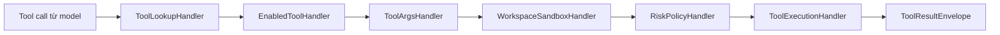

### **3.8. Memento Pattern (Mẫu thiết kế Ghi nhớ)**

**a. Vấn đề được giải quyết:**
Làm sao để người dùng có thể tắt ứng dụng (tắt CLI) hôm nay, nhưng ngày mai mở lên vẫn có thể gõ `--continue` để máy tính nhớ lại toàn bộ đoạn chat ngày hôm qua? Nếu Runner tự lưu từng dòng dữ liệu vào SQLite, nó sẽ phải phụ thuộc vào thư viện Database, phá vỡ nguyên lý thiết kế.

**b. Phân tích kiến trúc và Ánh xạ vai trò chi tiết:**

*Vai trò 1: Memento (Vật ghi nhớ)*
Đóng gói toàn bộ trạng thái cần thiết của cuộc trò chuyện (Lịch sử chat, metadata, tên model) thành một đối tượng thuần túy.
```typescript
// File: src/contracts.ts
export interface Session {
  version: number;
  id: string;
  agent: string;
  messages: ModelMessage[]; // Toàn bộ lịch sử trò chuyện
  metadata: Record<string, unknown>;
}
```

*Vai trò 2: Originator (Người tạo ra Memento)*
Chính là luồng chạy chính (Runner/AgentHarness). Nó tự động sinh ra/thay đổi trạng thái `Session` khi chat với AI, sau đó trao nó cho người giữ cửa.

*Vai trò 3: Caretaker (Người giữ cửa/Người bảo quản)*
Là `SessionStore`. Kẻ duy nhất biết cách tương tác với SQLite để cất giữ (Save) hoặc khôi phục (Load) trạng thái.
```typescript
// File: src/session.ts
export class SessionStore {
  // Cất giữ Memento vào cơ sở dữ liệu
  async save(session: Session, options: SaveOptions): Promise<void> {
    this.withDatabase((db) => {
      // Logic lưu transaction vào SQLite
      db.prepare(`INSERT INTO sessions...`).run(sessionToRow(session));
    });
  }

  // Khôi phục Memento từ cơ sở dữ liệu
  async loadLatest(): Promise<Session> {
    // Trả về Session nguyên vẹn cho Originator chạy tiếp
    return this.load(sessionId);
  }
}
```

**c. Kết quả đạt được:**
Đảm bảo tính Đóng gói (Encapsulation) tuyệt đối. Lõi hệ thống có thể lưu hoặc khôi phục toàn bộ tiến trình hội thoại phức tạp mà không cần phơi bày bất cứ chi tiết nào về cơ sở dữ liệu SQL bên dưới.

### **3.9. Prototype Pattern (Mẫu thiết kế Nguyên mẫu)**

**a. Vấn đề được giải quyết:**
Khi người dùng muốn phân nhánh một cuộc hội thoại (dùng cờ `--fork`), hệ thống cần tạo ra một phiên làm việc mới y hệt phiên cũ (clone) nhưng có ID khác và không được làm bẩn dữ liệu của phiên cũ. Nếu lập trình viên dùng lệnh khởi tạo `new` và copy từng tham số (như `session.agent = old.agent; session.model = old.model...`), code sẽ rất thô sơ và dễ quên thuộc tính nếu class được mở rộng.

**b. Phân tích kiến trúc và Ánh xạ vai trò chi tiết:**

*Vai trò 1: Prototype (Nguyên mẫu)*
Mọi đối tượng `Session` đang chạy trên bộ nhớ chính là bản gốc (Prototype) có khả năng được sao chép.

*Vai trò 2: Client (Người yêu cầu nhân bản)*
Lớp `SessionStore` (hoặc `ForkingSessionSelectionStrategy`) đóng vai trò nhận lệnh và thực hiện thuật toán nhân bản sâu (Deep Clone).
```typescript
// File: src/session.ts
export class SessionStore {
  // Hàm tạo ra một bản sao hoàn chỉnh từ bản gốc (source)
  fork(source: Session): Session {
    const now = new Date().toISOString();
    return {
      version: 1,
      id: `sess_${randomUUID()}`,     // Sinh ID mới
      parentSessionId: source.id,     // Lưu vết lịch sử nhánh
      agent: source.agent,
      provider: source.provider,
      model: source.model,
      createdAt: now,
      updatedAt: now,
      // Nhân bản sâu (Deep Clone) các mảng và object phức tạp
      messages: structuredClone(source.messages) as ModelMessage[],
      metadata: structuredClone(source.metadata) as Record<string, unknown>,
    };
  }
}
```

**c. Kết quả đạt được:**
Cho phép tạo đối tượng mới rẻ và chính xác hơn dựa trên khuôn mẫu có sẵn. Người dùng thoải mái rẽ nhánh hội thoại (`--fork`) để thử các lệnh khác nhau mà không làm hỏng file lưu trữ gốc.

### **3.10. Strategy Pattern (Mẫu thiết kế Chiến lược)**

**a. Vấn đề được giải quyết:**
Người dùng khi gõ dòng lệnh có thể dùng rất nhiều cấu hình để tải Session:
- Mặc định: Tạo Session mới.
- `--continue`: Load phiên mới nhất.
- `--session <id>`: Load phiên cụ thể.
- Kèm `--fork`: Load xong rồi nhân bản nó ra.
Nếu dùng câu lệnh `if-else` lồng nhau để xử lý, khối lượng mã nguồn sẽ cực kỳ khổng lồ, logic rẽ nhánh chằng chịt, vi phạm OCP (nếu tương lai cần làm `--resume-workspace`).

**b. Phân tích kiến trúc và Ánh xạ vai trò chi tiết:**

*Vai trò 1: Strategy (Chiến lược chung)*
Định nghĩa một cái phễu bắt buộc tất cả mọi loại hình khởi tạo phải tuân theo hàm `select()`.
```typescript
// File: src/session-selection.ts
export interface SessionSelectionStrategy {
  readonly name: string;
  select(input: SessionSelectionInput): Promise<SessionSelectionResult>;
}
```

*Vai trò 2: Concrete Strategy (Chiến lược cụ thể)*
Mỗi chiến lược là một lớp riêng biệt, tự lo việc của nó.
```typescript
// File: src/session-selection.ts
// Chiến lược 1: Xử lý cờ --continue
export class ContinueLatestSessionStrategy implements SessionSelectionStrategy {
  async select(input: SessionSelectionInput): Promise<SessionSelectionResult> {
    const session = await input.sessionStore.loadLatest();
    return { session, agentName: session.agent, updateLatest: true };
  }
}

// Chiến lược 2: Xử lý cờ --session <id>
export class LoadByIdSessionStrategy implements SessionSelectionStrategy {
  constructor(private readonly sessionId: string) {}
  async select(input: SessionSelectionInput): Promise<SessionSelectionResult> {
    const session = await input.sessionStore.load(this.sessionId);
    return { session, agentName: session.agent, updateLatest: true };
  }
}
```

*Vai trò 3: Context (Ngữ cảnh / Người chọn chiến lược)*
Lớp `SessionSelectionStrategyResolver` làm nhiệm vụ đọc lệnh CLI và "rút" ra chiến lược phù hợp nhất trao cho hệ thống.
```typescript
// File: src/session-selection.ts
export class SessionSelectionStrategyResolver {
  resolve(request: RunRequest): SessionSelectionStrategy {
    let strategy: SessionSelectionStrategy;
    
    if (request.continueLast === true) strategy = new ContinueLatestSessionStrategy();
    else if (request.sessionId !== undefined) strategy = new LoadByIdSessionStrategy(request.sessionId);
    else strategy = new NewSessionSelectionStrategy();
    
    // Đặc biệt: Pattern Decorator/Strategy kết hợp để bọc Fork ra bên ngoài
    return request.fork === true ? new ForkingSessionSelectionStrategy(strategy) : strategy;
  }
}
```

**c. Kết quả đạt được:**
Thuật toán lựa chọn phiên chạy được tách biệt hoàn toàn. Việc mở rộng vô cùng dễ dàng, các lớp chiến lược độc lập nhau nên có thể thoải mái viết Unit Test riêng lẻ.

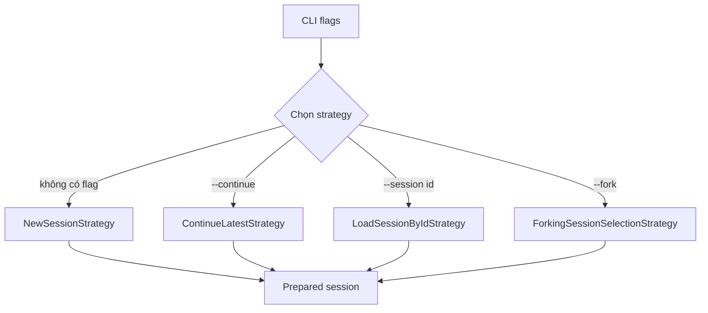

# **VII. CHI TIẾT TRIỂN KHAI, TECH STACK VÀ KIẾN TRÚC**

Phần VII tập trung vào chi tiết kỹ thuật đã được tách khỏi các phần I đến V. Nội dung này mô tả công nghệ sử dụng, cấu trúc mã nguồn, luồng xử lý nội bộ, lưu trữ dữ liệu, kiểm thử tự động và cách chạy hệ thống ở mức triển khai.

## **1. Tech stack**

| **Nhóm công nghệ** | **Công nghệ sử dụng** | **Vai trò trong hệ thống** |
| --- | --- | --- |
| Runtime | Node.js `>=22.12.0` | Môi trường chạy CLI. |
| Ngôn ngữ | TypeScript | Viết mã nguồn có kiểm tra kiểu tĩnh. |
| Module system | ESM / NodeNext | Tổ chức import/export theo chuẩn hiện đại. |
| CLI parser | Commander | Parse flag và hiển thị trợ giúp dòng lệnh. |
| Provider SDK | OpenAI SDK, Anthropic SDK | Kết nối tới mô hình AI và chuẩn hóa phản hồi. |
| Lưu trữ | SQLite qua `better-sqlite3` | Lưu session, message và latest pointer cục bộ. |
| Kiểm thử | Vitest | Unit test, integration test và E2E test. |
| Dev runtime | tsx | Chạy mã TypeScript trong quá trình phát triển. |
| Tài liệu | Markdown, MermaidJS | Viết báo cáo và vẽ sơ đồ kiến trúc. |

## **2. Cấu trúc mã nguồn chính**

| **Tệp / thư mục** | **Trách nhiệm** |
| --- | --- |
| `src/cli.ts` | Tiếp nhận flag CLI, đọc stdin fallback, xử lý list session và gọi harness. |
| `src/composition.ts` | Composition root, lắp ghép cấu hình mặc định, provider, session store, tools, runner và event sinks. |
| `src/config.ts` | Load và merge cấu hình runtime từ mặc định, file cấu hình và local override. |
| `src/harness.ts` | Facade chính, chạy preflight rồi gọi runner. |
| `src/preflight.ts` | Chuẩn bị run: validate request, resolve workspace, session, provider, agent và tools. |
| `src/session-selection.ts` | Các strategy chọn session: tạo mới, continue latest, load theo id và fork. |
| `src/provider.ts` | Provider registry, provider factory, OpenAI/Anthropic adapter và mapping tool schema. |
| `src/runner.ts` | Vòng lặp model/tool, lưu session và trả kết quả cuối cùng. |
| `src/session.ts` | SQLite session store, schema migration, save/load/fork/list. |
| `src/tool-policy.ts` | Tool registry và chain kiểm tra tool call trước khi thực thi. |
| `src/tools.ts` | Các tool dựng sẵn: `read`, `edit`, `apply_patch`, `bash`. |
| `src/workspace.ts` | Sandbox đường dẫn workspace và atomic write. |
| `src/events.ts` | Event bus, console sink, transcript sink và debug log sink. |
| `src/state-machine.ts` | State machine kiểm soát vòng đời runner. |
| `src/contracts.ts` | Các type và interface dùng chung. |

## **3. Kiến trúc tổng thể**

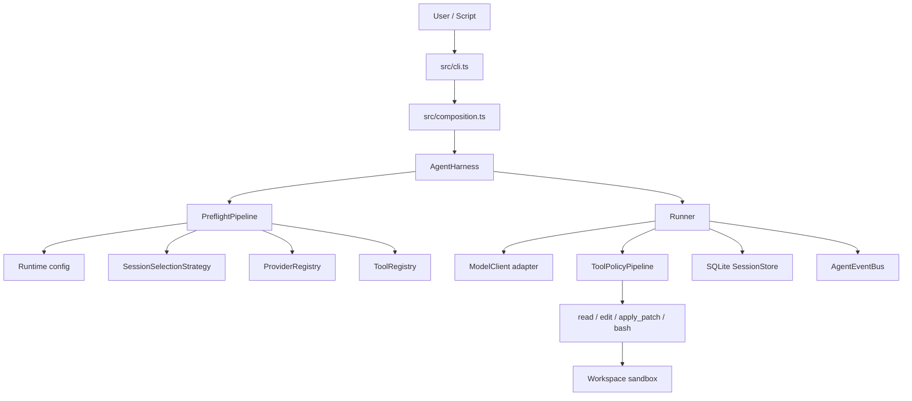

Luồng xử lý chính là: CLI parse tham số, composition tạo harness, preflight chuẩn bị run, runner gọi model, tool policy xử lý tool call nếu có, session store lưu trạng thái và event bus phát sự kiện cho console/transcript/debug.

## **4. Luồng chạy chi tiết**

```mermaid
sequenceDiagram
    actor User as Người dùng
    participant CLI as cli.ts
    participant Harness as AgentHarness
    participant Preflight as PreflightPipeline
    participant Provider as ModelClient
    participant Policy as ToolPolicyPipeline
    participant Store as SessionStore
    participant Events as AgentEventBus
    User->>CLI: fantasticcode flags / stdin
    CLI->>Harness: run(request)
    Harness->>Preflight: prepare(context)
    Preflight->>Store: create/load/fork/list session
    Preflight-->>Harness: PreparedRun
    Harness->>Events: run.started
    Harness->>Provider: complete(ModelRequest)
    Provider-->>Harness: ModelResponse
    alt Model yêu cầu tool
        Harness->>Policy: execute(toolCall)
        Policy-->>Harness: ToolResultEnvelope
        Harness->>Provider: complete(messages + tool result)
    end
    Harness->>Store: save(session)
    Harness->>Events: run.completed / run.failed
    Harness-->>CLI: RunResult
```

## **5. Provider và model adapter**

Hệ thống dùng `ProviderRegistry` để parse selector dạng `provider/model`, resolve cấu hình provider, API key, base URL và model thực tế. Sau đó `ProviderFactoryRegistry` tạo adapter tương ứng. Adapter chuẩn hóa SDK/provider khác nhau về interface nội bộ `ModelClient`, giúp runner không phụ thuộc trực tiếp vào SDK cụ thể.

Các provider built-in gồm `openai`, `anthropic` và `openrouter`.

## **6. Lưu trữ session**

Session được lưu trong `.fantasticcode/state.sqlite` dưới workspace hiện tại. SQLite được cấu hình theo hướng phù hợp cho lưu trữ cục bộ, có schema migration và thao tác save dạng transaction.

```mermaid
erDiagram
    sessions ||--o{ session_messages : contains
    sessions ||--o{ sessions : forks
    sessions ||--o{ latest_sessions : selected_as_latest
    sessions {
        text id PK
        text parent_session_id FK
        text agent
        text provider
        text model
        text created_at
        text updated_at
        text metadata_json
    }
    session_messages {
        text session_id PK,FK
        integer position PK
        text message_json
    }
    latest_sessions {
        text scope PK
        text session_id FK
    }
    schema_migrations {
        text name PK
        text applied_at
    }
```

Session id có dạng `sess_` cộng 32 ký tự hex. Khi fork, `SessionStore.fork` clone message và metadata từ session nguồn, tạo session mới và lưu `parentSessionId` để thể hiện quan hệ lineage.

## **7. Tool system và policy chain**

Các tool dựng sẵn gồm `read`, `edit`, `apply_patch` và `bash`. Mỗi tool là một `ToolCommand` có tên, mô tả, schema input và hàm `execute`. Trước khi thực thi, tool call đi qua `ToolPolicyPipeline`.

```mermaid
flowchart LR
    A["Tool call từ model"] --> B["ToolLookupHandler"]
    B --> C["EnabledToolHandler"]
    C --> D["ToolArgsHandler"]
    D --> E["WorkspaceSandboxHandler"]
    E --> F["RiskPolicyHandler"]
    F --> G["ToolExecutionHandler"]
    G --> H["ToolResultEnvelope"]
```

Policy chain giúp kiểm tra tool tồn tại, tool có được bật cho agent hay không, input có hợp lệ không, đường dẫn có nằm trong workspace không và thao tác có rủi ro rõ ràng hay không. Riêng `bash` có timeout, output cap và denylist cho lệnh phá hủy.

## **8. Event bus và quan sát hệ thống**

`AgentEventBus` phát event trong quá trình chạy agent. Các sink chính gồm `ConsoleSink`, `TranscriptSink` và `DebugLogSink`. Transcript được ghi dạng NDJSON; debug log cũng dùng NDJSON khi bật debug.

## **9. State machine của runner**

```mermaid
stateDiagram-v2
    [*] --> initialized
    initialized --> resolving
    resolving --> running
    resolving --> failed
    running --> waitingForTool
    waitingForTool --> running
    running --> persisting
    running --> failed
    waitingForTool --> failed
    persisting --> completed
    persisting --> failed
    completed --> [*]
    failed --> [*]
```

`RunnerStateMachine` kiểm soát vòng đời run và từ chối các transition không hợp lệ. Điều này giúp tránh trạng thái mâu thuẫn khi runner vừa chờ tool, vừa lưu session hoặc đã thất bại.

## **10. CLI flags và ví dụ sử dụng**

| **Flag** | **Ý nghĩa** |
| --- | --- |
| `-m`, `--model` | Chọn model theo dạng `provider/model`. |
| `-c`, `--continue` | Tiếp tục session gần nhất. |
| `-s`, `--session` | Load session theo id. |
| `--fork` | Tạo session mới từ session đang tiếp tục hoặc session theo id. |
| `--prompt` | Prompt đầu vào. |
| `--agent` | Chọn agent preset. |
| `--workspace` | Chọn workspace làm việc. |
| `--debug` | Bật debug log. |
| `--list-sessions` | Liệt kê các session đã lưu. |

```bash
fantasticcode --model openai/gpt-4.1 --prompt "inspect this repo"
fantasticcode --continue --prompt "continue the last task"
fantasticcode --session sess_1234567890abcdef1234567890abcdef --fork --prompt "try another approach"
fantasticcode --agent reviewer --model openai/gpt-4.1 --prompt "review the repo"
fantasticcode --list-sessions --workspace .
```

## **11. Cấu hình và biến môi trường**

Các tệp cấu hình chính gồm `agent-harness.config.example.json`, `agent-harness.config.json` và `agent-harness.local.json`. Các biến môi trường provider thường dùng gồm `OPENAI_API_KEY`, `ANTHROPIC_API_KEY` và `OPENROUTER_API_KEY`.

## **12. Kiểm thử và QA command**

| **Command** | **Mục đích** |
| --- | --- |
| `npm run dev` | Chạy CLI trực tiếp bằng TypeScript trong quá trình phát triển. |
| `npm run typecheck` | Kiểm tra kiểu TypeScript. |
| `npm test` | Chạy bộ test Vitest. |
| `npm run test:watch` | Chạy test ở chế độ watch. |
| `npm run build` | Build ra thư mục `dist`. |
| `npm run qa` | Chạy typecheck, test, build, pack dry-run và smoke test CLI help. |

Các nhóm test nằm trong thư mục `test/`, bao phủ CLI, config, provider, session, preflight, runner, tools, events, state machine và E2E harness flow.

## **13. Ghi chú triển khai**

- Public CLI binary là `fantasticcode`.
- Package export chính trỏ tới `dist/index.js` sau khi build.
- Session, transcript và debug log được tạo trong thư mục `.fantasticcode` của workspace.
- Mặc định code hiện tại dùng model `openai/gpt-5.4-mini`; một số ví dụ tài liệu dùng model minh họa khác để người đọc dễ hiểu.

# **Kết luận**

Sau khi hoàn thành bài tập lớn này, nhóm chúng em đã hiểu rõ hơn cách phân tích yêu cầu, lập kế hoạch, thiết kế, triển khai và kiểm thử một dự án phần mềm. Thông qua đề tài **fantasticcode**, nhóm có cơ hội áp dụng kiến thức về design pattern vào một hệ thống cụ thể thay vì chỉ trình bày lý thuyết.

Kết quả đạt được gồm một công cụ agent dòng lệnh có thể chạy được, có khả năng duy trì phiên làm việc, hỗ trợ thao tác an toàn trong thư mục dự án, có kiểm thử và có tài liệu giải thích design pattern rõ ràng. Quan trọng hơn, mỗi pattern được gắn với một trách nhiệm thật trong hệ thống, giúp việc giải thích và bảo trì trở nên rõ ràng hơn.

Những kết quả này là nền tảng để nhóm tiếp tục mở rộng hệ thống trong tương lai, ví dụ thêm provider mới, thêm tool mới, bổ sung approval flow hoặc cải thiện chính sách an toàn cho workspace.

# **Lời cảm ơn**

Nhóm chúng em xin gửi lời cảm ơn chân thành đến **thầy Cù Việt Dũng** đã hướng dẫn, truyền đạt kiến thức và định hướng trong quá trình thực hiện bài tập lớn. Những góp ý của thầy đã giúp nhóm hiểu rõ hơn cách xây dựng tài liệu phát triển dự án phần mềm và cách áp dụng mẫu thiết kế vào hệ thống thực tế.

Do thời gian và kinh nghiệm còn hạn chế, bài làm của nhóm chúng em khó tránh khỏi những thiếu sót. Chúng em rất mong nhận được sự cảm thông, góp ý và nhận xét từ thầy để đề tài được hoàn thiện hơn.

Nhóm chúng em xin trân trọng cảm ơn!
