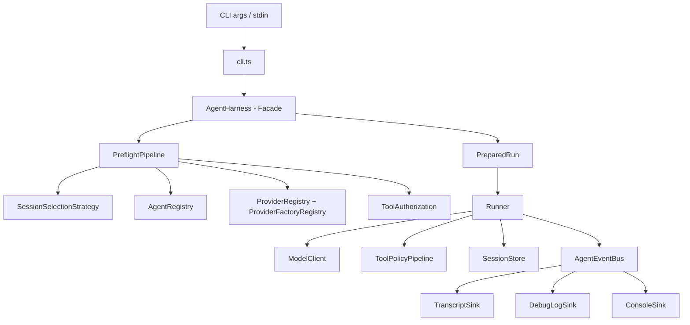
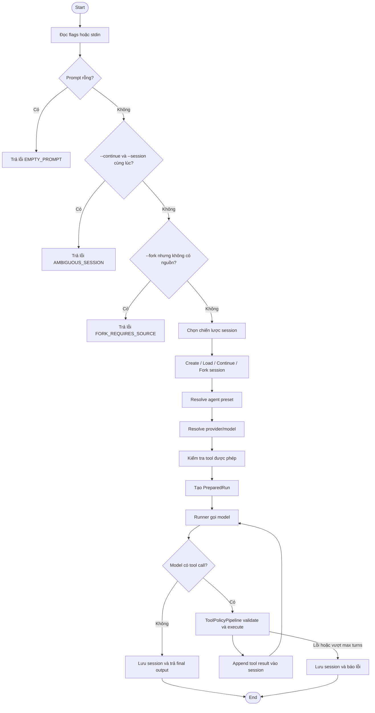
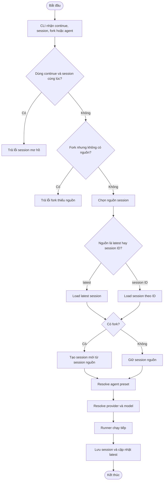
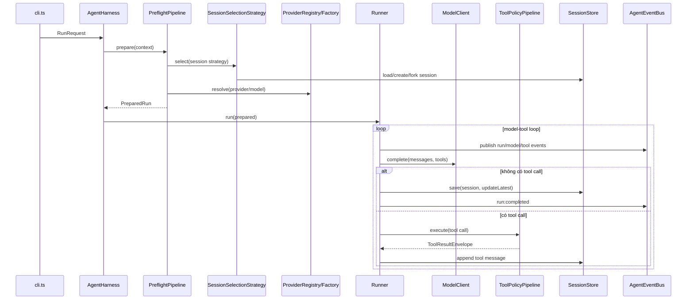
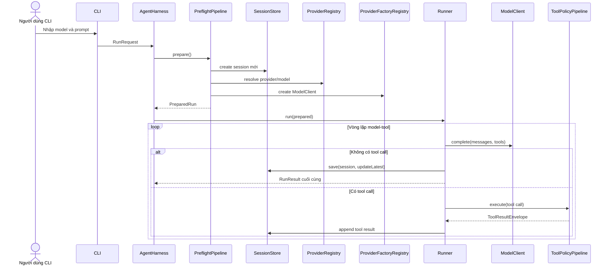
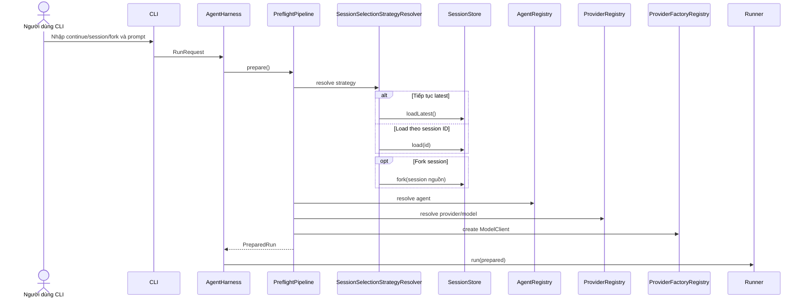
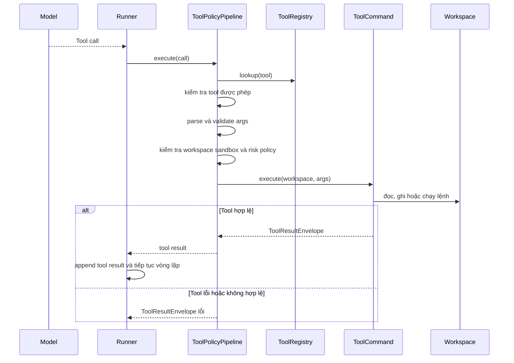
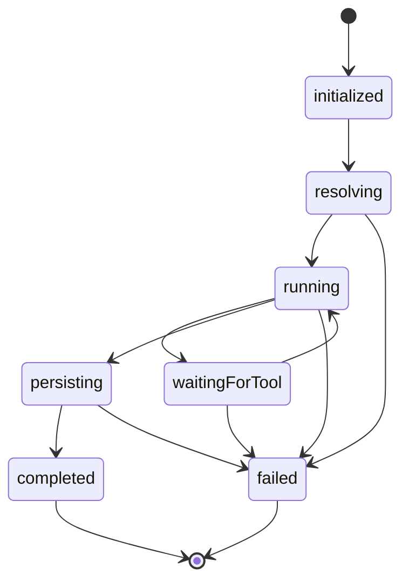

**BÀI TẬP LỚN**

**PHÁT TRIỂN DỰ ÁN PHẦN MỀM**

**Đề Tài:**

**FantasticCode - CLI Agent Harness Hỗ Trợ Lập Trình**

Nhóm thực hiện: Nhóm 7 - 65KTPM

Giảng viên hướng dẫn: TS.Cù Việt Dũng

*Hà Nội, 2026*

**MỤC LỤC**

# **LỜI NÓI ĐẦU**

Trong bối cảnh trí tuệ nhân tạo ngày càng được ứng dụng sâu vào hoạt động phát triển phần mềm, các công cụ hỗ trợ lập trình không chỉ dừng lại ở việc gợi ý mã nguồn mà còn có thể tham gia vào quá trình đọc mã, chỉnh sửa tệp, chạy lệnh kiểm thử và lưu lại ngữ cảnh làm việc. Điều này đặt ra nhu cầu xây dựng một khung agent đơn giản, dễ kiểm soát, có khả năng hoạt động qua dòng lệnh và thể hiện rõ các nguyên lý thiết kế phần mềm trong một hệ thống thực tế.

Xuất phát từ nhu cầu đó, đề tài **FantasticCode** được xây dựng như một khung CLI agent harness bằng TypeScript. Hệ thống cho phép người dùng gửi yêu cầu thông qua các tham số dòng lệnh, lựa chọn mô hình theo định dạng `provider/model`, kết nối tới các endpoint tương thích OpenAI, thực thi một tập công cụ an toàn trong phạm vi workspace và lưu trữ phiên làm việc để có thể tiếp tục hoặc rẽ nhánh ở các lần chạy sau.

Điểm trọng tâm của dự án không chỉ nằm ở chức năng gọi mô hình AI, mà còn ở cách tổ chức kiến trúc theo các mẫu thiết kế trong sách Gang of Four. FantasticCode được thiết kế để minh họa các mẫu như Facade, Strategy, Adapter, Command, Memento, Prototype, Factory Method, Chain of Responsibility, Observer và State thông qua các thành phần cụ thể: `AgentHarness`, `ProviderAdapter`, `ToolCommand`, `SessionStore`, `RunnerStateMachine`, `AgentEventBus` và các pipeline kiểm soát an toàn.

Tài liệu này trình bày quá trình phân tích yêu cầu, lập kế hoạch, thiết kế kiến trúc, tổ chức mã nguồn và kiểm thử cho dự án FantasticCode. Nội dung được viết nhằm làm rõ cách một hệ thống CLI agent nhỏ có thể được phát triển theo hướng có cấu trúc, có khả năng mở rộng và có cơ sở kiểm chứng bằng kiểm thử tự động.

Mặc dù đã rất cố gắng trong quá trình xây dựng và hoàn thiện tài liệu, đề tài khó tránh khỏi những thiếu sót nhất định. Nhóm chúng em kính mong nhận được sự góp ý và chỉ dẫn thêm từ thầy để bài làm được hoàn thiện hơn.

Chúng em xin trân trọng cảm ơn!

# **I. PHÂN TÍCH YÊU CẦU KHÁCH HÀNG**

## **1. Bản kế hoạch quản lý yêu cầu (RMP)**

### **1.1. Giới thiệu**

#### ***1.1.1. Mục đích***

Tài liệu Kế hoạch Quản lý Yêu cầu (Requirements Management Plan - RMP) này được xây dựng nhằm xác định cách thu thập, phân tích, đặc tả và kiểm soát các yêu cầu của dự án **FantasticCode**. Đây là một khung CLI agent harness bằng TypeScript, phục vụ việc chạy agent lập trình thông qua dòng lệnh, kết nối tới provider tương thích OpenAI, thực thi công cụ trong phạm vi workspace và lưu trữ phiên làm việc có thể tiếp tục hoặc rẽ nhánh.

Tài liệu đóng vai trò là cơ sở để:

##### 1. Xác định rõ phạm vi chức năng của CLI agent harness;
##### 2. Liên kết nhu cầu người dùng với các tính năng đã thiết kế và triển khai;
##### 3. Kiểm soát các thay đổi yêu cầu trong quá trình phát triển;
##### 4. Làm tài liệu tham chiếu cho các phần lập kế hoạch, thiết kế kiến trúc và kiểm thử.

#### ***1.1.2. Phạm vi áp dụng***

Bản RMP này áp dụng cho toàn bộ yêu cầu của FantasticCode trong phạm vi phiên bản hiện tại. Hệ thống tập trung vào CLI scriptable, không xây dựng giao diện TUI, không vận hành như một chatbot tương tác liên tục và không mở rộng sang nền tảng plugin hoàn chỉnh. Các yêu cầu chính bao gồm xử lý tham số dòng lệnh, quản lý session, chọn provider/model, chọn agent preset, thực thi công cụ an toàn và ghi nhận sự kiện chạy.

### **1.2. Công cụ sử dụng và các kiểu yêu cầu**

#### ***1.2.1. Các công cụ sử dụng quản lý yêu cầu***

| **STT** | **Công cụ** | **Mục đích sử dụng** |
| --- | --- | --- |
| 1 | Markdown | Soạn thảo tài liệu phát triển, tài liệu thiết kế và mô tả yêu cầu. |
| 2 | Git | Quản lý lịch sử thay đổi mã nguồn và tài liệu. |
| 3 | TypeScript / Node.js | Xây dựng CLI, định nghĩa interface và kiểm tra kiểu tĩnh. |
| 4 | npm / Vitest | Chạy kiểm thử, build, typecheck và kiểm tra chất lượng dự án. |
| 5 | README và tài liệu thiết kế | Làm nguồn đối chiếu cho phạm vi, kiến trúc và cách sử dụng hệ thống. |

#### ***1.2.2. Các kiểu yêu cầu cho dự án***

| **Loại yêu cầu** | **Loại tài liệu** | **Mô tả** |
| --- | --- | --- |
| Yêu cầu của các bên liên quan (STRQ) | Yêu cầu của các bên liên quan (STR) | Mô tả nhu cầu của người dùng CLI, người duy trì dự án, người kiểm thử và hệ thống provider bên ngoài. |
| Yêu cầu tính năng (FEAT) | Tài liệu tầm nhìn (VIS) | Mô tả các chức năng chính như chạy prompt, chọn model, quản lý session, gọi tool và ghi log. |
| Ca sử dụng (UC) / Kịch bản (SC) | Đặc tả ca sử dụng (UCS) | Mô tả các tình huống người dùng chạy agent, tiếp tục session, fork session và để model gọi tool. |
| Yêu cầu bổ sung (SUPL) | Đặc tả bổ sung (SS) | Mô tả các yêu cầu phi chức năng về an toàn workspace, khả năng kiểm thử, giới hạn tài nguyên và tính tương thích. |

#### ***1.2.3. Loại tài liệu yêu cầu cho dự án***

| **Loại tài liệu** | **Mô tả** | **Loại yêu cầu mặc định** |
| --- | --- | --- |
| Kế hoạch quản lý yêu cầu (RMP) | Tài liệu mô tả phương pháp, phạm vi và công cụ quản lý yêu cầu của FantasticCode. | Không áp dụng |
| Yêu cầu của các bên liên quan (STR) | Tập hợp các nhu cầu chính từ người dùng CLI, maintainer và người kiểm thử. | STRQ |
| Tài liệu tầm nhìn (VIS) | Mô tả mục tiêu sản phẩm, phạm vi và tính năng chính. | FEAT |
| Đặc tả ca sử dụng (UCS) | Mô tả cách actor tương tác với hệ thống qua CLI, session và tool call. | UC / SC |
| Đặc tả bổ sung (SS) | Mô tả ràng buộc kỹ thuật, an toàn, logging, giới hạn tài nguyên và kiểm thử. | SUPL |

### **1.3. Các nhân tố tham gia dự án phần mềm**

| **Nhóm / vai trò** | **Số lượng** | **Nhiệm vụ chính** |
| --- | --- | --- |
| Phân tích yêu cầu | 1-2 | Xác định phạm vi CLI harness, actor, luồng sử dụng và tiêu chí nghiệm thu. |
| Thiết kế kiến trúc | 1-2 | Thiết kế module, interface, pattern GoF, session flow, provider adapter và policy pipeline. |
| Phát triển | 2-3 | Cài đặt CLI, provider, session store, runner, tools, event bus và state machine. |
| Kiểm thử | 1-2 | Viết kiểm thử cho CLI, provider, session, runner, tool policy, workspace safety và e2e flow. |
| Tài liệu | 1 | Viết README, tài liệu thiết kế và tài liệu phát triển dự án. |

### **1.4. Bảng liên lạc với các nhân tố chính (Stakeholder)**

| **STT** | **Nhân tố chính** | **Vai trò trong dự án** | **Trách nhiệm chính** | **Hình thức liên lạc** |
| --- | --- | --- | --- | --- |
| 1 | Người dùng CLI | Người sử dụng chính | Chạy agent, cung cấp prompt, chọn model, tiếp tục hoặc fork session. | Trao đổi trực tiếp, tài liệu hướng dẫn |
| 2 | Nhóm phát triển | Đơn vị thực hiện | Thiết kế và triển khai các module CLI, provider, runner, tools và session. | Git, Discord, họp nhóm |
| 3 | Người kiểm thử | Đảm bảo chất lượng | Xác nhận chức năng CLI, session, provider, tool safety và luồng e2e. | Test report, issue, trao đổi nhóm |
| 4 | Maintainer dự án | Quản lý kỹ thuật | Kiểm soát kiến trúc, dependency, quy ước mã nguồn và phạm vi tính năng. | Review mã nguồn, tài liệu thiết kế |
| 5 | Provider AI bên ngoài | Hệ thống phụ thuộc | Cung cấp endpoint chat completion tương thích OpenAI và phản hồi tool calls. | API, biến môi trường, tài liệu provider |

## **2. Tài liệu yêu cầu người dùng (STR)**

### **2.1. Mục đích**

Tài liệu này mô tả nhu cầu, mong đợi và yêu cầu chính của các bên liên quan đối với FantasticCode. Nội dung tập trung vào hành vi người dùng có thể quan sát được qua CLI, các ràng buộc khi chọn provider/model, cách quản lý session và yêu cầu an toàn khi agent thực thi công cụ trên workspace.

### **2.2. Phạm vi**

Phạm vi yêu cầu bao gồm toàn bộ luồng chạy agent từ lúc người dùng nhập lệnh, hệ thống kiểm tra tham số, chuẩn bị session/provider/agent/tool, gọi provider AI, xử lý tool call, lưu session và trả kết quả. Tài liệu không mô tả các chức năng ngoài phạm vi hiện tại như giao diện TUI, plugin marketplace, streaming UI, telemetry từ xa hoặc hỗ trợ provider tùy biến qua CLI.

### **2.3. Yêu cầu thu thập từ Stakeholder**

| **Stakeholder** | **Phương pháp thu thập yêu cầu** | **Yêu cầu (STRQ)** |
| --- | --- | --- |
| Người dùng CLI | Phân tích kịch bản sử dụng | STRQ-01: Người dùng cần chạy agent bằng tham số dòng lệnh như `--model`, `--prompt`, `--continue`, `--session`, `--fork`, `--agent` và `--workspace`. |
| Người dùng CLI | Phân tích thao tác nhập liệu | STRQ-02: Người dùng cần nhập prompt trực tiếp qua `--prompt` hoặc truyền nội dung qua stdin khi chạy script. |
| Người dùng CLI | Phân tích vòng đời làm việc | STRQ-03: Người dùng cần tạo session mới, tiếp tục session gần nhất, mở session theo ID và fork session để thử hướng xử lý khác. |
| Maintainer dự án | Phân tích ràng buộc kỹ thuật | STRQ-04: Hệ thống cần chọn model theo dạng `provider/model`, lấy API key từ biến môi trường và hỗ trợ endpoint tương thích OpenAI. |
| Nhóm phát triển | Phân tích kiến trúc | STRQ-05: Hệ thống cần hỗ trợ agent preset, trong đó mỗi preset quy định system prompt, tool được phép dùng và giới hạn số lượt tool. |
| Người kiểm thử | Phân tích kịch bản kiểm thử | STRQ-06: Hệ thống cần có các công cụ `read`, `edit`, `apply_patch` và `bash`, đồng thời phải kiểm soát quyền gọi tool bằng policy pipeline. |
| Maintainer dự án | Phân tích an toàn | STRQ-07: Hệ thống cần giới hạn file và lệnh trong workspace, chặn path traversal, chặn file nhị phân/quá lớn và từ chối lệnh shell nguy hiểm. |
| Người kiểm thử | Phân tích khả năng truy vết | STRQ-08: Hệ thống cần lưu session, transcript và sự kiện chạy để có thể kiểm tra lại quá trình agent thực hiện tác vụ. |
| Nhóm phát triển | Phân tích lỗi vận hành | STRQ-09: Hệ thống cần báo lỗi rõ ràng khi prompt rỗng, thiếu model cho session mới, session mơ hồ, provider không hợp lệ hoặc tool call sai schema. |
| Người đọc tài liệu | Phân tích mục tiêu học tập | STRQ-10: Hệ thống cần thể hiện rõ các mẫu thiết kế GoF trong kiến trúc thực tế thay vì chỉ mô tả lý thuyết. |

## **3. Tài liệu đặc trưng (VIS)**

### **3.1. Mục đích**

Tài liệu tầm nhìn xác định mục tiêu sản phẩm, phạm vi chức năng và các đặc trưng chính của FantasticCode. Dự án hướng tới việc xây dựng một CLI agent harness nhỏ gọn nhưng có cấu trúc rõ ràng, đủ để minh họa cách một hệ thống agent thực tế tổ chức provider, session, tools, runner, event và state machine.

### **3.2. Phạm vi**

Trong phạm vi:

#### 1. Xây dựng CLI scriptable, không yêu cầu TUI hoặc giao diện web.
#### 2. Hỗ trợ model selector theo định dạng `provider/model`.
#### 3. Hỗ trợ provider tích hợp sẵn gồm `openai` và `openrouter` thông qua HTTP API tương thích OpenAI.
#### 4. Hỗ trợ session mới, session gần nhất, session theo ID và fork session.
#### 5. Hỗ trợ agent preset như `coder` và `reviewer`.
#### 6. Hỗ trợ tool `read`, `edit`, `apply_patch` và `bash` trong workspace.
#### 7. Hỗ trợ preflight validation, tool policy pipeline, runner loop, state machine và event bus.
#### 8. Hỗ trợ kiểm thử tự động bằng TypeScript, Vitest và QA script.

Ngoài phạm vi phiên bản hiện tại:

#### 1. Không xây dựng giao diện TUI, REPL hoặc dashboard.
#### 2. Không hỗ trợ plugin tool động từ bên ngoài.
#### 3. Không cung cấp cơ chế đăng ký provider tùy biến trực tiếp qua CLI.
#### 4. Không triển khai streaming UI hoặc telemetry từ xa.

### **3.3. Tính năng hệ thống**

| **Yêu cầu (STRQ)** | **Kỹ thuật xác định FEAT** | **Tính năng (FEAT)** |
| --- | --- | --- |
| STRQ-01, STRQ-02 | Phân tích CLI và luồng nhập liệu | FEAT-01: CLI nhận tham số `--model`, `--prompt`, `--continue`, `--session`, `--fork`, `--agent`, `--workspace`; prompt có thể lấy từ stdin khi không truyền bằng flag. |
| STRQ-03 | Phân tích vòng đời session | FEAT-02: Session store tạo mới, load theo ID, tiếp tục latest session và fork session với `parentSessionId`. |
| STRQ-04 | Phân tích tích hợp provider | FEAT-03: Provider registry phân giải `provider/model`; provider factory tạo adapter tương thích OpenAI; API key lấy từ biến môi trường. |
| STRQ-05 | Phân tích hành vi agent | FEAT-04: Agent registry cung cấp preset `coder` và `reviewer`, mỗi preset có tool set và giới hạn tool turn riêng. |
| STRQ-06, STRQ-07 | Phân tích tool safety | FEAT-05: Tool registry và tool policy pipeline kiểm tra tool được phép, schema đầu vào, thực thi và chuẩn hóa kết quả. |
| STRQ-08 | Phân tích truy vết hệ thống | FEAT-06: Event bus phát sự kiện chạy, ghi transcript NDJSON và ghi debug NDJSON khi bật debug qua môi trường. |
| STRQ-09 | Phân tích lỗi và validation | FEAT-07: Preflight pipeline kiểm tra prompt, model, session flag, provider, agent và tool authorization trước khi runner bắt đầu. |
| STRQ-10 | Phân tích mục tiêu học tập | FEAT-08: Kiến trúc module minh họa các mẫu GoF như Facade, Strategy, Adapter, Command, Memento, Prototype, Factory Method, Chain of Responsibility, Observer và State. |

### **3.4. Ràng buộc và yêu cầu chất lượng**

#### ***3.4.1. Ràng buộc***

##### 1. Môi trường chạy: Dự án yêu cầu Node.js từ phiên bản `>=22.12.0`.
##### 2. Kiểu dự án: Mã nguồn được viết bằng TypeScript theo module ESM.
##### 3. Provider: Phiên bản hiện tại chỉ tích hợp sẵn `openai` và `openrouter`; các provider này dùng API tương thích OpenAI.
##### 4. Model selector: Session mới bắt buộc có `--model provider/model`; session tiếp tục có thể dùng lại provider/model đã lưu.
##### 5. Bảo mật workspace: Công cụ file và shell phải bị giới hạn trong workspace của dự án.
##### 6. Debug: Tham số `--debug` đã được khai báo ở CLI, nhưng debug log hiện được bật bằng biến môi trường `FANTASTICCODE_DEBUG=1`.

#### ***3.4.2. Yêu cầu chất lượng***

##### 1. An toàn: Hệ thống phải chặn path traversal, file nhị phân, file đọc quá giới hạn và các lệnh shell có rủi ro phá hủy dữ liệu.
##### 2. Độ tin cậy: Session phải được ghi ổn định, có latest pointer và có thể lưu cả khi runner gặp lỗi.
##### 3. Dễ sử dụng: CLI phải trả kết quả cuối cùng qua stdout và thông báo lỗi qua stderr.
##### 4. Dễ kiểm thử: Các thành phần chính như CLI, provider, session, runner, tool policy và state machine phải có kiểm thử tự động.
##### 5. Dễ mở rộng: Provider, agent và tool được tổ chức qua registry/factory/interface để giảm phụ thuộc trực tiếp giữa các module.

## **4. Tài liệu UseCase (UCS)**

### **4.1. Mục đích**

Tài liệu Đặc tả Ca sử dụng (UCS) mô tả các tương tác chính giữa người dùng CLI, agent/model, provider AI bên ngoài và hệ thống FantasticCode. Các ca sử dụng này là cơ sở để thiết kế luồng xử lý, viết kiểm thử và nghiệm thu chức năng.

### **4.2. Phạm vi**

Tài liệu tập trung vào các ca sử dụng thuộc phạm vi CLI agent harness:

- Chạy một session mới từ prompt và model selector.
- Tiếp tục session gần nhất hoặc session theo ID.
- Fork session để tạo nhánh xử lý mới.
- Cho phép model gọi tool trong workspace.
- Lưu session và ghi nhận sự kiện chạy.

### **4.3. Sơ đồ UseCase**

#### 4.3.1. Sơ đồ Use Case tổng quát

Sơ đồ tổng quát có thể biểu diễn bằng các actor sau: Người dùng CLI, FantasticCode CLI, Provider AI, Workspace và Session Store. Người dùng gửi prompt qua CLI; CLI chuẩn bị context; Provider AI sinh phản hồi hoặc tool call; Workspace cung cấp quyền đọc/ghi/chạy lệnh có kiểm soát; Session Store lưu lại lịch sử chạy.

#### 4.3.2. Sơ đồ phân rã Module Use Case

Các module use case chính gồm: quản lý tham số CLI, quản lý session, phân giải provider/model, chọn agent preset, kiểm soát tool call, thực thi runner loop và ghi nhận sự kiện.

## **5. Kịch bản use case (UCS)**

### **5.1. Đặc tả use case: Chạy session mới**

| **Tên use case** | Chạy session mới |
| --- | --- |
| Tác nhân chính | Người dùng CLI |
| Mục đích | Gửi prompt đầu tiên tới agent và tạo session mới. |
| Mức độ ưu tiên | Cao |
| Điều kiện kích hoạt | Người dùng chạy `fantasticcode --model <provider/model> --prompt <nội dung>`. |
| Điều kiện tiên quyết | Provider hợp lệ, API key tồn tại trong biến môi trường, prompt không rỗng. |
| Điều kiện thành công | Hệ thống trả kết quả cuối cùng, lưu session và cập nhật latest pointer. |
| Điều kiện thất bại | Thiếu model, thiếu API key, prompt rỗng hoặc provider trả lỗi. |
| Luồng sự kiện chính | CLI nhận lệnh, preflight kiểm tra yêu cầu, tạo session, gọi provider, xử lý tool call nếu có, lưu session, in kết quả. |
| Luồng sự kiện thay thế | Nếu không có `--prompt`, CLI đọc nội dung từ stdin pipe. |
| Luồng sự kiện ngoại lệ | Nếu stdin là terminal và prompt rỗng, hệ thống báo lỗi validation. |

### **5.2. Đặc tả use case: Tiếp tục hoặc fork session**

| **Tên use case** | Tiếp tục hoặc fork session |
| --- | --- |
| Tác nhân chính | Người dùng CLI |
| Mục đích | Tái sử dụng ngữ cảnh cũ hoặc tạo nhánh session mới để thử hướng xử lý khác. |
| Mức độ ưu tiên | Cao |
| Điều kiện kích hoạt | Người dùng chạy `--continue`, `--session <id>`, hoặc kết hợp với `--fork`. |
| Điều kiện tiên quyết | Session nguồn tồn tại trong workspace. |
| Điều kiện thành công | Hệ thống load đúng session; nếu fork thì tạo session ID mới có `parentSessionId`. |
| Điều kiện thất bại | Dùng đồng thời `--continue` và `--session`, dùng `--fork` nhưng không có session nguồn, hoặc session ID không tồn tại. |
| Luồng sự kiện chính | CLI nhận lệnh, session strategy chọn latest/session ID, runner chạy tiếp với lịch sử đã lưu. |
| Luồng sự kiện thay thế | Người dùng truyền `--agent` để ghi đè agent preset cho lần chạy hiện tại. |
| Luồng sự kiện ngoại lệ | Nếu latest pointer không tồn tại khi dùng `--continue`, hệ thống báo lỗi session. |

### **5.3. Đặc tả use case: Model gọi công cụ**

| **Tên use case** | Model gọi công cụ |
| --- | --- |
| Tác nhân chính | Agent/model |
| Mục đích | Cho phép model đọc, chỉnh sửa, áp dụng patch hoặc chạy lệnh trong workspace một cách có kiểm soát. |
| Mức độ ưu tiên | Cao |
| Điều kiện kích hoạt | Provider trả về tool call trong phản hồi chat completion. |
| Điều kiện tiên quyết | Tool nằm trong danh sách được agent preset cho phép và input đúng schema. |
| Điều kiện thành công | Tool được thực thi, kết quả được append vào message history và runner tiếp tục vòng lặp. |
| Điều kiện thất bại | Tool không tồn tại, không được phép, input sai schema, truy cập ngoài workspace hoặc lệnh bash bị policy từ chối. |
| Luồng sự kiện chính | Runner nhận tool call, tool policy kiểm tra, tool thực thi, event bus ghi nhận, kết quả trả về model. |
| Luồng sự kiện thay thế | Nếu tool lỗi có kiểm soát, hệ thống trả tool result dạng lỗi để runner lưu lại. |
| Luồng sự kiện ngoại lệ | Nếu runner vượt quá giới hạn lượt tool của agent, hệ thống dừng và báo lỗi runner. |

## **6. Các yêu cầu phi chức năng**

### **6.1. Mục đích**

Mục này xác định các tiêu chuẩn chất lượng, ràng buộc kỹ thuật và điều kiện vận hành mà FantasticCode phải đáp ứng. Vì hệ thống có khả năng đọc/ghi file và chạy lệnh, các yêu cầu phi chức năng tập trung mạnh vào an toàn workspace, độ tin cậy session, giới hạn tài nguyên và khả năng kiểm thử.

### **6.2. Phạm vi**

Các yêu cầu phi chức năng áp dụng cho toàn bộ các thành phần của FantasticCode, bao gồm CLI, preflight pipeline, provider adapter, session store, runner, tool policy pipeline, workspace boundary, event bus và bộ kiểm thử.

### **6.3. Chi tiết các yêu cầu phi chức năng**

| **Mã yêu cầu** | **Yếu tố chất lượng** | **Tiêu chuẩn đáp ứng** |
| --- | --- | --- |
| NFR-01 | An toàn workspace | File tool và bash chỉ được hoạt động trong workspace; hệ thống phải chặn path traversal và truy cập ngoài phạm vi. |
| NFR-02 | An toàn lệnh shell | Bash tool phải có timeout, giới hạn output và từ chối các lệnh phá hủy như `rm -rf`, `git reset --hard`, `format`. |
| NFR-03 | Giới hạn tài nguyên | Read tool giới hạn 128KB; stdout/stderr của bash giới hạn 64KB; timeout bash mặc định 10 giây và tối đa 30 giây. |
| NFR-04 | Độ tin cậy session | Session phải lưu được lịch sử message, provider, model, agent, metadata và latest pointer; fork session phải giữ liên kết cha. |
| NFR-05 | Tương thích provider | Provider tích hợp sẵn phải dùng chat completions tương thích OpenAI và chuẩn hóa phản hồi về định dạng nội bộ. |
| NFR-06 | Quan sát được | Hệ thống phải ghi transcript NDJSON; debug log được ghi khi bật bằng `FANTASTICCODE_DEBUG=1`; sự kiện chính được phát qua event bus. |
| NFR-07 | Dễ sử dụng | CLI phải hỗ trợ help, stdout cho kết quả cuối cùng và stderr cho lỗi/sự kiện hệ thống. |
| NFR-08 | Dễ bảo trì | Các module phải tách trách nhiệm rõ ràng: CLI, harness, preflight, provider, session, runner, tools, events và state machine. |
| NFR-09 | Kiểm thử được | Dự án phải có kiểm thử tự động cho CLI, provider, session, runner, tool policy, workspace safety, event bus và e2e flow. |
| NFR-10 | Giới hạn phạm vi v1 | Không yêu cầu TUI, REPL, plugin runtime, provider tùy biến qua CLI hoặc telemetry từ xa trong phiên bản hiện tại. |

# **II. LẬP KẾ HOẠCH DỰ ÁN**

## **1. Bảng phân chia công việc**

| **MSV** | **Họ và tên** | **Phạm vi phụ trách** | **2 mẫu thiết kế phụ trách** |
| --- | --- | --- | --- |
| 2321170611 | Nguyễn Hồng Phúc | Quản lý dự án, `AgentHarness`, lựa chọn provider/agent/session | Facade, Strategy |
| 2321170631 | Ngô Quang Tùng | Provider adapter, provider factory, chuẩn hóa model client | Adapter, Factory Method |
| 2321170609 | Nguyễn Hải Ninh | Tool commands, preflight pipeline, tool policy và workspace safety | Command, Chain of Responsibility |
| 2321060422 | Ngô Đức Nam Khánh | Session store, session snapshot, continue và fork session | Memento, Prototype |
| 2321170630 | Hoàng Tùng | Event bus, transcript/debug sinks, runner state machine và QA liên quan | Observer, State |

## **2. Giới thiệu**

### **2.1. Mục tiêu dự án**

#### 2.1.1. Mục tiêu tổng quát

- Xây dựng **FantasticCode** thành một CLI agent harness viết bằng TypeScript, có thể chạy bằng tham số dòng lệnh và phù hợp cho các tác vụ lập trình có hỗ trợ AI.
- Hỗ trợ kết nối tới provider tương thích OpenAI thông qua định dạng `provider/model`.
- Cho phép agent sử dụng bộ công cụ an toàn trong workspace gồm `read`, `edit`, `apply_patch` và `bash`.
- Lưu lại phiên làm việc để người dùng có thể tiếp tục, mở lại theo ID hoặc fork thành nhánh mới.
- Minh họa việc áp dụng các mẫu thiết kế GoF trong một hệ thống agent nhỏ nhưng có cấu trúc thực tế.

#### 2.1.2. Mục tiêu cụ thể

- Chuẩn hóa luồng chạy CLI từ `cli.ts` tới `AgentHarness` và `Runner`.
- Cài đặt cơ chế phân tích model selector theo dạng `provider/model`.
- Thiết kế provider registry, provider factory và adapter cho endpoint OpenAI-compatible.
- Thiết kế session store dùng file JSON, hỗ trợ tạo mới, load, continue và fork.
- Cài đặt agent registry với các preset như `coder` và `reviewer`.
- Tổ chức tool registry và tool policy pipeline để kiểm soát tool call.
- Bảo vệ workspace bằng path sandbox, atomic write, giới hạn file/output và denylist lệnh nguy hiểm.
- Phát sự kiện chạy qua event bus và ghi transcript/debug log khi cần.
- Xây dựng bộ kiểm thử tự động bằng Vitest và quy trình QA bằng `npm run qa`.

#### 2.1.3. Phạm vi giới hạn của mục tiêu

- Không xây dựng TUI, REPL, dashboard hoặc giao diện web.
- Không triển khai plugin runtime hoặc marketplace tool.
- Không cung cấp cơ chế đăng ký provider tùy biến trực tiếp qua CLI trong phiên bản hiện tại.
- Không dùng cơ sở dữ liệu quan hệ; session và log được lưu bằng file JSON/NDJSON.
- Không gọi dịch vụ provider thật trong kiểm thử tự động; test dùng server giả lập OpenAI-compatible.

### **2.2. Phạm vi dự án**

#### 2.2.1. Phạm vi trong dự án

- CLI nhận các tham số `--model`, `--prompt`, `--continue`, `--session`, `--fork`, `--agent` và `--workspace`.
- Prompt có thể truyền trực tiếp bằng flag hoặc qua stdin pipe.
- Provider tích hợp sẵn gồm `openai` và `openrouter`, dùng HTTP API tương thích OpenAI.
- Session được lưu dưới `.fantasticcode/sessions/`, có `latest.json` và ID dạng `sess_<32-hex>`.
- Runner điều phối model call, tool call, tool result, state machine và session persistence.
- Tool `read`, `edit`, `apply_patch`, `bash` hoạt động trong workspace và được kiểm soát bằng policy.
- QA gồm typecheck, Vitest, build, package dry-run và CLI help smoke test.

#### 2.2.2. Phạm vi ngoài dự án

- Không quản lý tài khoản người dùng, phân quyền web hoặc dữ liệu doanh nghiệp.
- Không triển khai dashboard quan sát, telemetry từ xa hoặc hệ thống phân tán.
- Không quản lý nhiều workspace đồng thời trong một phiên chạy.
- Không hỗ trợ streaming UI trong tài liệu phiên bản hiện tại.
- Không bảo đảm mọi provider OpenAI-compatible đều có cùng capability; hệ thống chỉ kiểm tra và báo lỗi trong phạm vi adapter hiện có.

## **3. Tổ chức dự án**

### **3.1. Cơ cấu tổ chức**

**Chủ đề dự án:** FantasticCode - CLI Agent Harness Hỗ Trợ Lập Trình

**Quản lý dự án:** Nguyễn Hồng Phúc

**Nhóm phát triển dự án:** Một nhóm FantasticCode thống nhất gồm 5 thành viên. Nhóm không tách thành nhiều team độc lập; mỗi thành viên phụ trách một phần chức năng và 2 mẫu thiết kế GoF, sau đó tích hợp chung trong cùng codebase.

| **Thành viên** | **Mẫu thiết kế phụ trách** | **Module/đầu ra chính** |
| --- | --- | --- |
| Nguyễn Hồng Phúc | Facade, Strategy | `AgentHarness`, lựa chọn provider/agent/session, điều phối kế hoạch và tài liệu yêu cầu. |
| Ngô Quang Tùng | Adapter, Factory Method | `OpenAICompatibleAdapter`, `ProviderRegistry`, `ProviderFactoryRegistry`, chuẩn hóa provider/model. |
| Nguyễn Hải Ninh | Command, Chain of Responsibility | `ToolCommand`, `ReadTool`, `EditTool`, `ApplyPatchTool`, `BashTool`, `PreflightPipeline`, `ToolPolicyPipeline`. |
| Ngô Đức Nam Khánh | Memento, Prototype | `SessionStore`, session JSON, latest pointer, continue và fork session. |
| Hoàng Tùng | Observer, State | `AgentEventBus`, transcript/debug sinks, `RunnerStateMachine`, kiểm thử luồng event/state. |

### **3.2. Vai trò và trách nhiệm**

| **Vai trò** | **Trách nhiệm** |
| --- | --- |
| Quản lý và lập kế hoạch dự án | Cả nhóm thống nhất phạm vi, chia mẫu thiết kế, theo dõi tiến độ và kiểm soát thay đổi. |
| Phân tích yêu cầu | Cả nhóm cùng xác định CLI flags, session semantics, provider support, tools và yêu cầu phi chức năng. |
| Thiết kế hệ thống | Mỗi thành viên thiết kế phần module gắn với 2 mẫu GoF được phân công, sau đó review chéo trong nhóm. |
| Lập trình viên | Cả nhóm cùng phát triển trên một codebase, tập trung vào các module đã phân công trong bảng trên. |
| Kiểm thử | Mỗi thành viên viết hoặc cập nhật test cho module mình phụ trách; nhóm chạy chung `npm run qa` trước nghiệm thu. |
| Tài liệu / release | Cả nhóm cập nhật tài liệu thiết kế, tài liệu phát triển, README và checklist phát hành. |

### **3.3. Phạm vi tài nguyên**

- Ngôn ngữ và nền tảng: TypeScript, Node.js `>=22.12.0`, ESM.
- Công cụ phát triển: npm, tsx, TypeScript compiler, Visual Studio Code, Git.
- Công cụ CLI: Commander.
- Công cụ kiểm thử: Vitest, temp workspace fixture, OpenAI-compatible stub server.
- Script chất lượng: `npm run typecheck`, `npm test -- --run`, `npm run build`, `npm run qa`.
- Tài liệu tham chiếu: `README.md`, `docs/agent-harness-design.md`, mã nguồn trong `src/` và kiểm thử trong `test/`.

## **4. Phân tích rủi ro**

### **4.1. Bảng phân tích rủi ro**

| **STT** | **Rủi ro** | **Xác suất** | **Tác động** | **Giải pháp** |
| --- | --- | --- | --- | --- |
| 1 | Mở rộng phạm vi vượt khỏi CLI harness | Trung bình | Cao | Chốt rõ phạm vi v1, từ chối TUI/plugin/dashboard nếu chưa có yêu cầu chính thức. |
| 2 | Khác biệt giữa các provider OpenAI-compatible | Trung bình | Cao | Giữ `ModelClient` làm contract nội bộ, normalize response và test bằng stub server. |
| 3 | Tool đọc/ghi/chạy lệnh gây ảnh hưởng ngoài workspace | Thấp | Rất cao | Dùng workspace sandbox, atomic write, output cap, timeout và denylist lệnh nguy hiểm. |
| 4 | Session bị lỗi hoặc latest pointer sai | Trung bình | Cao | Ghi file atomic, kiểm thử create/load/continue/fork, lưu `parentSessionId` khi fork. |
| 5 | Luồng runner/tool loop bị lặp vô hạn | Thấp | Cao | Dùng `maxToolTurns` theo agent preset và state machine có trạng thái lỗi terminal. |
| 6 | Thiếu test cho các tổ hợp flag biên | Trung bình | Trung bình | Bổ sung test CLI/preflight cho `--continue`, `--session`, `--fork`, prompt rỗng. |
| 7 | Môi trường Node/npm không tương thích | Thấp | Trung bình | Khai báo engine Node `>=22.12.0` và chạy QA trên môi trường thống nhất. |
| 8 | Tài liệu mô tả quá mức so với triển khai | Trung bình | Trung bình | Đối chiếu tài liệu với README, source và test trước khi nghiệm thu. |

### **4.2. Công thức tính độ rủi ro**

Áp dụng phân tích rủi ro định tính:

- Xác suất (P): Cao = 3, Trung bình = 2, Thấp = 1.
- Tác động (I): Rất cao = 4, Cao = 3, Trung bình = 2, Thấp = 1.

**Công thức:** R = P x I

### **4.3. Bảng tính toán cụ thể**

| **STT** | **Rủi ro** | **P** | **I** | **R** | **Phân loại** |
| --- | --- | --- | --- | --- | --- |
| 1 | Mở rộng phạm vi vượt khỏi CLI harness | 2 | 3 | 6 | Cao |
| 2 | Khác biệt giữa các provider OpenAI-compatible | 2 | 3 | 6 | Cao |
| 3 | Tool ảnh hưởng ngoài workspace | 1 | 4 | 4 | Trung bình |
| 4 | Session/latest pointer sai | 2 | 3 | 6 | Cao |
| 5 | Runner/tool loop lặp vô hạn | 1 | 3 | 3 | Thấp/Trung bình |
| 6 | Thiếu test tổ hợp flag biên | 2 | 2 | 4 | Trung bình |
| 7 | Môi trường Node/npm không tương thích | 1 | 2 | 2 | Thấp |
| 8 | Tài liệu mô tả quá mức so với triển khai | 2 | 2 | 4 | Trung bình |

Phân loại:

- R = 1-3: Rủi ro thấp, theo dõi trong quá trình phát triển.
- R = 4-6: Rủi ro đáng chú ý, cần có biện pháp phòng ngừa.
- R = 7-12: Rủi ro cao, cần ưu tiên xử lý và có phương án dự phòng.

### **4.4. Cơ sở xác định các tham số thời gian**

#### ***4.4.1. Bảng chuyển đổi rủi ro thành thời gian dự phòng***

| **Mức rủi ro** | **Hệ số dự phòng** | **Áp dụng cho FantasticCode** |
| --- | --- | --- |
| Thấp | +10% | Lỗi nhỏ về tài liệu, định dạng hoặc help text. |
| Trung bình | +20% đến +30% | Lỗi test, sai session semantics, thiếu validation. |
| Cao | +40% đến +60% | Lỗi provider/tool safety/runner loop cần sửa kiến trúc. |

#### ***4.4.2. Các yếu tố thuận lợi***

| **STT** | **Yếu tố thuận lợi** | **Tác động** |
| --- | --- | --- |
| 1 | Repo có tài liệu thiết kế `docs/agent-harness-design.md` | Giảm thời gian phân tích kiến trúc. |
| 2 | Module đã tách rõ trong `src/` | Dễ chia việc và kiểm thử độc lập. |
| 3 | Có bộ test trong `test/` và QA script | Giảm rủi ro hồi quy khi chỉnh sửa. |
| 4 | Provider được giả lập bằng stub server trong test | Không phụ thuộc API thật khi kiểm thử. |

## **5. Lập lịch dự án sử dụng phương pháp PERT/CPM**

### **5.1. Công thức PERT**

Áp dụng công thức thời gian kỳ vọng:

te = (to + 4tm + tp) / 6

Trong đó:

- to: thời gian lạc quan.
- tm: thời gian khả thi nhất.
- tp: thời gian bi quan.

### **5.2. Bảng danh mục công việc**

| **Mã** | **Tên công việc** | **CV trước** | **to** | **tm** | **tp** | **te** |
| --- | --- | --- | ---: | ---: | ---: | ---: |
| A | Chốt yêu cầu và phạm vi | - | 1 | 2 | 3 | 2.0 |
| B | Thiết kế kiến trúc và interface | A | 1 | 2 | 4 | 2.2 |
| C | Phát triển CLI, model-id, agent registry | B | 2 | 3 | 5 | 3.2 |
| D | Phát triển provider và session | C | 2 | 4 | 6 | 4.0 |
| E | Phát triển tools, tool policy, workspace safety | C, D | 2 | 4 | 7 | 4.2 |
| F | Phát triển preflight, runner, state machine, events | D, E | 3 | 5 | 8 | 5.2 |
| G | Kiểm thử, sửa lỗi và hardening | F | 2 | 4 | 6 | 4.0 |
| H | Đóng gói, README, tài liệu phát triển | G | 1 | 2 | 3 | 2.0 |

Tổng thời gian kỳ vọng theo chuỗi chính: khoảng **26.8 ngày làm việc**.

### **5.3. Sơ đồ Gantt dạng văn bản**

| **Tuần** | **Công việc chính** | **Mốc bàn giao** |
| --- | --- | --- |
| Tuần 1 | Chốt yêu cầu, thiết kế kiến trúc, định nghĩa interface | RMP/STR/VIS, design doc, WBS |
| Tuần 2 | CLI, model-id, agent registry, provider registry | CLI chạy được với flags cơ bản |
| Tuần 3 | Session store, session selection, tool commands, workspace safety | Tạo/load/fork session và tool cơ bản |
| Tuần 4 | Preflight, runner loop, state machine, event bus | Luồng harness e2e hoàn chỉnh |
| Tuần 5 | Unit/integration/e2e test, QA script, sửa lỗi | `npm run qa` pass |
| Tuần 6 | Rà soát tài liệu, đóng gói, nghiệm thu | README/tài liệu hoàn chỉnh, CLI help smoke pass |

### **5.4. Đường găng**

Đường găng của dự án là:

**A -> B -> C -> D/E -> F -> G -> H**

Trong đó F và G là hai giai đoạn có rủi ro cao nhất vì liên quan tới runner loop, tool execution, session persistence và kiểm thử toàn luồng.

## **6. Ước lượng dự án**

### **6.1. Ước lượng theo ngày-người**

| **Hạng mục** | **Ước lượng** | **Ghi chú** |
| --- | ---: | --- |
| Phân tích yêu cầu và kế hoạch | 5 ngày-người | Chốt scope, use case, NFR, rủi ro. |
| Thiết kế kiến trúc | 6 ngày-người | Module, interface, pattern, lưu trữ file. |
| Phát triển core CLI/harness | 12 ngày-người | CLI, harness, provider, session. |
| Phát triển tools và safety | 10 ngày-người | Tools, policy, workspace, bash constraints. |
| Runner, events, state machine | 8 ngày-người | Model/tool loop, event sinks, lifecycle. |
| Kiểm thử và hardening | 8 ngày-người | Unit, integration, e2e, QA. |
| Tài liệu và đóng gói | 5 ngày-người | README, design doc, build/package. |
| **Tổng** | **54 ngày-người** | Phù hợp với nhóm nhỏ làm trong 5-6 tuần. |

### **6.2. Ước lượng theo quy mô chức năng**

| **Nhóm chức năng** | **Độ phức tạp** | **Lý do** |
| --- | --- | --- |
| CLI và flag parsing | Thấp | Bề mặt nhỏ, dùng Commander. |
| Provider adapter | Trung bình | Cần chuẩn hóa request/response và lỗi provider. |
| Session persistence | Trung bình | Có create/load/latest/fork và atomic write. |
| Tool execution | Cao | Có ghi file, chạy bash, schema validation và chính sách an toàn. |
| Runner loop | Cao | Điều phối model call, tool call, max turns, save-on-failure. |
| Event/logging | Trung bình | Transcript/debug/console sinks cần đồng bộ event. |
| QA | Trung bình | Cần test nhiều module và e2e fixture. |

### **6.3. Kết luận ước lượng**

Với phạm vi là một CLI agent harness thay vì hệ thống web nghiệp vụ lớn, mô hình ước lượng theo ngày-người phù hợp hơn FPA/COCOMO truyền thống. Dự án có quy mô vừa phải nhưng chứa các phần rủi ro kỹ thuật cao như tool safety, session persistence và runner loop. Do đó kế hoạch 5-6 tuần với khoảng 54 ngày-người là hợp lý để hoàn thiện code, kiểm thử và tài liệu.

# **III. PHÂN TÍCH VÀ THIẾT KẾ HỆ THỐNG**

## **1. Kiến trúc tổng thể**

FantasticCode được thiết kế như một CLI agent harness có kiến trúc module rõ ràng. Hệ thống nhận tham số dòng lệnh, chuẩn hóa yêu cầu chạy, chọn session, chọn provider/model, chọn agent preset, thực thi vòng lặp model-tool, lưu session và ghi nhận sự kiện vận hành.



Nguyên tắc thiết kế chính:

- CLI chỉ parse tham số, đọc stdin và gọi facade.
- `AgentHarness` đóng vai trò Facade, che giấu chi tiết provider, session, tools và runner.
- `PreflightPipeline` kiểm tra yêu cầu trước khi runner bắt đầu.
- `Runner` điều phối model call, tool call, tool result, session persistence và event publishing.
- Dữ liệu bền vững được lưu bằng file JSON/NDJSON, không dùng cơ sở dữ liệu quan hệ trong phiên bản hiện tại.

## **2. Biểu đồ hoạt động**



Luồng trên thể hiện các điểm kiểm soát quan trọng: validation đầu vào, chọn session, resolve provider/model, kiểm soát tool call, giới hạn lượt tool và lưu session kể cả khi xảy ra lỗi có kiểm soát.

### **2.1. Lưu đồ use case: Chạy session mới**


### **2.2. Lưu đồ use case: Tiếp tục hoặc fork session**



### **2.3. Lưu đồ use case: Model gọi công cụ**


## **3. Biểu đồ tuần tự**



### **3.1. Biểu đồ tuần tự use case: Chạy session mới**



### **3.2. Biểu đồ tuần tự use case: Tiếp tục hoặc fork session**



### **3.3. Biểu đồ tuần tự use case: Model gọi công cụ**



## **4. Thiết kế module/lớp**

| **Module/Lớp** | **Trách nhiệm** | **Mẫu thiết kế liên quan** |
| --- | --- | --- |
| `cli.ts` | Parse flags, đọc stdin, tạo `RunRequest` | Không áp dụng trực tiếp |
| `AgentHarness` | Điều phối preflight và runner | Facade |
| `PreflightPipeline` | Validate request, chọn session, resolve agent/provider, authorize tools | Chain of Responsibility |
| `SessionSelectionStrategyResolver` | Chọn chiến lược new/continue/load/fork session | Strategy |
| `ProviderRegistry` | Phân giải `provider/model` thành provider config và model | Strategy |
| `ProviderFactoryRegistry` | Tạo `ModelClient` phù hợp với provider | Factory Method |
| `OpenAICompatibleAdapter` | Chuẩn hóa HTTP API tương thích OpenAI thành interface nội bộ | Adapter |
| `AgentRegistry` | Chọn agent preset như `coder` hoặc `reviewer` | Strategy |
| `ToolRegistry` | Đăng ký và tra cứu tool callable | Command registry |
| `ToolPolicyPipeline` | Lookup, kiểm tra tool được phép, validate schema, áp dụng workspace sandbox, áp dụng risk policy, execute tool | Chain of Responsibility |
| `ReadTool`, `EditTool`, `ApplyPatchTool`, `BashTool` | Thực thi các hành động agentic trong workspace | Command |
| `RunnerStateMachine` | Quản lý trạng thái hợp lệ của runner | State |
| `Runner` | Điều phối model call, tool call, persistence và event | Điều phối các pattern |
| `SessionStore` | Tạo, lưu, load, continue và fork session | Memento, Prototype |
| `AgentEventBus` | Phát sự kiện tới transcript/debug/console sinks | Observer |
| `Workspace` | Giới hạn file/process trong workspace | Safety boundary |

### **4.1. Phân tích chi tiết các mẫu thiết kế GoF**

Phần này là trọng tâm thiết kế của FantasticCode. Nhóm không chỉ liệt kê tên mẫu thiết kế, mà gắn từng mẫu với một trách nhiệm thật trong hệ thống. Tiêu chí đánh giá của nhóm là: mỗi pattern phải giải quyết một vấn đề kiến trúc cụ thể, có interface/class rõ ràng trong mã nguồn, có khả năng kiểm thử và không biến thành "pattern theatre". Các mẫu được triển khai tập trung trong `src/`, còn `docs/agent-harness-design.md` là tài liệu thiết kế gốc dùng để đối chiếu.

#### **4.1.1. Tổng quan phân công Design Pattern**

| **Pattern** | **Thành viên phụ trách** | **File/Class chính** | **Vai trò trong hệ thống** | **Đánh giá** |
| --- | --- | --- | --- | --- |
| Facade | Nguyễn Hồng Phúc | `src/harness.ts` - `AgentHarness` | Cung cấp một cổng vào đơn giản cho CLI, che giấu preflight, runner, provider, session và tool subsystem. | Đạt |
| Strategy | Nguyễn Hồng Phúc | `src/session-selection.ts`, `src/provider.ts`, `src/agent.ts` | Chọn runtime behavior cho session, provider và agent preset. | Đạt |
| Adapter | Ngô Quang Tùng | `src/provider.ts` - `OpenAICompatibleAdapter` | Chuyển đổi OpenAI-compatible HTTP API sang `ModelClient` nội bộ. | Đạt |
| Factory Method | Ngô Quang Tùng | `ProviderFactory`, `OpenAICompatibleProviderFactory`, `ProviderFactoryRegistry` | Tạo `ModelClient` phù hợp với provider mà caller chỉ phụ thuộc interface. | Đạt, cần trình bày đúng phạm vi |
| Command | Nguyễn Hải Ninh | `ToolCommand`, `ReadTool`, `EditTool`, `ApplyPatchTool`, `BashTool` | Đóng gói tool call thành object có schema và `execute()`. | Đạt |
| Chain of Responsibility | Nguyễn Hải Ninh | `PreflightPipeline`, `ToolPolicyPipeline` | Chạy request/tool call qua chuỗi handler có thể delegate hoặc dừng sớm. | Đạt sau hardening |
| Memento | Ngô Đức Nam Khánh | `SessionStore`, `Session` | Lưu snapshot session để restore qua `--continue` hoặc `--session`. | Đạt |
| Prototype | Ngô Đức Nam Khánh | `SessionStore.fork()` | Clone session nguồn thành session mới có lineage. | Đạt |
| Observer | Hoàng Tùng | `AgentEventBus`, `ConsoleSink`, `TranscriptSink`, `DebugLogSink` | Phát event tới nhiều sink mà runner không phụ thuộc trực tiếp vào sink. | Đạt sau cô lập lỗi observer |
| State | Hoàng Tùng | `RunnerStateMachine` và các state class | Kiểm soát lifecycle runner bằng state object và transition hợp lệ. | Đạt |

#### **4.1.2. Facade - `AgentHarness`**

**Mục đích GoF:** Facade cung cấp một interface đơn giản cho một tập subsystem phức tạp. Thay vì để CLI biết chi tiết cách chọn session, resolve provider, authorize tool và chạy runner, hệ thống gom điểm vào qua `AgentHarness.run(request)`.

**Triển khai trong FantasticCode:** `AgentHarness` nằm tại `src/harness.ts`. Class này nhận `HarnessSettings`, `PreflightPipeline` và `Runner`, sau đó public method duy nhất là `run(request: RunRequest): Promise<RunResult>`. Trong method này, harness tạo input context, gọi `preflight.prepare(createPreflightContext(...))`, rồi chuyển kết quả đã chuẩn bị cho `runner.run(prepared)`. CLI ở `src/cli.ts` chỉ cần tạo `RunRequest` từ flags/stdin và gọi facade, không tự gọi `SessionStore`, `ProviderRegistry`, `ToolPolicyPipeline` hay `RunnerStateMachine`.

**Vì sao đúng Facade:** Facade ở đây làm nhiệm vụ điều phối, không chứa business logic chi tiết. Logic validate request nằm trong `PreflightPipeline`, logic model/tool loop nằm trong `Runner`, logic lưu session nằm trong `SessionStore`, logic provider nằm trong `provider.ts`. Do đó `AgentHarness` không trở thành god object. Nếu sau này thay đổi cách preflight hoặc runner hoạt động, CLI vẫn giữ contract đơn giản là `harness.run(request)`.

**Lưu ý khi báo cáo:** Nên nhấn mạnh Facade không phải là "class lớn chứa mọi thứ". Điểm tốt của FantasticCode là Facade mỏng, chỉ che giấu độ phức tạp subsystem và giữ CLI scriptable.

#### **4.1.3. Strategy - lựa chọn provider, agent và session**

**Mục đích GoF:** Strategy định nghĩa một họ thuật toán/hành vi có thể thay thế cho nhau và chọn tại runtime. Trong FantasticCode, Strategy xuất hiện ở ba nhóm: session selection, provider selection và agent selection.

**Session selection strategy:** File `src/session-selection.ts` định nghĩa interface `SessionSelectionStrategy` với method `select(input)`. Các concrete strategy gồm `NewSessionSelectionStrategy`, `ContinueLatestSessionStrategy`, `LoadByIdSessionStrategy` và `ForkingSessionSelectionStrategy`. `SessionSelectionStrategyResolver.resolve(request)` chọn strategy dựa trên flags: không có session thì tạo mới, `--continue` thì load latest, `--session` thì load theo ID, còn `--fork` bọc strategy nguồn bằng `ForkingSessionSelectionStrategy`.

**Provider strategy:** `ProviderRegistry.resolve(selector, env)` chọn provider config dựa trên `provider/model`. Các provider như `openai` và `openrouter` có cùng contract nội bộ nhưng khác base URL, API key env và cấu hình. Runner không cần biết provider nào được chọn, vì sau preflight nó chỉ nhận `ModelClient`.

**Agent strategy:** `AgentRegistry.resolve(name)` chọn `AgentPreset`. Mỗi preset như `coder` hoặc `reviewer` thay đổi system prompt, danh sách tool được phép và `maxToolTurns`. Runner dùng cùng một vòng lặp, nhưng hành vi agent thay đổi theo preset đã chọn.

**Vì sao đúng Strategy:** Hành vi sau flag mới là strategy, không phải bản thân CLI flag. `--continue`, `--session`, `--fork`, `--agent`, `--model` chỉ là input cấu hình; các class registry/strategy mới là nơi hiện thực runtime behavior. Thiết kế này giúp thêm strategy mới mà không phải sửa luồng runner chính.

#### **4.1.4. Adapter - `OpenAICompatibleAdapter`**

**Mục đích GoF:** Adapter chuyển đổi interface của một hệ thống bên ngoài sang interface mà client nội bộ mong muốn. FantasticCode cần gọi endpoint chat completion tương thích OpenAI, nhưng runner không nên phụ thuộc trực tiếp vào wire format của provider.

**Triển khai trong FantasticCode:** `OpenAICompatibleAdapter` trong `src/provider.ts` implement `ModelClient`. Method `complete(request: ModelRequest)` nhận request nội bộ, chuyển `ModelMessage` sang provider message bằng `toProviderMessage()`, gửi HTTP request tới `/chat/completions`, đọc JSON response và chuẩn hóa bằng `normalizeChatCompletion()`. Các hàm `normalizeToolCalls()` và `normalizeUsage()` chuyển `tool_calls`, `finish_reason`, token usage và text về `ModelResponse` nội bộ.

**Vì sao đúng Adapter:** Provider-specific details như header `authorization`, endpoint path, OpenAI message role, `tool_calls`, `tool_call_id`, `finish_reason` chỉ tồn tại trong adapter. `Runner` chỉ gọi `modelClient.complete()` và xử lý `response.text`, `response.toolCalls`, `response.finishReason`, không biết response gốc của OpenAI/OpenRouter ra sao. Như vậy provider boundary được cô lập rõ.

**Lưu ý khi báo cáo:** Trong phiên bản hiện tại, adapter tích hợp sẵn là OpenAI-compatible. Tài liệu có thể nói kiến trúc cho phép thêm adapter khác, nhưng không nên khẳng định đã có Anthropic/Gemini SDK nếu source chưa triển khai.

#### **4.1.5. Factory Method - `ProviderFactory` và registry tạo `ModelClient`**

**Mục đích GoF:** Factory Method để phần tạo object cụ thể nằm sau một interface/factory, giúp caller không phụ thuộc vào constructor cụ thể.

**Triển khai trong FantasticCode:** `src/provider.ts` định nghĩa interface `ProviderFactory` gồm `supports(provider: string)` và `create(resolved: ResolvedProvider): ModelClient`. `OpenAICompatibleProviderFactory` là concrete factory, kiểm tra provider `openai` hoặc `openrouter` và tạo `OpenAICompatibleAdapter`. `ProviderFactoryRegistry.create(resolved)` duyệt danh sách factory, chọn factory hỗ trợ provider hiện tại, rồi gọi `factory.create(resolved)`.

**Vì sao đúng Factory Method:** Preflight chỉ cần yêu cầu tạo `ModelClient` thông qua `ProviderFactoryRegistry`, không cần biết constructor `OpenAICompatibleAdapter`. Khi thêm provider mới có SDK riêng, nhóm có thể thêm một concrete factory mới implement `ProviderFactory` mà không sửa runner. Đây là điểm "method tạo object" có ý nghĩa kiến trúc thật.

**Phân biệt với simple factory:** Các hàm trong `src/construction.ts` như `createSessionStore()`, `createToolRegistry()`, `createRunner()` và `createEventBus()` là helper lắp ráp dependency ở composition boundary. Chúng hữu ích nhưng không nên lấy làm ví dụ chính cho Factory Method, vì chúng chủ yếu là simple factory function. Trong báo cáo, phần Factory Method nên tập trung vào `ProviderFactory`, `OpenAICompatibleProviderFactory` và `ProviderFactoryRegistry`.

#### **4.1.6. Command - `ToolCommand` và các tool cụ thể**

**Mục đích GoF:** Command đóng gói một yêu cầu thành object để có thể validate, log, authorize và execute theo một cách thống nhất.

**Triển khai trong FantasticCode:** Interface `ToolCommand` trong `src/contracts.ts` gồm `name`, `description`, `schema` và `execute(ctx, input)`. Bốn concrete command trong `src/tools.ts` là `ReadTool`, `EditTool`, `ApplyPatchTool` và `BashTool`. Mỗi tool tự mô tả schema JSON, nhận `ToolContext` có `Workspace`, rồi trả kết quả dạng object/string.

**Luồng thực thi:** Model trả về tool call; runner chuyển tool call vào `ToolPolicyPipeline`; pipeline lookup command, kiểm tra tool có được agent cho phép không, parse JSON arguments, validate schema, enforce sandbox/risk policy rồi mới gọi `tool.execute(...)`. Kết quả được bọc thành `ToolResultEnvelope` để runner append vào session message history.

**Vì sao đúng Command:** Các hành động agentic được object hóa thay vì viết thành helper rời rạc. Điều này giúp mọi tool đi qua cùng policy, cùng logging/event, cùng schema validation và cùng envelope kết quả. Pattern này không bị lạm dụng vì chỉ những hành động model-callable mới là Command; các helper nội bộ như parse patch hoặc normalize response không bị gắn nhãn Command.

#### **4.1.7. Chain of Responsibility - `PreflightPipeline` và `ToolPolicyPipeline`**

**Mục đích GoF:** Chain of Responsibility truyền request qua chuỗi handler. Mỗi handler có thể xử lý một phần, biến đổi context, gọi `next()` để chuyển tiếp hoặc dừng chuỗi bằng lỗi có cấu trúc.

**Preflight chain:** `src/preflight.ts` dùng các handler như `RequestValidationHandler`, `SessionSelectionHandler`, `AgentResolutionHandler`, `ProviderResolutionHandler` và `ToolAuthorizationHandler`. Thứ tự này có ý nghĩa: validate prompt/flag trước, chọn session, resolve agent, resolve provider/model, sau đó mới authorize tools. Nếu prompt rỗng, session flag mơ hồ, provider thiếu API key hoặc tool không hợp lệ, handler sẽ throw `HarnessError` trước khi runner chạy.

**Tool policy chain:** `src/tool-policy.ts` dùng chuỗi handler: `ToolLookupHandler -> EnabledToolHandler -> ToolArgsHandler -> WorkspaceSandboxHandler -> RiskPolicyHandler -> ToolExecutionHandler`. Chuỗi này thể hiện đúng policy trước execution: lookup tool, kiểm tra quyền agent, parse/validate schema, kiểm tra đường dẫn workspace, chặn lệnh bash nguy hiểm, sau đó mới execute command và chuẩn hóa output.

**Vì sao đúng Chain of Responsibility:** Các handler có chung interface `handle(input, next)` và thứ tự policy rõ ràng, testable. `WorkspaceSandboxHandler` có thể short-circuit khi path ra ngoài workspace; `RiskPolicyHandler` có thể short-circuit lệnh như `rm -r -f`, `sh -c 'rm -rf .'`, `git reset --hard` hoặc `format /q C:` trước khi `BashTool` được gọi. Đây không chỉ là một danh sách function call, vì mỗi handler nhận quyền quyết định delegate hoặc dừng chuỗi.

**Giá trị sau hardening:** Phiên bản hiện tại đã đưa sandbox/risk policy vào đúng chain thay vì để policy nằm lẫn trong tool implementation. Schema validation cũng kiểm tra đủ `string`, `number`, `boolean`, `object`, `array`, required fields, unknown fields và min/max number.

#### **4.1.8. Memento - `SessionStore` và session JSON**

**Mục đích GoF:** Memento lưu lại trạng thái của một object để có thể khôi phục sau này mà không làm lộ chi tiết runtime bên trong object đó.

**Triển khai trong FantasticCode:** `Session` là snapshot bền vững của conversation. `SessionStore.create()` tạo session mới; `load(id)` khôi phục session theo ID; `loadLatest()` đọc `latest.json`; `save(session, { updateLatest })` ghi session bằng atomic write. Session chứa `version`, `id`, `parentSessionId`, `agent`, `provider`, `model`, `createdAt`, `updatedAt`, `messages` và `metadata`.

**Vì sao đúng Memento:** Session JSON lưu đủ thông tin để runner tiếp tục hội thoại qua `--continue` hoặc `--session`, nhưng không lưu live runtime object như socket, process, fetch client hay file handle. Runner có thể thay đổi implementation mà session schema vẫn là memento độc lập. `validateSession()` kiểm tra schema version và các field cốt lõi trước khi load.

**Điểm an toàn dữ liệu:** `SessionStore.save()` ghi file tạm rồi rename, giúp giảm nguy cơ session hỏng khi đang ghi. `latest.json` chỉ là pointer `{ sessionId }`, không copy toàn bộ session.

#### **4.1.9. Prototype - fork session bằng `SessionStore.fork()`**

**Mục đích GoF:** Prototype tạo object mới bằng cách clone một object đã có, đặc biệt hữu ích khi object nguồn có trạng thái phức tạp.

**Triển khai trong FantasticCode:** Khi người dùng dùng `--fork`, `ForkingSessionSelectionStrategy` chọn session nguồn rồi gọi `SessionStore.fork(source)`. Method này tạo session ID mới, set `parentSessionId` bằng ID session nguồn, giữ agent/provider/model, tạo timestamp mới và deep-copy `messages` cùng `metadata` bằng `structuredClone()`.

**Vì sao đúng Prototype:** Fork session không tạo session rỗng; nó clone context hội thoại hiện có để người dùng thử hướng xử lý khác từ cùng một trạng thái ban đầu. Clone boundary rõ ràng: chỉ clone dữ liệu serializable của session, không clone transient runtime resources. Lineage `parentSessionId` giúp truy vết nhánh session trong báo cáo/test.

#### **4.1.10. Observer - `AgentEventBus` và các sink**

**Mục đích GoF:** Observer cho phép nhiều subscriber phản ứng với event mà event source không cần biết cụ thể subscriber là ai.

**Triển khai trong FantasticCode:** `AgentEventBus` trong `src/events.ts` quản lý danh sách handler bằng `subscribe(handler)` và phát event bằng `publish(event)`. Các observer/sink gồm `ConsoleSink`, `TranscriptSink` và `DebugLogSink`. Runner phát các event như `run:started`, `model:response`, `tool:started`, `tool:completed`, `session:saved`, `run:completed`, `run:failed`.

**Vì sao đúng Observer:** Runner không gọi trực tiếp `appendFile()` cho transcript hoặc debug log; runner chỉ publish event. Sink quyết định cách xử lý event: console ghi stderr, transcript/debug ghi NDJSON trong `.fantasticcode/`. Event bus không phải Singleton bắt buộc; nó được tạo và truyền qua composition, giúp test dễ thay thế.

**Điểm chất lượng:** `AgentEventBus.publish()` hiện bắt lỗi từng handler và gọi error handler riêng. Vì vậy một observer bị lỗi không chặn các observer khác và không làm hỏng core runner state. Observers chỉ làm side effect ghi log/console, không mutate session hoặc runner state.

#### **4.1.11. State - `RunnerStateMachine`**

**Mục đích GoF:** State biểu diễn trạng thái thành object riêng, để hành vi/chuyển tiếp hợp lệ phụ thuộc vào state hiện tại thay vì chỉ dùng enum và switch rải rác.

**Triển khai trong FantasticCode:** `src/state-machine.ts` định nghĩa interface `RunnerState` với `name`, `enter(ctx)` và `transitionTo(next)`. Các state class cụ thể gồm `InitializedState`, `ResolvingState`, `RunningState`, `WaitingForToolState`, `PersistingState`, `CompletedState` và `FailedState`. `RunnerStateMachine.transitionTo(next)` ủy quyền cho state hiện tại quyết định transition có hợp lệ không.

**Luật chuyển trạng thái:**

```text
initialized -> resolving
resolving -> running | failed
running -> waitingForTool | persisting | failed
waitingForTool -> running | failed
persisting -> completed | failed
completed -> none
failed -> none
```

**Vì sao đúng State:** Mỗi state class tự validate transition của mình. `completed` và `failed` là terminal states, mọi transition tiếp đều bị reject bằng `HarnessError`. Đây không phải là string enum đơn giản; behavior kiểm soát transition nằm sau các state object. Runner sử dụng state machine để ghi lại history lifecycle và tránh những luồng không hợp lệ như chạy tool sau khi đã completed.

#### **4.1.12. Kết luận phần Design Pattern**

FantasticCode đáp ứng mục tiêu môn học vì 10 mẫu GoF đều gắn với trách nhiệm thật trong kiến trúc:

- Nhóm cấu trúc hệ thống dùng Facade, Strategy, Adapter và Factory Method để giảm coupling giữa CLI, provider, agent và runner.
- Nhóm tool safety dùng Command và Chain of Responsibility để chuẩn hóa tool call, validation, sandbox và risk policy.
- Nhóm session dùng Memento và Prototype để hỗ trợ continue/fork một cách có truy vết.
- Nhóm runtime observability và lifecycle dùng Observer và State để tách logging/event khỏi runner và kiểm soát trạng thái hợp lệ.

Điểm cần nhấn mạnh khi bảo vệ là nhóm không tính nhầm các helper thông thường thành pattern. Ví dụ, `construction.ts` có các hàm `createXxx()` hỗ trợ composition nhưng phần Factory Method chính nằm ở `ProviderFactory`. Tương tự, CLI flags không phải Strategy; Strategy là behavior được chọn bởi flags. Cách phân biệt này giúp báo cáo tránh "pattern theatre" và chứng minh rằng các mẫu thiết kế được áp dụng có mục đích kỹ thuật rõ ràng.

### **4.2. State machine của runner**



State machine giúp runner không chuyển trạng thái tùy tiện. Các trạng thái `completed` và `failed` là trạng thái kết thúc. Nếu tool call lỗi, provider response sai hoặc vượt giới hạn tool turn, runner chuyển sang trạng thái lỗi và vẫn cố gắng lưu session để phục vụ truy vết.

## **5. Thiết kế lưu trữ dữ liệu**

Hệ thống không dùng CSDL quan hệ. Dữ liệu được lưu trong thư mục `.fantasticcode/` của workspace:

```text
<workspace>/.fantasticcode/
  sessions/
    latest.json
    sess_<32-hex>.json
  transcript.ndjson
  debug.ndjson
```

### **5.1. Session JSON**

Session là memento của một phiên agent, lưu đủ dữ liệu để tiếp tục hoặc fork:

```ts
type Session = {
  version: 1
  id: string
  parentSessionId?: string
  agent: string
  provider: string
  model: string
  createdAt: string
  updatedAt: string
  messages: ModelMessage[]
  metadata: Record<string, unknown>
}
```

Ý nghĩa các trường chính:

| **Trường** | **Ý nghĩa** |
| --- | --- |
| `version` | Phiên bản schema session. |
| `id` | ID session dạng `sess_<32-hex>`. |
| `parentSessionId` | ID session gốc khi dùng `--fork`. |
| `agent` | Agent preset của session. |
| `provider` / `model` | Provider và model dùng cho lần chạy. |
| `messages` | Lịch sử user/assistant/tool messages. |
| `metadata` | Dữ liệu mở rộng phục vụ truy vết. |

### **5.2. latest.json**

`latest.json` là con trỏ tới session gần nhất trong workspace:

```json
{ "sessionId": "sess_..." }
```

Khi chạy `--continue`, hệ thống đọc con trỏ này để chọn session nguồn. Khi session lưu thành công và `updateLatest` được bật, con trỏ latest được cập nhật.

### **5.3. transcript.ndjson và debug.ndjson**

Event log được ghi theo định dạng NDJSON, mỗi dòng là một event độc lập:

```json
{"type":"run:started","sessionId":"sess_..."}
{"type":"tool:started","sessionId":"sess_...","name":"read"}
{"type":"run:completed","sessionId":"sess_..."}
```

- `transcript.ndjson`: ghi transcript sự kiện chính.
- `debug.ndjson`: ghi thêm khi bật debug bằng môi trường.
- Console sink in sự kiện ra stderr để không trộn với final output ở stdout.

### **5.4. Luật an toàn dữ liệu**

- Tất cả đường dẫn file phải đi qua `Workspace` để tránh path traversal.
- Ghi session và file thay đổi bằng atomic write để giảm nguy cơ hỏng dữ liệu.
- `read` giới hạn kích thước file; `bash` giới hạn timeout và output.
- `apply_patch` phiên bản hiện tại hỗ trợ add/update và từ chối delete patch.

## **6. Mô hình dữ liệu chính**

| **Kiểu dữ liệu** | **Vai trò** |
| --- | --- |
| `RunRequest` | Đầu vào được tạo từ CLI flags và stdin. |
| `PreparedRun` | Yêu cầu đã được preflight chuẩn bị đầy đủ. |
| `ModelMessage` | Tin nhắn user/assistant/tool trong session. |
| `ModelRequest` / `ModelResponse` | Contract giữa runner và provider adapter. |
| `ToolCommand` | Interface cho tool callable. |
| `ToolResultEnvelope` | Kết quả tool sau khi qua policy pipeline. |
| `AgentPreset` | Cấu hình system prompt, tools và max tool turns. |
| `AgentEvent` | Sự kiện được phát bởi event bus. |
| `RunnerStateName` | Tên trạng thái hợp lệ của runner. |

## **7. Ghi chú thiết kế an toàn**

- Provider-specific request/response chỉ tồn tại trong adapter, không rò rỉ vào runner.
- Tool call phải qua lookup, enabled-tool check, schema validation, workspace sandbox và risk policy trước khi execute.
- `bash` đặt `GIT_TERMINAL_PROMPT=0` để tránh treo lệnh tương tác.
- Lỗi có cấu trúc giúp CLI trả thông tin rõ ràng qua stderr.


# **IV. KIỂM THỬ**

## **1. Mục tiêu kiểm thử**

- Xác nhận CLI, preflight, provider, agent, session, tool-policy, runner và harness hoạt động đúng theo thiết kế.
- Bảo đảm các luồng chính: tạo phiên mới, tiếp tục phiên, fork phiên, gọi model, thực thi tool, lưu session và phát sự kiện đều ổn định.
- Bảo đảm quy trình QA tự động chạy được từ mã nguồn đến gói phát hành.
- Phát hiện sớm lỗi liên quan tới session semantics, model ID parsing, tool safety và provider compatibility.

## **2. Các nguyên tắc cơ bản của kiểm thử**

Dự án áp dụng các nguyên tắc kiểm thử sau:

1. Kiểm thử chỉ ra sự hiện diện của lỗi, không chứng minh hệ thống tuyệt đối không có lỗi.
2. Không thể kiểm thử toàn bộ mọi tổ hợp provider/tool/session, do đó ưu tiên các luồng rủi ro cao.
3. Kiểm thử càng sớm càng tốt, đặc biệt với CLI flags và preflight validation.
4. Lỗi thường tập trung ở các module phức tạp như runner, tool policy, provider adapter và session store.
5. Bộ test cần được cập nhật khi thêm provider, agent preset hoặc tool mới.
6. Kiểm thử phụ thuộc ngữ cảnh: CLI agent harness cần test khác với ứng dụng web nghiệp vụ.
7. Không có lỗi kỹ thuật vẫn chưa đủ; CLI phải dễ dùng, báo lỗi rõ và không phá workspace.

## **3. Quy trình kiểm thử**

Quy trình kiểm thử được chuẩn hóa theo các bước:

1. **Lập kế hoạch kiểm thử:** xác định module, rủi ro, tiêu chí vào/ra và test matrix.
2. **Thiết kế test case:** chuyển yêu cầu STR/FEAT/NFR thành kịch bản kiểm thử tự động.
3. **Chuẩn bị fixture:** tạo temp workspace, stub OpenAI-compatible server và dữ liệu session mẫu.
4. **Thực thi kiểm thử:** chạy Vitest cho unit, integration và e2e tests.
5. **Kiểm tra tĩnh:** chạy TypeScript typecheck và build.
6. **Smoke test phát hành:** chạy `npm pack --dry-run` và `node dist/cli.js --help`.
7. **Đánh giá kết quả:** nếu có lỗi, sửa và chạy lại toàn bộ `npm run qa`.

## **4. Các phương pháp kiểm thử**

- **Unit test:** kiểm tra từng module như `model-id`, `agent`, `state-machine`, `session`.
- **Integration test:** kiểm tra phối hợp giữa provider, session, preflight, tool-policy và runner.
- **End-to-end test:** kiểm tra toàn luồng `AgentHarness` với provider stub và workspace tạm.
- **Smoke test:** kiểm tra build, đóng gói và CLI help.
- **Static validation:** dùng TypeScript compiler để phát hiện lỗi kiểu dữ liệu trước runtime.

## **5. Phạm vi kiểm thử (Scope)**

### **5.1. Trong phạm vi**

- CLI flag parsing, stdin prompt fallback và error formatting.
- Model ID parsing theo định dạng `provider/model`.
- Agent preset resolution.
- Provider registry, provider factory và OpenAI-compatible adapter.
- Preflight validation, session selection, tool authorization.
- Session store: create, load, latest, continue, fork, atomic write.
- Built-in tools: `read`, `edit`, `apply_patch`, `bash`.
- Tool policy pipeline: lookup, enabled check, schema validation, workspace sandbox, risk policy và execute.
- Event bus, transcript/debug sinks và console sink.
- Runner loop, max tool turns, save-on-success và save-on-failure.
- Harness e2e flow.

### **5.2. Ngoài phạm vi**

- Kiểm thử giao diện web, tài khoản người dùng, phân quyền hoặc nghiệp vụ quản lý hành chính cũ.
- Kiểm thử tải lớn hoặc benchmark hiệu năng provider thật.
- Kiểm thử tích hợp với API provider thật trong môi trường CI mặc định.
- Kiểm thử security chuyên sâu ngoài các policy/sandbox đã định nghĩa cho workspace.

## **6. Tài liệu tham chiếu**

- `README.md`: mô tả cách dùng CLI, providers, tools, sessions và QA.
- `docs/agent-harness-design.md`: kiến trúc, luồng xử lý và mẫu thiết kế GoF.
- `package.json`: scripts `dev`, `build`, `typecheck`, `test`, `qa`.
- `src/`: mã nguồn các module cần kiểm thử.
- `test/`: bộ test tự động hiện có.

## **7. Công cụ kiểm thử (Tools)**

| **Công cụ** | **Mục đích** |
| --- | --- |
| Node.js `>=22.12.0` | Môi trường runtime chính. |
| TypeScript compiler | Typecheck và build. |
| Vitest | Chạy unit/integration/e2e tests. |
| `test/helpers/temp-workspace.ts` | Tạo workspace tạm để test file/session/tool. |
| `test/helpers/stub-openai-server.ts` | Giả lập endpoint OpenAI-compatible. |
| `npm pack --dry-run` | Kiểm tra gói phát hành không thiếu file. |
| `node dist/cli.js --help` | Smoke test CLI sau build. |

QA script chuẩn:

```bash
npm run qa
```

Lệnh này thực hiện lần lượt: typecheck, Vitest run, build, package dry-run và CLI help smoke test.

## **8. Tiêu chuẩn kiểm thử**

| **Hạng mục** | **Tiêu chuẩn** |
| --- | --- |
| Điều kiện bắt đầu test | Dependencies đã được cài, Node đáp ứng `>=22.12.0`, mã nguồn và test fixture sẵn sàng. |
| Dữ liệu test | Dùng workspace tạm, session mẫu và OpenAI-compatible stub server; không cần API key thật. |
| Điều kiện dừng test | Tất cả test trong phạm vi đã chạy, không còn lỗi blocking hoặc lỗi TypeScript. |
| Tiêu chuẩn thành công | `npm run qa` pass hoàn toàn, CLI help chạy được, build và pack dry-run không lỗi. |
| Tiêu chuẩn chấp nhận rủi ro | Lỗi còn lại nếu có phải nằm ngoài phạm vi v1 và được ghi nhận trong tài liệu. |

## **9. Kịch bản kiểm thử**

### **9.1. Ma trận test case**

| **Mã** | **Mục tiêu** | **Thiết lập/Dữ liệu** | **Kết quả mong đợi** | **File kiểm thử** |
| --- | --- | --- | --- | --- |
| TC-01 | Phân tích flag CLI | `--model`, `--agent`, `--prompt`, `--workspace` | Tạo đúng `RunRequest` | `test/cli.test.ts` |
| TC-02 | Quy tắc `--continue`, `--session`, `--fork` | Tổ hợp flag hợp lệ và không hợp lệ | Parse ổn định, báo lỗi khi xung đột | `test/cli.test.ts` |
| TC-03 | Parse `provider/model` | Chuỗi có nhiều dấu `/`, thiếu provider hoặc model | Tách provider đúng, từ chối input sai | `test/model-id.test.ts` |
| TC-04 | Resolve agent preset | `coder`, `reviewer`, tên không hợp lệ | Trả preset đúng hoặc báo lỗi | `test/agent.test.ts` |
| TC-05 | Resolve provider và API key | Registry và env giả lập | Tách provider/model đúng, báo thiếu key khi cần | `test/provider.test.ts` |
| TC-06 | Gọi OpenAI-compatible adapter | Stub server trả completion/tool-call | Gửi request đúng, đọc response đúng | `test/provider.test.ts` |
| TC-07 | Preflight kiểm tra request | Prompt, session flags, fork flag | Chặn tổ hợp mơ hồ/sai điều kiện | `test/preflight.test.ts` |
| TC-08 | Chọn/tiếp tục/fork session | Session store cục bộ | Giữ history, metadata, `parentSessionId` đúng | `test/preflight.test.ts`, `test/session.test.ts` |
| TC-09 | Session store | Create, save, load latest, fork | Lưu session và cập nhật latest đúng | `test/session.test.ts` |
| TC-10 | Tool policy và built-in tools | `read`, `edit`, `apply_patch`, `bash` | Đọc file, sửa file, thêm file, chặn lệnh nguy hiểm | `test/tools.test.ts` |
| TC-11 | Event bus | Publish run/tool/session events | Ghi transcript và console sink đúng | `test/events.test.ts` |
| TC-12 | State machine | Chuyển trạng thái hợp lệ/không hợp lệ | History đúng, trạng thái lỗi là terminal | `test/state-machine.test.ts` |
| TC-13 | Runner không dùng tool | Model trả text cuối | Lưu assistant message và output cuối | `test/runner.test.ts` |
| TC-14 | Runner có tool call | Model gọi `read` rồi trả text | Chạy tool, append tool result, hoàn tất đúng | `test/runner.test.ts` |
| TC-15 | Harness e2e | Provider stub và workspace tạm | Đi qua provider, tool, session và trả kết quả | `test/harness-e2e.test.ts` |
| TC-16 | QA/smoke phát hành | `npm run qa`, `node dist/cli.js --help` | Typecheck, test, build, pack dry-run và help đều pass | `package.json` |

### **9.2. Kết luận kiểm thử**

Bộ kiểm thử của FantasticCode tập trung vào hành vi cốt lõi của một CLI agent harness: parse lệnh, chuẩn hóa provider/model, quản lý session, thực thi tool an toàn, điều phối runner và bảo đảm sản phẩm có thể build/pack. Các test case web, tài khoản người dùng, phân quyền hoặc kiểm thử giao diện không thuộc phạm vi dự án này.
