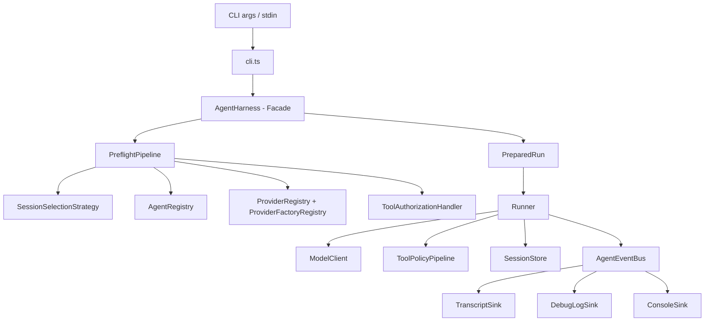
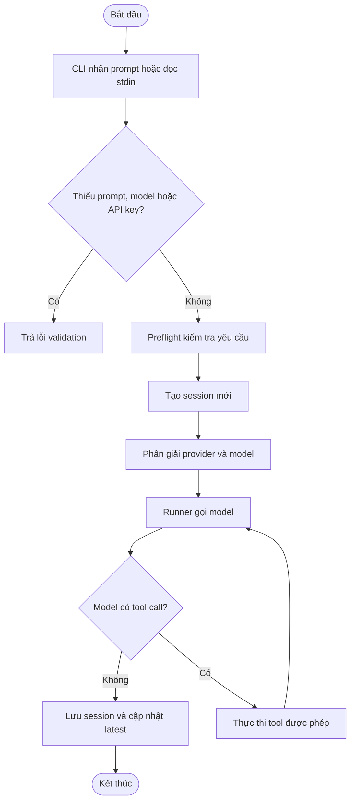
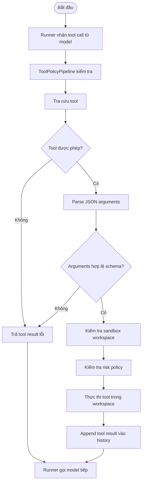
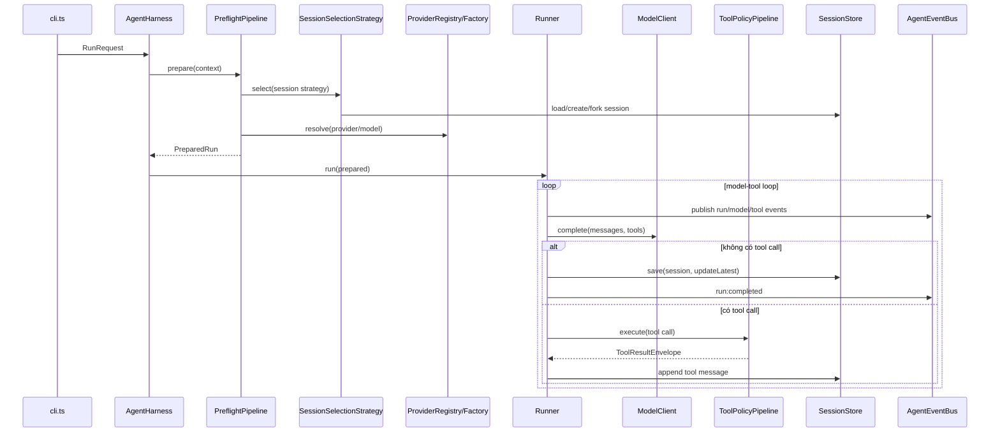
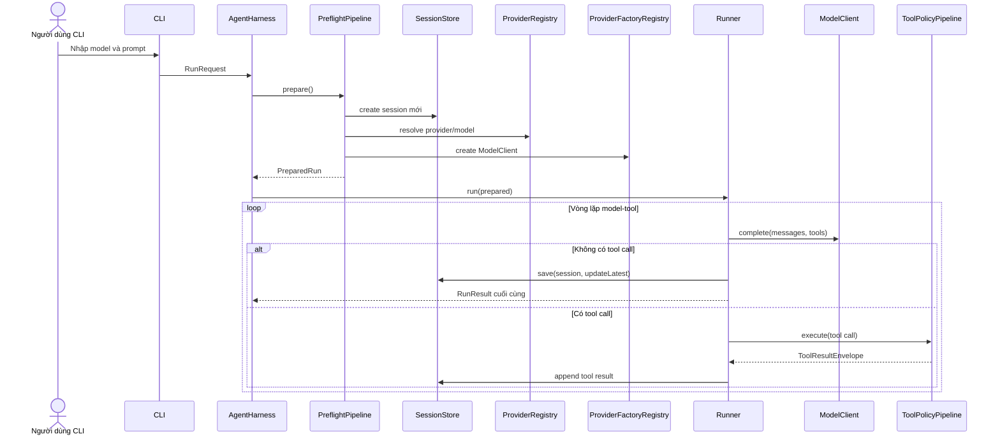
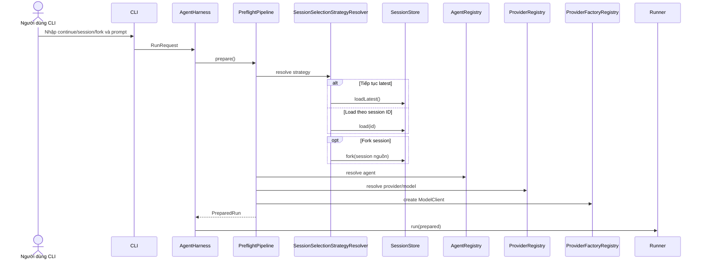
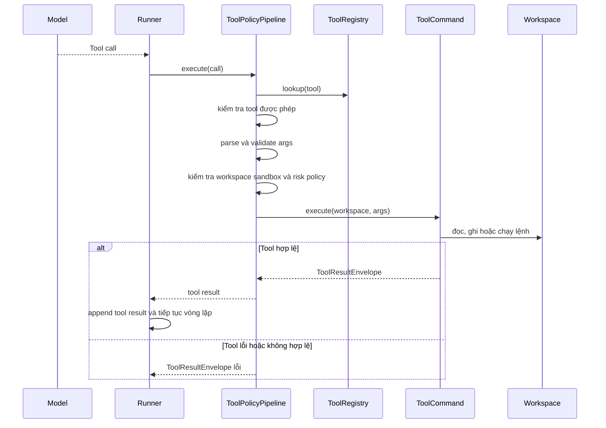
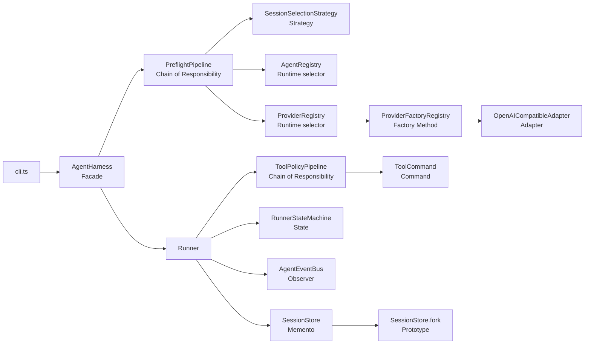
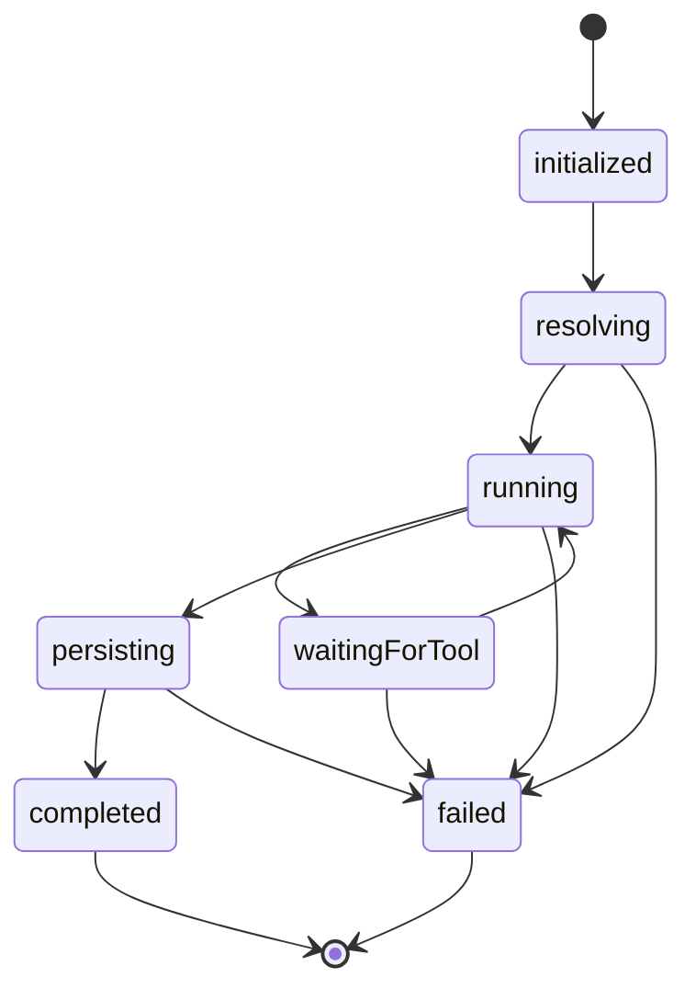

**BÀI TẬP LỚN**

**PHÁT TRIỂN DỰ ÁN PHẦN MỀM**

**Đề Tài:**

**FantasticCode - CLI Agent Harness Hỗ Trợ Lập Trình**

Nhóm thực hiện: Nhóm 7 - 65KTPM

Giảng viên hướng dẫn: TS.Cù Việt Dũng

*Hà Nội, 2026*

**MỤC LỤC**

# **LỜI NÓI ĐẦU**

Trong bối cảnh trí tuệ nhân tạo ngày càng được ứng dụng sâu vào hoạt động phát triển phần mềm, các công cụ hỗ trợ lập trình không chỉ dừng lại ở việc gợi ý mã nguồn mà còn có thể tham gia vào quá trình đọc mã, chỉnh sửa tệp, chạy lệnh kiểm thử và lưu lại ngữ cảnh làm việc. Điều này đặt ra nhu cầu xây dựng một khung agent đơn giản, dễ kiểm soát, có khả năng hoạt động qua dòng lệnh và thể hiện rõ các nguyên lý thiết kế phần mềm trong một hệ thống thực tế.

Xuất phát từ nhu cầu đó, đề tài **FantasticCode** được xây dựng như một khung CLI agent harness bằng TypeScript. Hệ thống cho phép người dùng gửi yêu cầu thông qua các tham số dòng lệnh, lựa chọn mô hình theo định dạng `provider/model`, kết nối tới các endpoint tương thích OpenAI, thực thi một tập công cụ an toàn trong phạm vi workspace và lưu trữ phiên làm việc để có thể tiếp tục hoặc rẽ nhánh ở các lần chạy sau.

Điểm trọng tâm của dự án không chỉ nằm ở chức năng gọi mô hình AI, mà còn ở cách tổ chức kiến trúc theo các mẫu thiết kế trong sách Gang of Four. FantasticCode được thiết kế để minh họa các mẫu như Facade, Strategy, Adapter, Command, Memento, Prototype, Factory Method, Chain of Responsibility, Observer và State thông qua các thành phần cụ thể: `AgentHarness`, `ProviderAdapter`, `ToolCommand`, `SessionStore`, `RunnerStateMachine`, `AgentEventBus` và các pipeline kiểm soát an toàn.

Tài liệu này trình bày quá trình phân tích yêu cầu, lập kế hoạch, thiết kế kiến trúc, tổ chức mã nguồn và kiểm thử cho dự án FantasticCode. Nội dung được viết nhằm làm rõ cách một hệ thống CLI agent nhỏ có thể được phát triển theo hướng có cấu trúc, có khả năng mở rộng và có cơ sở kiểm chứng bằng kiểm thử tự động.

Mặc dù đã rất cố gắng trong quá trình xây dựng và hoàn thiện tài liệu, đề tài khó tránh khỏi những thiếu sót nhất định. Nhóm chúng em kính mong nhận được sự góp ý và chỉ dẫn thêm từ thầy để bài làm được hoàn thiện hơn.

Chúng em xin trân trọng cảm ơn!

# **I. PHÂN TÍCH YÊU CẦU KHÁCH HÀNG**

## **1. Bản kế hoạch quản lý yêu cầu (RMP)**

### **1.1. Giới thiệu**

#### ***1.1.1. Mục đích***

Tài liệu Kế hoạch Quản lý Yêu cầu (Requirements Management Plan - RMP) này được xây dựng nhằm xác định cách thu thập, phân tích, đặc tả và kiểm soát các yêu cầu của dự án **FantasticCode**. Đây là một khung CLI agent harness bằng TypeScript, phục vụ việc chạy agent lập trình thông qua dòng lệnh, kết nối tới provider tương thích OpenAI, thực thi công cụ trong phạm vi workspace và lưu trữ phiên làm việc có thể tiếp tục hoặc rẽ nhánh.

Tài liệu đóng vai trò là cơ sở để:

##### 1. Xác định rõ phạm vi chức năng của CLI agent harness;
##### 2. Liên kết nhu cầu người dùng với các tính năng đã thiết kế và triển khai;
##### 3. Kiểm soát các thay đổi yêu cầu trong quá trình phát triển;
##### 4. Làm tài liệu tham chiếu cho các phần lập kế hoạch, thiết kế kiến trúc và kiểm thử.

#### ***1.1.2. Phạm vi áp dụng***

Bản RMP này áp dụng cho toàn bộ yêu cầu của FantasticCode trong phạm vi phiên bản hiện tại. Hệ thống tập trung vào CLI scriptable, không xây dựng giao diện TUI, không vận hành như một chatbot tương tác liên tục và không mở rộng sang nền tảng plugin hoàn chỉnh. Các yêu cầu chính bao gồm xử lý tham số dòng lệnh, quản lý session, chọn provider/model, chọn agent preset, thực thi công cụ an toàn và ghi nhận sự kiện chạy.

### **1.2. Công cụ sử dụng và các kiểu yêu cầu**

#### ***1.2.1. Các công cụ sử dụng quản lý yêu cầu***

| **STT** | **Công cụ** | **Mục đích sử dụng** |
| --- | --- | --- |
| 1 | Markdown | Soạn thảo tài liệu phát triển, tài liệu thiết kế và mô tả yêu cầu. |
| 2 | Git | Quản lý lịch sử thay đổi mã nguồn và tài liệu. |
| 3 | TypeScript / Node.js | Xây dựng CLI, định nghĩa interface và kiểm tra kiểu tĩnh. |
| 4 | npm / Vitest | Chạy kiểm thử, build, typecheck và kiểm tra chất lượng dự án. |
| 5 | README và tài liệu thiết kế | Làm nguồn đối chiếu cho phạm vi, kiến trúc và cách sử dụng hệ thống. |

#### ***1.2.2. Các kiểu yêu cầu cho dự án***

| **Loại yêu cầu** | **Loại tài liệu** | **Mô tả** |
| --- | --- | --- |
| Yêu cầu của các bên liên quan (STRQ) | Yêu cầu của các bên liên quan (STR) | Mô tả nhu cầu của người dùng CLI, người duy trì dự án, người kiểm thử và hệ thống provider bên ngoài. |
| Yêu cầu tính năng (FEAT) | Tài liệu tầm nhìn (VIS) | Mô tả các chức năng chính như chạy prompt, chọn model, quản lý session, gọi tool và ghi log. |
| Ca sử dụng (UC) / Kịch bản (SC) | Đặc tả ca sử dụng (UCS) | Mô tả các tình huống người dùng chạy agent, tiếp tục session, fork session và để model gọi tool. |
| Yêu cầu bổ sung (SUPL) | Đặc tả bổ sung (SS) | Mô tả các yêu cầu phi chức năng về an toàn workspace, khả năng kiểm thử, giới hạn tài nguyên và tính tương thích. |

#### ***1.2.3. Loại tài liệu yêu cầu cho dự án***

| **Loại tài liệu** | **Mô tả** | **Loại yêu cầu mặc định** |
| --- | --- | --- |
| Kế hoạch quản lý yêu cầu (RMP) | Tài liệu mô tả phương pháp, phạm vi và công cụ quản lý yêu cầu của FantasticCode. | Không áp dụng |
| Yêu cầu của các bên liên quan (STR) | Tập hợp các nhu cầu chính từ người dùng CLI, maintainer và người kiểm thử. | STRQ |
| Tài liệu tầm nhìn (VIS) | Mô tả mục tiêu sản phẩm, phạm vi và tính năng chính. | FEAT |
| Đặc tả ca sử dụng (UCS) | Mô tả cách actor tương tác với hệ thống qua CLI, session và tool call. | UC / SC |
| Đặc tả bổ sung (SS) | Mô tả ràng buộc kỹ thuật, an toàn, logging, giới hạn tài nguyên và kiểm thử. | SUPL |

### **1.3. Các nhân tố tham gia dự án phần mềm**

| **Nhóm / vai trò** | **Số lượng** | **Nhiệm vụ chính** |
| --- | --- | --- |
| Phân tích yêu cầu | 1-2 | Xác định phạm vi CLI harness, actor, luồng sử dụng và tiêu chí nghiệm thu. |
| Thiết kế kiến trúc | 1-2 | Thiết kế module, interface, pattern GoF, session flow, provider adapter và policy pipeline. |
| Phát triển | 2-3 | Cài đặt CLI, provider, session store, runner, tools, event bus và state machine. |
| Kiểm thử | 1-2 | Viết kiểm thử cho CLI, provider, session, runner, tool policy, workspace safety và e2e flow. |
| Tài liệu | 1 | Viết README, tài liệu thiết kế và tài liệu phát triển dự án. |

### **1.4. Bảng liên lạc với các nhân tố chính (Stakeholder)**

| **STT** | **Nhân tố chính** | **Vai trò trong dự án** | **Trách nhiệm chính** | **Hình thức liên lạc** |
| --- | --- | --- | --- | --- |
| 1 | Người dùng CLI | Người sử dụng chính | Chạy agent, cung cấp prompt, chọn model, tiếp tục hoặc fork session. | Trao đổi trực tiếp, tài liệu hướng dẫn |
| 2 | Nhóm phát triển | Đơn vị thực hiện | Thiết kế và triển khai các module CLI, provider, runner, tools và session. | Git, Discord, họp nhóm |
| 3 | Người kiểm thử | Đảm bảo chất lượng | Xác nhận chức năng CLI, session, provider, tool safety và luồng e2e. | Test report, issue, trao đổi nhóm |
| 4 | Maintainer dự án | Quản lý kỹ thuật | Kiểm soát kiến trúc, dependency, quy ước mã nguồn và phạm vi tính năng. | Review mã nguồn, tài liệu thiết kế |
| 5 | Provider AI bên ngoài | Hệ thống phụ thuộc | Cung cấp endpoint chat completion tương thích OpenAI và phản hồi tool calls. | API, biến môi trường, tài liệu provider |

## **2. Tài liệu yêu cầu người dùng (STR)**

### **2.1. Mục đích**

Tài liệu này mô tả nhu cầu, mong đợi và yêu cầu chính của các bên liên quan đối với FantasticCode. Nội dung tập trung vào hành vi người dùng có thể quan sát được qua CLI, các ràng buộc khi chọn provider/model, cách quản lý session và yêu cầu an toàn khi agent thực thi công cụ trên workspace.

### **2.2. Phạm vi**

Phạm vi yêu cầu bao gồm toàn bộ luồng chạy agent từ lúc người dùng nhập lệnh, hệ thống kiểm tra tham số, chuẩn bị session/provider/agent/tool, gọi provider AI, xử lý tool call, lưu session và trả kết quả. Tài liệu không mô tả các chức năng ngoài phạm vi hiện tại như giao diện TUI, plugin marketplace, streaming UI, telemetry từ xa hoặc hỗ trợ provider tùy biến qua CLI.

### **2.3. Yêu cầu thu thập từ Stakeholder**

| **Stakeholder** | **Phương pháp thu thập yêu cầu** | **Yêu cầu (STRQ)** |
| --- | --- | --- |
| Người dùng CLI | Phân tích kịch bản sử dụng | STRQ-01: Người dùng cần chạy agent bằng tham số dòng lệnh như `--model`, `--prompt`, `--continue`, `--session`, `--fork`, `--agent`, `--workspace` và `--debug`. |
| Người dùng CLI | Phân tích thao tác nhập liệu | STRQ-02: Người dùng cần nhập prompt trực tiếp qua `--prompt` hoặc truyền nội dung qua stdin khi chạy script. |
| Người dùng CLI | Phân tích vòng đời làm việc | STRQ-03: Người dùng cần tạo session mới, tiếp tục session gần nhất, mở session theo ID và fork session để thử hướng xử lý khác. |
| Maintainer dự án | Phân tích ràng buộc kỹ thuật | STRQ-04: Hệ thống cần chọn model theo dạng `provider/model`, lấy API key từ biến môi trường và hỗ trợ endpoint tương thích OpenAI. |
| Nhóm phát triển | Phân tích kiến trúc | STRQ-05: Hệ thống cần hỗ trợ agent preset, trong đó mỗi preset quy định system prompt, tool được phép dùng và giới hạn số lượt tool. |
| Người kiểm thử | Phân tích kịch bản kiểm thử | STRQ-06: Hệ thống cần có các công cụ `read`, `edit`, `apply_patch` và `bash`, đồng thời phải kiểm soát quyền gọi tool bằng policy pipeline. |
| Maintainer dự án | Phân tích an toàn | STRQ-07: Hệ thống cần giới hạn file và lệnh trong workspace, chặn path traversal, chặn file nhị phân/quá lớn và từ chối lệnh shell nguy hiểm. |
| Người kiểm thử | Phân tích khả năng truy vết | STRQ-08: Hệ thống cần lưu session, transcript và sự kiện chạy để có thể kiểm tra lại quá trình agent thực hiện tác vụ. |
| Nhóm phát triển | Phân tích lỗi vận hành | STRQ-09: Hệ thống cần báo lỗi rõ ràng khi prompt rỗng, thiếu model cho session mới, session mơ hồ, provider không hợp lệ hoặc tool call sai schema. |
| Người đọc tài liệu | Phân tích mục tiêu học tập | STRQ-10: Hệ thống cần thể hiện rõ các mẫu thiết kế GoF trong kiến trúc thực tế thay vì chỉ mô tả lý thuyết. |

## **3. Tài liệu đặc trưng (VIS)**

### **3.1. Mục đích**

Tài liệu tầm nhìn xác định mục tiêu sản phẩm, phạm vi chức năng và các đặc trưng chính của FantasticCode. Dự án hướng tới việc xây dựng một CLI agent harness nhỏ gọn nhưng có cấu trúc rõ ràng, đủ để minh họa cách một hệ thống agent thực tế tổ chức provider, session, tools, runner, event và state machine.

### **3.2. Phạm vi**

Trong phạm vi:

#### 1. Xây dựng CLI scriptable, không yêu cầu TUI hoặc giao diện web.
#### 2. Hỗ trợ model selector theo định dạng `provider/model`.
#### 3. Hỗ trợ provider tích hợp sẵn gồm `openai` và `openrouter` thông qua HTTP API tương thích OpenAI.
#### 4. Hỗ trợ session mới, session gần nhất, session theo ID và fork session.
#### 5. Hỗ trợ agent preset như `coder` và `reviewer`.
#### 6. Hỗ trợ tool `read`, `edit`, `apply_patch` và `bash` trong workspace.
#### 7. Hỗ trợ preflight validation, tool policy pipeline, runner loop, state machine và event bus.
#### 8. Hỗ trợ kiểm thử tự động bằng TypeScript, Vitest và QA script.

Ngoài phạm vi phiên bản hiện tại:

#### 1. Không xây dựng giao diện TUI, REPL hoặc dashboard.
#### 2. Không hỗ trợ plugin tool động từ bên ngoài.
#### 3. Không cung cấp cơ chế đăng ký provider tùy biến trực tiếp qua CLI.
#### 4. Không triển khai streaming UI hoặc telemetry từ xa.

### **3.3. Tính năng hệ thống**

| **Yêu cầu (STRQ)** | **Kỹ thuật xác định FEAT** | **Tính năng (FEAT)** |
| --- | --- | --- |
| STRQ-01, STRQ-02 | Phân tích CLI và luồng nhập liệu | FEAT-01: CLI nhận tham số `--model`, `--prompt`, `--continue`, `--session`, `--fork`, `--agent`, `--workspace`, `--debug`; prompt có thể lấy từ stdin khi không truyền bằng flag. |
| STRQ-03 | Phân tích vòng đời session | FEAT-02: Session store tạo mới, load theo ID, tiếp tục latest session và fork session với `parentSessionId`. |
| STRQ-04 | Phân tích tích hợp provider | FEAT-03: Provider registry phân giải `provider/model`; provider factory tạo adapter tương thích OpenAI; API key lấy từ biến môi trường. |
| STRQ-05 | Phân tích hành vi agent | FEAT-04: Agent registry cung cấp preset `coder` và `reviewer`, mỗi preset có tool set và giới hạn tool turn riêng. |
| STRQ-06, STRQ-07 | Phân tích tool safety | FEAT-05: Tool registry và tool policy pipeline kiểm tra tool được phép, schema đầu vào, thực thi và chuẩn hóa kết quả. |
| STRQ-08 | Phân tích truy vết hệ thống | FEAT-06: Event bus phát sự kiện chạy, ghi transcript NDJSON và ghi debug NDJSON khi bật `--debug` hoặc biến môi trường. |
| STRQ-09 | Phân tích lỗi và validation | FEAT-07: Preflight pipeline kiểm tra prompt, model, session flag, provider, agent và tool authorization trước khi runner bắt đầu. |
| STRQ-10 | Phân tích mục tiêu học tập | FEAT-08: Kiến trúc module minh họa các mẫu GoF như Facade, Strategy, Adapter, Command, Memento, Prototype, Factory Method, Chain of Responsibility, Observer và State. |

### **3.4. Ràng buộc và yêu cầu chất lượng**

#### ***3.4.1. Ràng buộc***

##### 1. Môi trường chạy: Dự án yêu cầu Node.js từ phiên bản `>=22.12.0`.
##### 2. Kiểu dự án: Mã nguồn được viết bằng TypeScript theo module ESM.
##### 3. Provider: Phiên bản hiện tại chỉ tích hợp sẵn `openai` và `openrouter`; các provider này dùng API tương thích OpenAI.
##### 4. Model selector: Session mới bắt buộc có `--model provider/model`; session tiếp tục có thể dùng lại provider/model đã lưu.
##### 5. Bảo mật workspace: Công cụ file và shell phải bị giới hạn trong workspace của dự án.
##### 6. Debug: Debug log được bật bằng tham số `--debug` hoặc biến môi trường `FANTASTICCODE_DEBUG=1`.

#### ***3.4.2. Yêu cầu chất lượng***

##### 1. An toàn: Hệ thống phải chặn path traversal, file nhị phân, file đọc quá giới hạn và các lệnh shell có rủi ro phá hủy dữ liệu.
##### 2. Độ tin cậy: Session phải được ghi ổn định, có latest pointer và có thể lưu cả khi runner gặp lỗi.
##### 3. Dễ sử dụng: CLI phải trả kết quả cuối cùng qua stdout và thông báo lỗi qua stderr.
##### 4. Dễ kiểm thử: Các thành phần chính như CLI, provider, session, runner, tool policy và state machine phải có kiểm thử tự động.
##### 5. Dễ mở rộng: Provider, agent và tool được tổ chức qua registry/factory/interface để giảm phụ thuộc trực tiếp giữa các module.

## **4. Tài liệu UseCase (UCS)**

### **4.1. Mục đích**

Tài liệu Đặc tả Ca sử dụng (UCS) mô tả các tương tác chính giữa người dùng CLI, agent/model, provider AI bên ngoài và hệ thống FantasticCode. Các ca sử dụng này là cơ sở để thiết kế luồng xử lý, viết kiểm thử và nghiệm thu chức năng.

### **4.2. Phạm vi**

Tài liệu tập trung vào các ca sử dụng thuộc phạm vi CLI agent harness:

- Chạy một session mới từ prompt và model selector.
- Tiếp tục session gần nhất hoặc session theo ID.
- Fork session để tạo nhánh xử lý mới.
- Cho phép model gọi tool trong workspace.
- Lưu session và ghi nhận sự kiện chạy.

### **4.3. Sơ đồ UseCase**

#### 4.3.1. Sơ đồ Use Case tổng quát

Sơ đồ tổng quát có thể biểu diễn bằng các actor sau: Người dùng CLI, FantasticCode CLI, Provider AI, Workspace và Session Store. Người dùng gửi prompt qua CLI; CLI chuẩn bị context; Provider AI sinh phản hồi hoặc tool call; Workspace cung cấp quyền đọc/ghi/chạy lệnh có kiểm soát; Session Store lưu lại lịch sử chạy.

#### 4.3.2. Sơ đồ phân rã Module Use Case

Các module use case chính gồm: quản lý tham số CLI, quản lý session, phân giải provider/model, chọn agent preset, kiểm soát tool call, thực thi runner loop và ghi nhận sự kiện.

## **5. Kịch bản use case (UCS)**

### **5.1. Đặc tả use case: Chạy session mới**

| **Tên use case** | Chạy session mới |
| --- | --- |
| Tác nhân chính | Người dùng CLI |
| Mục đích | Gửi prompt đầu tiên tới agent và tạo session mới. |
| Mức độ ưu tiên | Cao |
| Điều kiện kích hoạt | Người dùng chạy `fantasticcode --model <provider/model> --prompt <nội dung>`. |
| Điều kiện tiên quyết | Provider hợp lệ, API key tồn tại trong biến môi trường, prompt không rỗng. |
| Điều kiện thành công | Hệ thống trả kết quả cuối cùng, lưu session và cập nhật latest pointer. |
| Điều kiện thất bại | Thiếu model, thiếu API key, prompt rỗng hoặc provider trả lỗi. |
| Luồng sự kiện chính | CLI nhận lệnh, preflight kiểm tra yêu cầu, tạo session, gọi provider, xử lý tool call nếu có, lưu session, in kết quả. |
| Luồng sự kiện thay thế | Nếu không có `--prompt`, CLI đọc nội dung từ stdin pipe. |
| Luồng sự kiện ngoại lệ | Nếu stdin là terminal và prompt rỗng, hệ thống báo lỗi validation. |

### **5.2. Đặc tả use case: Tiếp tục hoặc fork session**

| **Tên use case** | Tiếp tục hoặc fork session |
| --- | --- |
| Tác nhân chính | Người dùng CLI |
| Mục đích | Tái sử dụng ngữ cảnh cũ hoặc tạo nhánh session mới để thử hướng xử lý khác. |
| Mức độ ưu tiên | Cao |
| Điều kiện kích hoạt | Người dùng chạy `--continue`, `--session <id>`, hoặc kết hợp với `--fork`. |
| Điều kiện tiên quyết | Session nguồn tồn tại trong workspace. |
| Điều kiện thành công | Hệ thống load đúng session; nếu fork thì tạo session ID mới có `parentSessionId`. |
| Điều kiện thất bại | Dùng đồng thời `--continue` và `--session`, dùng `--fork` nhưng không có session nguồn, hoặc session ID không tồn tại. |
| Luồng sự kiện chính | CLI nhận lệnh, session strategy chọn latest/session ID, runner chạy tiếp với lịch sử đã lưu. |
| Luồng sự kiện thay thế | Người dùng truyền `--agent` để ghi đè agent preset cho lần chạy hiện tại. |
| Luồng sự kiện ngoại lệ | Nếu latest pointer không tồn tại khi dùng `--continue`, hệ thống báo lỗi session. |

### **5.3. Đặc tả use case: Model gọi công cụ**

| **Tên use case** | Model gọi công cụ |
| --- | --- |
| Tác nhân chính | Agent/model |
| Mục đích | Cho phép model đọc, chỉnh sửa, áp dụng patch hoặc chạy lệnh trong workspace một cách có kiểm soát. |
| Mức độ ưu tiên | Cao |
| Điều kiện kích hoạt | Provider trả về tool call trong phản hồi chat completion. |
| Điều kiện tiên quyết | Tool nằm trong danh sách được agent preset cho phép và input đúng schema. |
| Điều kiện thành công | Tool được thực thi, kết quả được append vào message history và runner tiếp tục vòng lặp. |
| Điều kiện thất bại | Tool không tồn tại, không được phép, input sai schema, truy cập ngoài workspace hoặc lệnh bash bị policy từ chối. |
| Luồng sự kiện chính | Runner nhận tool call, tool policy kiểm tra, tool thực thi, event bus ghi nhận, kết quả trả về model. |
| Luồng sự kiện thay thế | Nếu tool lỗi có kiểm soát, hệ thống trả tool result dạng lỗi để runner lưu lại. |
| Luồng sự kiện ngoại lệ | Nếu runner vượt quá giới hạn lượt tool của agent, hệ thống dừng và báo lỗi runner. |

## **6. Các yêu cầu phi chức năng**

### **6.1. Mục đích**

Mục này xác định các tiêu chuẩn chất lượng, ràng buộc kỹ thuật và điều kiện vận hành mà FantasticCode phải đáp ứng. Vì hệ thống có khả năng đọc/ghi file và chạy lệnh, các yêu cầu phi chức năng tập trung mạnh vào an toàn workspace, độ tin cậy session, giới hạn tài nguyên và khả năng kiểm thử.

### **6.2. Phạm vi**

Các yêu cầu phi chức năng áp dụng cho toàn bộ các thành phần của FantasticCode, bao gồm CLI, preflight pipeline, provider adapter, session store, runner, tool policy pipeline, workspace boundary, event bus và bộ kiểm thử.

### **6.3. Chi tiết các yêu cầu phi chức năng**

| **Mã yêu cầu** | **Yếu tố chất lượng** | **Tiêu chuẩn đáp ứng** |
| --- | --- | --- |
| NFR-01 | An toàn workspace | File tool và bash chỉ được hoạt động trong workspace; hệ thống phải chặn path traversal và truy cập ngoài phạm vi. |
| NFR-02 | An toàn lệnh shell | Bash tool phải có timeout, giới hạn output và từ chối các lệnh phá hủy như `rm -rf`, `git reset --hard`, `format`. |
| NFR-03 | Giới hạn tài nguyên | Read tool giới hạn 128KB; stdout/stderr của bash giới hạn 64KB; timeout bash mặc định 10 giây và tối đa 30 giây. |
| NFR-04 | Độ tin cậy session | Session phải lưu được lịch sử message, provider, model, agent, metadata và latest pointer; fork session phải giữ liên kết cha. |
| NFR-05 | Tương thích provider | Provider tích hợp sẵn phải dùng chat completions tương thích OpenAI và chuẩn hóa phản hồi về định dạng nội bộ. |
| NFR-06 | Quan sát được | Hệ thống phải ghi transcript NDJSON; debug log được ghi khi bật `--debug` hoặc `FANTASTICCODE_DEBUG=1`; sự kiện chính được phát qua event bus. |
| NFR-07 | Dễ sử dụng | CLI phải hỗ trợ help, stdout cho kết quả cuối cùng và stderr cho lỗi/sự kiện hệ thống. |
| NFR-08 | Dễ bảo trì | Các module phải tách trách nhiệm rõ ràng: CLI, harness, preflight, provider, session, runner, tools, events và state machine. |
| NFR-09 | Kiểm thử được | Dự án phải có kiểm thử tự động cho CLI, provider, session, runner, tool policy, workspace safety, event bus và e2e flow. |
| NFR-10 | Giới hạn phạm vi v1 | Không yêu cầu TUI, REPL, plugin runtime, provider tùy biến qua CLI hoặc telemetry từ xa trong phiên bản hiện tại. |

# **II. LẬP KẾ HOẠCH DỰ ÁN**

## **1. Bảng phân chia công việc**

| **MSV** | **Họ và tên** | **Phạm vi phụ trách** | **2 mẫu thiết kế phụ trách** |
| --- | --- | --- | --- |
| 2321170611 | Nguyễn Hồng Phúc | Quản lý dự án, `AgentHarness`, session Strategy và provider/agent selectors | Facade, Strategy |
| 2321170631 | Ngô Quang Tùng | Provider adapter, provider factory, chuẩn hóa model client | Adapter, Factory Method |
| 2321170609 | Nguyễn Hải Ninh | Tool commands, preflight pipeline, tool policy và workspace safety | Command, Chain of Responsibility |
| 2321060422 | Ngô Đức Nam Khánh | Session store, session snapshot, continue và fork session | Memento, Prototype |
| 2321170630 | Hoàng Tùng | Event bus, transcript/debug sinks, runner state machine và QA liên quan | Observer, State |

## **2. Giới thiệu**

### **2.1. Mục tiêu dự án**

#### 2.1.1. Mục tiêu tổng quát

- Xây dựng **FantasticCode** thành một CLI agent harness viết bằng TypeScript, có thể chạy bằng tham số dòng lệnh và phù hợp cho các tác vụ lập trình có hỗ trợ AI.
- Hỗ trợ kết nối tới provider tương thích OpenAI thông qua định dạng `provider/model`.
- Cho phép agent sử dụng bộ công cụ an toàn trong workspace gồm `read`, `edit`, `apply_patch` và `bash`.
- Lưu lại phiên làm việc để người dùng có thể tiếp tục, mở lại theo ID hoặc fork thành nhánh mới.
- Minh họa việc áp dụng các mẫu thiết kế GoF trong một hệ thống agent nhỏ nhưng có cấu trúc thực tế.

#### 2.1.2. Mục tiêu cụ thể

- Chuẩn hóa luồng chạy CLI từ `cli.ts` tới `AgentHarness` và `Runner`.
- Cài đặt cơ chế phân tích model selector theo dạng `provider/model`.
- Thiết kế provider registry, provider factory và adapter cho endpoint OpenAI-compatible.
- Thiết kế session store dùng file JSON, hỗ trợ tạo mới, load, continue và fork.
- Cài đặt agent registry với các preset như `coder` và `reviewer`.
- Tổ chức tool registry và tool policy pipeline để kiểm soát tool call.
- Bảo vệ workspace bằng path sandbox, atomic write, giới hạn file/output và denylist lệnh nguy hiểm.
- Phát sự kiện chạy qua event bus và ghi transcript/debug log khi bật `--debug` hoặc cấu hình môi trường.
- Xây dựng bộ kiểm thử tự động bằng Vitest và quy trình QA bằng `npm run qa`.

#### 2.1.3. Phạm vi giới hạn của mục tiêu

- Không xây dựng TUI, REPL, dashboard hoặc giao diện web.
- Không triển khai plugin runtime hoặc marketplace tool.
- Không cung cấp cơ chế đăng ký provider tùy biến trực tiếp qua CLI trong phiên bản hiện tại.
- Không dùng cơ sở dữ liệu quan hệ; session và log được lưu bằng file JSON/NDJSON.
- Không gọi dịch vụ provider thật trong kiểm thử tự động; test dùng server giả lập OpenAI-compatible.

### **2.2. Phạm vi dự án**

#### 2.2.1. Phạm vi trong dự án

- CLI nhận các tham số `--model`, `--prompt`, `--continue`, `--session`, `--fork`, `--agent` và `--workspace`.
- Prompt có thể truyền trực tiếp bằng flag hoặc qua stdin pipe.
- Provider tích hợp sẵn gồm `openai` và `openrouter`, dùng HTTP API tương thích OpenAI.
- Session được lưu dưới `.fantasticcode/sessions/`, có `latest.json` và ID dạng `sess_<32-hex>`.
- Runner điều phối model call, tool call, tool result, state machine và session persistence.
- Tool `read`, `edit`, `apply_patch`, `bash` hoạt động trong workspace và được kiểm soát bằng policy.
- QA gồm typecheck, Vitest, build, package dry-run và CLI help smoke test.

#### 2.2.2. Phạm vi ngoài dự án

- Không quản lý tài khoản người dùng, phân quyền web hoặc dữ liệu doanh nghiệp.
- Không triển khai dashboard quan sát, telemetry từ xa hoặc hệ thống phân tán.
- Không quản lý nhiều workspace đồng thời trong một phiên chạy.
- Không hỗ trợ streaming UI trong tài liệu phiên bản hiện tại.
- Không bảo đảm mọi provider OpenAI-compatible đều có cùng capability; hệ thống chỉ kiểm tra và báo lỗi trong phạm vi adapter hiện có.

## **3. Tổ chức dự án**

### **3.1. Cơ cấu tổ chức**

**Chủ đề dự án:** FantasticCode - CLI Agent Harness Hỗ Trợ Lập Trình

**Quản lý dự án:** Nguyễn Hồng Phúc

**Nhóm phát triển dự án:** Một nhóm FantasticCode thống nhất gồm 5 thành viên. Nhóm không tách thành nhiều team độc lập; mỗi thành viên phụ trách một phần chức năng và 2 mẫu thiết kế GoF, sau đó tích hợp chung trong cùng codebase.

| **Thành viên** | **Mẫu thiết kế phụ trách** | **Module/đầu ra chính** |
| --- | --- | --- |
| Nguyễn Hồng Phúc | Facade, Strategy | `AgentHarness`, session Strategy, provider/agent selectors, điều phối kế hoạch và tài liệu yêu cầu. |
| Ngô Quang Tùng | Adapter, Factory Method | `OpenAICompatibleAdapter`, `ProviderRegistry`, `ProviderFactoryRegistry`, chuẩn hóa provider/model. |
| Nguyễn Hải Ninh | Command, Chain of Responsibility | `ToolCommand`, `ReadTool`, `EditTool`, `ApplyPatchTool`, `BashTool`, `PreflightPipeline`, `ToolPolicyPipeline`. |
| Ngô Đức Nam Khánh | Memento, Prototype | `SessionStore`, session JSON, latest pointer, continue và fork session. |
| Hoàng Tùng | Observer, State | `AgentEventBus`, transcript/debug sinks, `RunnerStateMachine`, kiểm thử luồng event/state. |

### **3.2. Vai trò và trách nhiệm**

| **Vai trò** | **Trách nhiệm** |
| --- | --- |
| Quản lý và lập kế hoạch dự án | Cả nhóm thống nhất phạm vi, chia mẫu thiết kế, theo dõi tiến độ và kiểm soát thay đổi. |
| Phân tích yêu cầu | Cả nhóm cùng xác định CLI flags, session semantics, provider support, tools và yêu cầu phi chức năng. |
| Thiết kế hệ thống | Mỗi thành viên thiết kế phần module gắn với 2 mẫu GoF được phân công, sau đó review chéo trong nhóm. |
| Lập trình viên | Cả nhóm cùng phát triển trên một codebase, tập trung vào các module đã phân công trong bảng trên. |
| Kiểm thử | Mỗi thành viên viết hoặc cập nhật test cho module mình phụ trách; nhóm chạy chung `npm run qa` trước nghiệm thu. |
| Tài liệu / release | Cả nhóm cập nhật tài liệu thiết kế, tài liệu phát triển, README và checklist phát hành. |

### **3.3. Phạm vi tài nguyên**

- Ngôn ngữ và nền tảng: TypeScript, Node.js `>=22.12.0`, ESM.
- Công cụ phát triển: npm, tsx, TypeScript compiler, Visual Studio Code, Git.
- Công cụ CLI: Commander.
- Công cụ kiểm thử: Vitest, temp workspace fixture, OpenAI-compatible stub server.
- Script chất lượng: `npm run typecheck`, `npm test -- --run`, `npm run build`, `npm run qa`.
- Tài liệu tham chiếu: `README.md`, `docs/agent-harness-design.md`, mã nguồn trong `src/` và kiểm thử trong `test/`.

## **4. Phân tích rủi ro**

### **4.1. Bảng phân tích rủi ro**

| **STT** | **Rủi ro** | **Xác suất** | **Tác động** | **Giải pháp** |
| --- | --- | --- | --- | --- |
| 1 | Mở rộng phạm vi vượt khỏi CLI harness | Trung bình | Cao | Chốt rõ phạm vi v1, từ chối TUI/plugin/dashboard nếu chưa có yêu cầu chính thức. |
| 2 | Khác biệt giữa các provider OpenAI-compatible | Trung bình | Cao | Giữ `ModelClient` làm contract nội bộ, normalize response và test bằng stub server. |
| 3 | Tool đọc/ghi/chạy lệnh gây ảnh hưởng ngoài workspace | Thấp | Rất cao | Dùng workspace sandbox, atomic write, output cap, timeout và denylist lệnh nguy hiểm. |
| 4 | Session bị lỗi hoặc latest pointer sai | Trung bình | Cao | Ghi file atomic, kiểm thử create/load/continue/fork, lưu `parentSessionId` khi fork. |
| 5 | Luồng runner/tool loop bị lặp vô hạn | Thấp | Cao | Dùng `maxToolTurns` theo agent preset và state machine có trạng thái lỗi terminal. |
| 6 | Thiếu test cho các tổ hợp flag biên | Trung bình | Trung bình | Bổ sung test CLI/preflight cho `--continue`, `--session`, `--fork`, prompt rỗng. |
| 7 | Môi trường Node/npm không tương thích | Thấp | Trung bình | Khai báo engine Node `>=22.12.0` và chạy QA trên môi trường thống nhất. |
| 8 | Tài liệu mô tả quá mức so với triển khai | Trung bình | Trung bình | Đối chiếu tài liệu với README, source và test trước khi nghiệm thu. |

### **4.2. Công thức tính độ rủi ro**

Áp dụng phân tích rủi ro định tính:

- Xác suất (P): Cao = 3, Trung bình = 2, Thấp = 1.
- Tác động (I): Rất cao = 4, Cao = 3, Trung bình = 2, Thấp = 1.

**Công thức:** R = P x I

### **4.3. Bảng tính toán cụ thể**

| **STT** | **Rủi ro** | **P** | **I** | **R** | **Phân loại** |
| --- | --- | --- | --- | --- | --- |
| 1 | Mở rộng phạm vi vượt khỏi CLI harness | 2 | 3 | 6 | Cao |
| 2 | Khác biệt giữa các provider OpenAI-compatible | 2 | 3 | 6 | Cao |
| 3 | Tool ảnh hưởng ngoài workspace | 1 | 4 | 4 | Trung bình |
| 4 | Session/latest pointer sai | 2 | 3 | 6 | Cao |
| 5 | Runner/tool loop lặp vô hạn | 1 | 3 | 3 | Thấp/Trung bình |
| 6 | Thiếu test tổ hợp flag biên | 2 | 2 | 4 | Trung bình |
| 7 | Môi trường Node/npm không tương thích | 1 | 2 | 2 | Thấp |
| 8 | Tài liệu mô tả quá mức so với triển khai | 2 | 2 | 4 | Trung bình |

Phân loại:

- R = 1-3: Rủi ro thấp, theo dõi trong quá trình phát triển.
- R = 4-6: Rủi ro đáng chú ý, cần có biện pháp phòng ngừa.
- R = 7-12: Rủi ro cao, cần ưu tiên xử lý và có phương án dự phòng.

### **4.4. Cơ sở xác định các tham số thời gian**

#### ***4.4.1. Bảng chuyển đổi rủi ro thành thời gian dự phòng***

| **Mức rủi ro** | **Hệ số dự phòng** | **Áp dụng cho FantasticCode** |
| --- | --- | --- |
| Thấp | +10% | Lỗi nhỏ về tài liệu, định dạng hoặc help text. |
| Trung bình | +20% đến +30% | Lỗi test, sai session semantics, thiếu validation. |
| Cao | +40% đến +60% | Lỗi provider/tool safety/runner loop cần sửa kiến trúc. |

#### ***4.4.2. Các yếu tố thuận lợi***

| **STT** | **Yếu tố thuận lợi** | **Tác động** |
| --- | --- | --- |
| 1 | Repo có tài liệu thiết kế `docs/agent-harness-design.md` | Giảm thời gian phân tích kiến trúc. |
| 2 | Module đã tách rõ trong `src/` | Dễ chia việc và kiểm thử độc lập. |
| 3 | Có bộ test trong `test/` và QA script | Giảm rủi ro hồi quy khi chỉnh sửa. |
| 4 | Provider được giả lập bằng stub server trong test | Không phụ thuộc API thật khi kiểm thử. |

## **5. Lập lịch dự án sử dụng phương pháp PERT/CPM**

### **5.1. Công thức PERT**

Áp dụng công thức thời gian kỳ vọng:

te = (to + 4tm + tp) / 6

Trong đó:

- to: thời gian lạc quan.
- tm: thời gian khả thi nhất.
- tp: thời gian bi quan.

### **5.2. Bảng danh mục công việc**

| **Mã** | **Tên công việc** | **CV trước** | **to** | **tm** | **tp** | **te** |
| --- | --- | --- | ---: | ---: | ---: | ---: |
| A | Chốt yêu cầu và phạm vi | - | 1 | 2 | 3 | 2.0 |
| B | Thiết kế kiến trúc và interface | A | 1 | 2 | 4 | 2.2 |
| C | Phát triển CLI, model-id, agent registry | B | 2 | 3 | 5 | 3.2 |
| D | Phát triển provider và session | C | 2 | 4 | 6 | 4.0 |
| E | Phát triển tools, tool policy, workspace safety | C, D | 2 | 4 | 7 | 4.2 |
| F | Phát triển preflight, runner, state machine, events | D, E | 3 | 5 | 8 | 5.2 |
| G | Kiểm thử, sửa lỗi và hardening | F | 2 | 4 | 6 | 4.0 |
| H | Đóng gói, README, tài liệu phát triển | G | 1 | 2 | 3 | 2.0 |

Tổng thời gian kỳ vọng theo chuỗi chính: khoảng **26.8 ngày làm việc**.

### **5.3. Sơ đồ Gantt dạng văn bản**

| **Tuần** | **Công việc chính** | **Mốc bàn giao** |
| --- | --- | --- |
| Tuần 1 | Chốt yêu cầu, thiết kế kiến trúc, định nghĩa interface | RMP/STR/VIS, design doc, WBS |
| Tuần 2 | CLI, model-id, agent registry, provider registry | CLI chạy được với flags cơ bản |
| Tuần 3 | Session store, session selection, tool commands, workspace safety | Tạo/load/fork session và tool cơ bản |
| Tuần 4 | Preflight, runner loop, state machine, event bus | Luồng harness e2e hoàn chỉnh |
| Tuần 5 | Unit/integration/e2e test, QA script, sửa lỗi | `npm run qa` pass |
| Tuần 6 | Rà soát tài liệu, đóng gói, nghiệm thu | README/tài liệu hoàn chỉnh, CLI help smoke pass |

### **5.4. Đường găng**

Đường găng của dự án là:

**A -> B -> C -> D/E -> F -> G -> H**

Trong đó F và G là hai giai đoạn có rủi ro cao nhất vì liên quan tới runner loop, tool execution, session persistence và kiểm thử toàn luồng.

## **6. Ước lượng dự án**

### **6.1. Ước lượng theo ngày-người**

| **Hạng mục** | **Ước lượng** | **Ghi chú** |
| --- | ---: | --- |
| Phân tích yêu cầu và kế hoạch | 5 ngày-người | Chốt scope, use case, NFR, rủi ro. |
| Thiết kế kiến trúc | 6 ngày-người | Module, interface, pattern, lưu trữ file. |
| Phát triển core CLI/harness | 12 ngày-người | CLI, harness, provider, session. |
| Phát triển tools và safety | 10 ngày-người | Tools, policy, workspace, bash constraints. |
| Runner, events, state machine | 8 ngày-người | Model/tool loop, event sinks, lifecycle. |
| Kiểm thử và hardening | 8 ngày-người | Unit, integration, e2e, QA. |
| Tài liệu và đóng gói | 5 ngày-người | README, design doc, build/package. |
| **Tổng** | **54 ngày-người** | Phù hợp với nhóm nhỏ làm trong 5-6 tuần. |

### **6.2. Ước lượng theo quy mô chức năng**

| **Nhóm chức năng** | **Độ phức tạp** | **Lý do** |
| --- | --- | --- |
| CLI và flag parsing | Thấp | Bề mặt nhỏ, dùng Commander. |
| Provider adapter | Trung bình | Cần chuẩn hóa request/response và lỗi provider. |
| Session persistence | Trung bình | Có create/load/latest/fork và atomic write. |
| Tool execution | Cao | Có ghi file, chạy bash, schema validation và chính sách an toàn. |
| Runner loop | Cao | Điều phối model call, tool call, max turns, save-on-failure. |
| Event/logging | Trung bình | Transcript/debug/console sinks cần đồng bộ event. |
| QA | Trung bình | Cần test nhiều module và e2e fixture. |

### **6.3. Kết luận ước lượng**

Với phạm vi là một CLI agent harness thay vì hệ thống web nghiệp vụ lớn, mô hình ước lượng theo ngày-người phù hợp hơn FPA/COCOMO truyền thống. Dự án có quy mô vừa phải nhưng chứa các phần rủi ro kỹ thuật cao như tool safety, session persistence và runner loop. Do đó kế hoạch 5-6 tuần với khoảng 54 ngày-người là hợp lý để hoàn thiện code, kiểm thử và tài liệu.

# **III. PHÂN TÍCH VÀ THIẾT KẾ HỆ THỐNG**

## **1. Kiến trúc tổng thể**

FantasticCode được thiết kế như một CLI agent harness có kiến trúc module rõ ràng. Hệ thống nhận tham số dòng lệnh, chuẩn hóa yêu cầu chạy, chọn session, chọn provider/model, chọn agent preset, thực thi vòng lặp model-tool, lưu session và ghi nhận sự kiện vận hành.



Nguyên tắc thiết kế chính:

- CLI chỉ parse tham số, đọc stdin và gọi facade.
- `AgentHarness` đóng vai trò Facade, che giấu chi tiết provider, session, tools và runner.
- `PreflightPipeline` kiểm tra yêu cầu trước khi runner bắt đầu.
- `Runner` điều phối model call, tool call, tool result, session persistence và event publishing.
- Dữ liệu bền vững được lưu bằng file JSON/NDJSON, không dùng cơ sở dữ liệu quan hệ trong phiên bản hiện tại.

## **2. Biểu đồ hoạt động**


Luồng trên thể hiện các điểm kiểm soát quan trọng: validation đầu vào, chọn session, resolve provider/model, kiểm soát tool call, giới hạn lượt tool và lưu session kể cả khi xảy ra lỗi có kiểm soát.

### **2.1. Lưu đồ use case: Chạy session mới**



### **2.2. Lưu đồ use case: Tiếp tục hoặc fork session**


### **2.3. Lưu đồ use case: Model gọi công cụ**



## **3. Biểu đồ tuần tự**



### **3.1. Biểu đồ tuần tự use case: Chạy session mới**



### **3.2. Biểu đồ tuần tự use case: Tiếp tục hoặc fork session**



### **3.3. Biểu đồ tuần tự use case: Model gọi công cụ**



## **4. Thiết kế module/lớp**

| **Module/Lớp** | **Trách nhiệm** | **Mẫu thiết kế liên quan** |
| --- | --- | --- |
| `cli.ts` | Parse flags, đọc stdin, tạo `RunRequest` | Không áp dụng trực tiếp |
| `AgentHarness` | Điều phối preflight và runner | Facade |
| `PreflightPipeline` | Validate request, chọn session, resolve agent/provider, kiểm tra danh sách tool được phép | Chain of Responsibility |
| `SessionSelectionStrategyResolver` | Chọn chiến lược new/continue/load/fork session | Strategy |
| `ProviderRegistry` | Phân giải `provider/model` thành provider config và model | Runtime selector/registry |
| `ProviderFactoryRegistry` | Tạo `ModelClient` phù hợp với provider | Factory Method-style factory registry |
| `OpenAICompatibleAdapter` | Chuẩn hóa HTTP API tương thích OpenAI thành interface nội bộ | Adapter |
| `AgentRegistry` | Chọn agent preset như `coder` hoặc `reviewer` | Runtime selector/registry |
| `ToolRegistry` | Đăng ký và tra cứu tool callable | Command registry |
| `ToolPolicyPipeline` | Lookup, kiểm tra tool được phép, validate schema, áp dụng workspace sandbox, áp dụng risk policy, execute tool | Chain of Responsibility |
| `ReadTool`, `EditTool`, `ApplyPatchTool`, `BashTool` | Thực thi các hành động agentic trong workspace | Command |
| `RunnerStateMachine` | Quản lý trạng thái hợp lệ của runner | State |
| `Runner` | Điều phối model call, tool call, persistence và event | Điều phối các pattern |
| `SessionStore` | Tạo, lưu, load, load latest và fork session | Memento, Prototype |
| `AgentEventBus` | Phát sự kiện tới transcript/debug/console sinks | Observer |
| `Workspace` | Giới hạn đường dẫn và thao tác file trong workspace; process risk do tool policy kiểm soát | Safety boundary |

### **4.1. Phân tích chuyên sâu các mẫu thiết kế GoF**

Phần này là trọng tâm của báo cáo vì mục tiêu học thuật chính của đề tài là chứng minh nhóm hiểu và áp dụng đúng các mẫu thiết kế Gang of Four trong một hệ thống phần mềm có thật. FantasticCode không dùng pattern để đặt tên hình thức, mà dùng pattern để giải quyết các vấn đề thiết kế cụ thể: giảm phụ thuộc giữa CLI và subsystem, che giấu khác biệt provider, chuẩn hóa tool call, kiểm soát an toàn workspace, lưu và phục hồi session, phát sự kiện vận hành và kiểm soát vòng đời runner.

Để tránh áp dụng mẫu thiết kế một cách hình thức, nhóm sử dụng các tiêu chí sau khi đánh giá mỗi pattern:

| **Tiêu chí** | **Cách nhóm chứng minh trong báo cáo** |
| --- | --- |
| Có bài toán thiết kế cụ thể | Mỗi pattern được gắn với một vấn đề như coupling, runtime selection, tool safety hoặc lifecycle control. |
| Có participant rõ ràng | Xác định interface/class nào đóng vai trò GoF participant, ví dụ `Subject`, `Observer`, `Command`, `ConcreteCommand`, `State`. |
| Có luồng cộng tác thực tế | Trình bày pattern tham gia vào luồng CLI, preflight, model call, tool call, session persistence hoặc event publishing. |
| Có khả năng mở rộng/thay thế | Chỉ ra điểm có thể thêm provider, agent, tool, handler, sink hoặc state mà không sửa lõi runner/CLI. |
| Có kiểm thử hoặc hành vi chứng minh | Đối chiếu với các test trong `test/` như `provider.test.ts`, `tools.test.ts`, `session.test.ts`, `events.test.ts`. |
| Không gán nhãn quá mức | Nêu rõ những thành phần không được tính là pattern chính, ví dụ CLI flags không phải Strategy, `createXxx()` helper không phải ví dụ chính của Factory Method. |

#### **4.1.1. Bảng tổng hợp Design Pattern, trách nhiệm và minh chứng**

| **Pattern** | **Thành viên phụ trách** | **Bài toán giải quyết** | **Participant chính trong code** | **Minh chứng kiểm thử/luồng chạy** |
| --- | --- | --- | --- | --- |
| Facade | Nguyễn Hồng Phúc | Đơn giản hóa điểm vào hệ thống, tránh CLI phụ thuộc nhiều subsystem. | `AgentHarness` trong `src/harness.ts` | `test/harness-e2e.test.ts`, CLI chỉ gọi `harness.run(request)`. |
| Strategy | Nguyễn Hồng Phúc | Chọn chiến lược session tại runtime; provider/agent là các runtime selector hỗ trợ thay đổi cấu hình chạy. | `SessionSelectionStrategy`; hỗ trợ bởi `ProviderRegistry`, `AgentRegistry` | `test/preflight.test.ts`, `test/agent.test.ts`, provider/model selector. |
| Adapter | Ngô Quang Tùng | Cô lập OpenAI-compatible wire format khỏi runner. | `OpenAICompatibleAdapter implements ModelClient` | `test/provider.test.ts`, provider response được normalize. |
| Factory Method | Ngô Quang Tùng | Tạo `ModelClient` qua provider factory boundary thay vì gọi constructor trực tiếp. | `ProviderFactory`, `OpenAICompatibleProviderFactory`, `ProviderFactoryRegistry` | `test/provider.test.ts`, preflight tạo client qua registry. |
| Command | Nguyễn Hải Ninh | Chuẩn hóa tool call thành object có schema và execute. | `ToolCommand`, `ReadTool`, `EditTool`, `ApplyPatchTool`, `BashTool` | `test/tools.test.ts`, runner append tool result. |
| Chain of Responsibility | Nguyễn Hải Ninh | Tách validation/authorization/safety thành chuỗi handler có thể dừng sớm. | `PreflightPipeline`, `ToolPolicyPipeline` | `test/preflight.test.ts`, `test/tools.test.ts`. |
| Memento | Ngô Đức Nam Khánh | Lưu snapshot session để continue/load lại. | `Session`, `SessionStore.save/load/loadLatest` | `test/session.test.ts`, session JSON và `latest.json`. |
| Prototype | Ngô Đức Nam Khánh | Prototype-style fork một session từ session nguồn nhưng giữ lineage. | `SessionStore.fork()`, `ForkingSessionSelectionStrategy` | `test/session.test.ts`, `test/preflight.test.ts`. |
| Observer | Hoàng Tùng | Tách runner khỏi console/transcript/debug sinks. | `AgentEventBus`, `ConsoleSink`, `TranscriptSink`, `DebugLogSink` | `test/events.test.ts`, event bus fan-out. |
| State | Hoàng Tùng | Kiểm soát lifecycle runner bằng transition hợp lệ. | `RunnerStateMachine`, các state class cụ thể | `test/state-machine.test.ts`, runner transitions. |

Sơ đồ dưới đây tóm tắt cách các pattern phối hợp trong luồng chạy chính. Sơ đồ này không thay thế phần phân tích chi tiết từng pattern, mà giúp nhìn nhanh pattern nào xuất hiện ở boundary nào của hệ thống.



#### **4.1.2. Facade - `AgentHarness`**

**Bài toán thiết kế:** CLI agent harness có nhiều subsystem: parse request, chọn session, resolve provider/model, chọn agent, authorize tool, chạy runner, lưu session và phát event. Nếu `cli.ts` biết trực tiếp toàn bộ subsystem này, CLI sẽ bị coupling cao và khó bảo trì.

**Ý đồ GoF:** Facade cung cấp một interface đơn giản cho một hệ thống con phức tạp. Client chỉ làm việc với facade thay vì gọi từng subsystem riêng lẻ.

**Participants trong FantasticCode:**

| **Vai trò GoF** | **Thành phần trong dự án** | **Trách nhiệm** |
| --- | --- | --- |
| Facade | `AgentHarness` | Cung cấp `run(request)` làm điểm vào thống nhất. |
| Subsystems | `PreflightPipeline`, `Runner`, `SessionStore`, `ProviderRegistry`, `ToolPolicyPipeline` | Xử lý chi tiết từng phần của luồng chạy. |
| Client | `cli.ts` | Parse flags/stdin, tạo `RunRequest`, gọi facade. |

**Luồng cộng tác:** `cli.ts` tạo `RunRequest` rồi gọi `AgentHarness.run(request)`. `AgentHarness` tạo preflight context, gọi `preflight.prepare(...)` để nhận `PreparedRun`, sau đó gọi `runner.run(prepared)`. CLI không gọi trực tiếp provider, session store hoặc tool policy.

**Vì sao đây là Facade thật:** `AgentHarness` che giấu độ phức tạp subsystem nhưng không ôm business logic. Nó điều phối hai bước lớn là preflight và runner, còn validation, provider, session, tool và state machine vẫn nằm ở module chuyên trách. Nhờ vậy class này không trở thành god object.

**Minh chứng:** `src/harness.ts` có public method `run()`, `src/cli.ts` delegate qua harness, `test/harness-e2e.test.ts` kiểm chứng luồng end-to-end qua facade.

**Trade-off:** Facade giúp CLI đơn giản nhưng tạo một điểm điều phối trung tâm. Vì vậy nhóm giữ facade mỏng, không đưa toàn bộ logic vào `AgentHarness`.

**Câu hỏi bảo vệ dự kiến:**

- Hỏi: Vì sao `cli.ts` không phải Facade?
  Trả lời: `cli.ts` chỉ parse input và gọi hệ thống; Facade là `AgentHarness` vì nó cung cấp interface thống nhất che giấu preflight/runner/subsystems.
- Hỏi: Có nguy cơ `AgentHarness` thành god object không?
  Trả lời: Không, vì nó chỉ điều phối, còn logic nằm trong các module chuyên trách.

#### **4.1.3. Strategy - lựa chọn session và runtime selectors**

**Bài toán thiết kế:** Cùng một runner phải hỗ trợ nhiều cách chọn session, nhiều provider/model và nhiều agent preset. Nếu dùng `if/else` rải rác trong runner, việc thêm chế độ mới sẽ làm runner phình to và khó test. Trong ba nhóm này, phần thể hiện Strategy GoF đầy đủ nhất là session selection; provider và agent là runtime selector/registry hỗ trợ thay đổi cấu hình chạy.

**Ý đồ GoF:** Strategy đóng gói các thuật toán/hành vi có thể thay thế cho nhau sau một interface chung, sau đó chọn strategy tại runtime.

**Participants trong FantasticCode:**

| **Nhóm lựa chọn runtime** | **Interface/selector** | **Concrete behavior** |
| --- | --- | --- |
| Session selection - Strategy chính | `SessionSelectionStrategy` | `NewSessionSelectionStrategy`, `ContinueLatestSessionStrategy`, `LoadByIdSessionStrategy`, `ForkingSessionSelectionStrategy` |
| Provider selection - selector hỗ trợ | `ProviderRegistry.resolve()` | Chọn config `openai`, `openrouter` từ `provider/model`. |
| Agent selection - selector hỗ trợ | `AgentRegistry.resolve()` | Chọn preset `coder`, `reviewer` với prompt/tool/max-turn khác nhau. |

**Luồng cộng tác:** `SessionSelectionStrategyResolver.resolve(request)` đọc flags và trả về strategy phù hợp. Strategy được chọn thực hiện `select(input)` để tạo/load/fork session. Provider và agent cũng được resolve ở runtime thông qua registry, nhưng runner chỉ nhận kết quả đã chuẩn bị, không tự quyết định bằng nhánh điều kiện lớn.

**Vì sao đây là Strategy thật:** Nhóm có interface chung cho session strategy và nhiều concrete strategy có thể thay thế. Đây là phần Strategy GoF đầy đủ nhất. Với provider/agent, báo cáo chỉ xem chúng là runtime selector hỗ trợ cùng mục tiêu thay đổi hành vi theo cấu hình, không claim là Strategy object đầy đủ như session selection. Quan trọng là CLI flags không phải strategy; chúng chỉ là input để chọn behavior.

**Minh chứng:** `src/session-selection.ts` thể hiện rõ interface và concrete strategies; `test/preflight.test.ts` kiểm tra continue/load/fork; `test/agent.test.ts` kiểm tra agent preset resolution.

**Trade-off:** Strategy tăng số class nhỏ, nhưng đổi lại runner không bị phụ thuộc vào mọi tổ hợp flag. Đây là trade-off phù hợp vì session selection là phần dễ mở rộng; provider/agent selector vẫn giữ đơn giản bằng registry vì hiện chưa cần tách thành strategy object riêng.

**Câu hỏi bảo vệ dự kiến:**

- Hỏi: Strategy trong dự án nằm ở đâu rõ nhất?
  Trả lời: Rõ nhất là `SessionSelectionStrategy` với các concrete strategy new/latest/id/fork trong `src/session-selection.ts`.
- Hỏi: CLI flag có phải Strategy không?
  Trả lời: Không. Flag chỉ chọn strategy; behavior sau flag mới là Strategy.

#### **4.1.4. Adapter - `OpenAICompatibleAdapter`**

**Bài toán thiết kế:** Provider bên ngoài dùng HTTP API và response shape riêng như `choices`, `message`, `tool_calls`, `finish_reason`. Runner không nên phụ thuộc vào cấu trúc response OpenAI/OpenRouter vì như vậy sẽ khó đổi provider và khó test.

**Ý đồ GoF:** Adapter chuyển đổi interface không tương thích của hệ thống bên ngoài thành interface nội bộ mà client mong muốn.

**Participants trong FantasticCode:**

| **Vai trò GoF** | **Thành phần trong dự án** | **Trách nhiệm** |
| --- | --- | --- |
| Target interface | `ModelClient` | Contract nội bộ mà runner gọi. |
| Adapter | `OpenAICompatibleAdapter` | Implement `complete(request)` và che giấu HTTP/wire format. |
| Adaptee | OpenAI-compatible chat completion endpoint | API bên ngoài có request/response riêng. |
| Client | `Runner` | Chỉ phụ thuộc `ModelClient`, không phụ thuộc provider JSON. |

**Luồng cộng tác:** Runner gọi `modelClient.complete(ModelRequest)`. Adapter chuyển `ModelMessage` sang OpenAI message bằng `toProviderMessage()`, gửi HTTP request, sau đó dùng `normalizeChatCompletion()`, `normalizeToolCalls()` và `normalizeUsage()` để tạo `ModelResponse` nội bộ.

**Vì sao đây là Adapter thật:** Provider-specific fields như `authorization`, `/chat/completions`, `tool_calls`, `tool_call_id`, `finish_reason` chỉ nằm trong adapter. Runner chỉ xử lý `text`, `toolCalls`, `finishReason`, `usage`, không biết shape gốc của provider.

**Minh chứng:** `src/provider.ts` chứa `OpenAICompatibleAdapter implements ModelClient`; `test/provider.test.ts` dùng stub provider để kiểm tra request gửi đi và response normalize về contract nội bộ.

**Trade-off:** Adapter phải duy trì mapping request/response. Đổi lại, toàn bộ provider quirks được cô lập ở boundary, giúp runner ổn định.

**Câu hỏi bảo vệ dự kiến:**

- Hỏi: Adapter khác gì Factory Method trong provider?
  Trả lời: Factory Method tạo `ModelClient`; Adapter là object được tạo ra để chuyển đổi provider API sang `ModelClient`.
- Hỏi: Nếu thêm provider không tương thích OpenAI thì sao?
  Trả lời: Thêm adapter mới implement `ModelClient`, runner không đổi.

#### **4.1.5. Factory Method - `ProviderFactory` và `ProviderFactoryRegistry`**

**Bài toán thiết kế:** Hệ thống cần tạo `ModelClient` khác nhau theo provider. Nếu preflight tự `new OpenAICompatibleAdapter(...)`, preflight sẽ phụ thuộc constructor cụ thể và khó mở rộng sang provider khác.

**Ý đồ GoF:** Factory Method đưa quyết định tạo object cụ thể vào factory hoặc factory boundary, trong khi client chỉ phụ thuộc interface.

**Participants trong FantasticCode:**

| **Vai trò GoF** | **Thành phần trong dự án** | **Trách nhiệm** |
| --- | --- | --- |
| Product | `ModelClient` | Interface client nội bộ. |
| Concrete product | `OpenAICompatibleAdapter` | Client cụ thể cho OpenAI-compatible provider. |
| Creator/factory interface | `ProviderFactory` | Khai báo `supports()` và `create()`. |
| Concrete creator | `OpenAICompatibleProviderFactory` | Tạo adapter cho `openai` và `openrouter`. |
| Factory selector | `ProviderFactoryRegistry` | Chọn factory phù hợp và gọi `create()`. |

**Luồng cộng tác:** `ProviderRegistry` resolve selector thành `ResolvedProvider`. Sau đó `ProviderFactoryRegistry.create(resolved)` tìm factory có `supports(resolved.config.name)` và gọi `factory.create(resolved)` để nhận `ModelClient`.

**Vì sao đây là Factory Method-style boundary:** Điểm quan trọng là caller không biết concrete class nào được tạo. Khi thêm `AnthropicProviderFactory` hoặc `LocalProviderFactory`, có thể thêm factory mới mà không sửa runner. Pattern nằm ở provider factory boundary, không nằm ở mọi hàm `createXxx()` hoặc helper composition.

**Minh chứng:** `src/provider.ts` định nghĩa `ProviderFactory`, `OpenAICompatibleProviderFactory`, `ProviderFactoryRegistry`; `test/provider.test.ts` kiểm tra resolve provider và tạo client.

**Trade-off:** Factory registry thêm một lớp gián tiếp và trong v1 mới có một concrete provider factory chính. Đổi lại, provider creation tập trung, dễ mock/test và đúng nguyên tắc phụ thuộc vào abstraction.

**Câu hỏi bảo vệ dự kiến:**

- Hỏi: Vì sao không tính `createRunner()` là Factory Method chính?
  Trả lời: `createRunner()` chỉ là simple factory/helper composition. Factory boundary chính là `ProviderFactory.create()` vì nó tạo product theo provider-specific factory.
- Hỏi: Nếu thêm provider mới thì sửa ở đâu?
  Trả lời: Thêm concrete factory implement `ProviderFactory` và đăng ký vào `ProviderFactoryRegistry`.

#### **4.1.6. Command - `ToolCommand` và các tool agentic**

**Bài toán thiết kế:** Model có thể yêu cầu nhiều tool khác nhau như đọc file, sửa file, apply patch, chạy bash. Nếu mỗi tool là một hàm rời rạc với cách gọi riêng, runner sẽ phải biết chi tiết từng tool và khó áp dụng validation/logging thống nhất.

**Ý đồ GoF:** Command đóng gói một request thành object, cho phép validate, authorize, execute, log và lưu kết quả theo cùng một quy trình.

**Participants trong FantasticCode:**

| **Vai trò GoF** | **Thành phần trong dự án** | **Trách nhiệm** |
| --- | --- | --- |
| Command interface | `ToolCommand` | Khai báo `name`, `description`, `schema`, `execute()`. |
| Concrete commands | `ReadTool`, `EditTool`, `ApplyPatchTool`, `BashTool` | Thực thi hành động cụ thể trong workspace. |
| Invoker | `ToolPolicyPipeline` / `Runner` | Gọi command sau khi policy cho phép. |
| Receiver/context | `Workspace` | Cung cấp boundary đường dẫn file; tool policy kiểm soát lệnh bash rủi ro. |

**Luồng cộng tác:** Provider trả về tool call. Runner chuyển tool call cho `ToolPolicyPipeline`. Pipeline lookup command trong `ToolRegistry`, kiểm tra tool có được preset cho phép, validate arguments theo `schema`, áp dụng workspace sandbox/risk policy, rồi gọi `command.execute({ workspace }, args)`. Kết quả được đóng gói thành `ToolResultEnvelope`.

**Vì sao đây là Command thật:** Mỗi tool là object có metadata và hành vi thực thi. Runner không gọi trực tiếp `readFile`, `writeFile` hay `spawn`; nó xử lý mọi tool qua một command contract chung. Tool call cũng được lưu vào session transcript như một hành động có thể truy vết.

**Minh chứng:** `src/contracts.ts` định nghĩa `ToolCommand`; `src/tools.ts` triển khai bốn concrete commands; `test/tools.test.ts` kiểm tra read/edit/apply_patch/bash và lỗi tool arguments.

**Trade-off:** Mỗi tool cần schema và class riêng. Đổi lại, hệ thống có thể thêm tool mới bằng cách implement `ToolCommand`, ít ảnh hưởng runner.

**Câu hỏi bảo vệ dự kiến:**

- Hỏi: Vì sao `parsePatch()` không phải Command?
  Trả lời: Nó chỉ là helper nội bộ; Command là hành động model-callable có `name`, `schema`, `execute()` và đi qua policy pipeline.
- Hỏi: Command giúp gì cho an toàn?
  Trả lời: Tất cả command đi qua cùng validation/authorization/sandbox/risk policy trước khi execute.

#### **4.1.7. Chain of Responsibility - `PreflightPipeline` và `ToolPolicyPipeline`**

**Bài toán thiết kế:** Luồng chạy có nhiều bước kiểm tra: prompt, session flags, agent, provider, tool authorization; tool call cũng cần lookup, enabled check, schema validation, sandbox, risk policy và execution. Nếu viết tất cả trong một hàm lớn, thứ tự policy khó đọc và khó mở rộng.

**Ý đồ GoF:** Chain of Responsibility truyền request qua chuỗi handler có cùng interface. Mỗi handler xử lý một trách nhiệm và có quyền gọi `next()` hoặc dừng chuỗi bằng lỗi.

**Participants trong FantasticCode:**

| **Chain** | **Handlers chính** | **Mục đích** |
| --- | --- | --- |
| Preflight chain | `RequestValidationHandler`, `SessionSelectionHandler`, `AgentResolutionHandler`, `ProviderResolutionHandler`, `ToolAuthorizationHandler` | Chuẩn bị `PreparedRun` và kiểm tra preset chỉ bật những tool có đăng ký. |
| Tool policy chain | `ToolLookupHandler`, `EnabledToolHandler`, `ToolArgsHandler`, `WorkspaceSandboxHandler`, `RiskPolicyHandler`, `ToolExecutionHandler` | Kiểm soát tool call trước và trong khi execute. |

**Luồng cộng tác:** Trong preflight, request đi qua từng handler để validate và bổ sung context; `ToolAuthorizationHandler` chỉ xác nhận preset không tham chiếu tool chưa đăng ký. Trong tool policy, từng tool call đi qua lookup, enabled check, parse/validate schema, sandbox path, risk policy bash, rồi mới execute. Handler như `EnabledToolHandler` hoặc `RiskPolicyHandler` có thể dừng chuỗi trước khi command chạy.

**Vì sao đây là Chain of Responsibility thật:** Handler có chung interface `handle(input, next)`, không phải các function độc lập không liên quan. Mỗi handler có quyền delegate hoặc short-circuit. Thứ tự handler thể hiện policy rõ ràng và có thể test.

**Minh chứng:** `src/preflight.ts`, `src/tool-policy.ts`; `test/preflight.test.ts` kiểm tra lỗi prompt/session/provider/tool; `test/tools.test.ts` kiểm tra path traversal, schema lỗi và lệnh bash nguy hiểm.

**Trade-off:** Chain làm tăng số class handler, nhưng giảm độ phức tạp của runner và cho phép thêm policy mới mà không sửa command/runner.

**Câu hỏi bảo vệ dự kiến:**

- Hỏi: Chain khác gì pipeline function bình thường?
  Trả lời: Handler có interface chung, nhận `next`, có thể quyết định xử lý/chuyển tiếp/dừng chuỗi.
- Hỏi: Handler nào dừng chuỗi được?
  Trả lời: Ví dụ `RequestValidationHandler` dừng prompt rỗng; `WorkspaceSandboxHandler` dừng path ngoài workspace; `RiskPolicyHandler` dừng lệnh nguy hiểm.

#### **4.1.8. Memento - `SessionStore` và session snapshot**

**Bài toán thiết kế:** Người dùng cần tiếp tục session cũ hoặc mở session theo ID. Hệ thống phải lưu đủ trạng thái hội thoại nhưng không lộ hoặc phụ thuộc runtime object như process, socket, fetch client.

**Ý đồ GoF:** Memento lưu lại trạng thái cần thiết của object để khôi phục về sau mà không làm lộ representation runtime bên trong.

**Participants trong FantasticCode:**

| **Vai trò GoF** | **Thành phần trong dự án** | **Trách nhiệm** |
| --- | --- | --- |
| Originator | Runner/session flow | Sinh ra và cập nhật conversation state. |
| Memento | `Session` JSON | Lưu state serializable: provider, model, agent, messages, metadata. |
| Caretaker | `SessionStore` | Save/load/latest/fork session mà không cần biết logic runner. |

**Luồng cộng tác:** `SessionStore.create()` tạo session mới. Runner append messages trong quá trình chạy. `SessionStore.save()` ghi session bằng atomic write và cập nhật `latest.json`. `--continue` gọi `loadLatest()`, `--session` gọi `load(id)`.

**Vì sao đây là Memento thật:** Session file là snapshot đủ để restore conversation state, nhưng không lưu object sống. `validateSession()` kiểm tra schema version và các field top-level bắt buộc, giúp memento có contract serializable rõ ràng.

**Minh chứng:** `src/session.ts` có `create`, `load`, `loadLatest`, `save`, `validateSession`; `test/session.test.ts` kiểm tra create/save/load/latest.

**Trade-off:** Lưu JSON dễ inspect và phù hợp bài tập, nhưng không tối ưu cho dữ liệu lớn hoặc đồng bộ đa tiến trình. Với phạm vi CLI v1, lựa chọn này hợp lý.

**Câu hỏi bảo vệ dự kiến:**

- Hỏi: Session JSON có phải toàn bộ trạng thái runtime không?
  Trả lời: Không. Nó chỉ lưu memento serializable cần để tiếp tục hội thoại, không lưu socket/process/client.
- Hỏi: `latest.json` lưu gì?
  Trả lời: Chỉ lưu pointer `{ sessionId }`, không copy cả session.

#### **4.1.9. Prototype-style fork session bằng `SessionStore.fork()`**

**Bài toán thiết kế:** Người dùng muốn thử một hướng xử lý khác từ cùng ngữ cảnh cũ mà không làm hỏng session nguồn. Tạo session mới rỗng không đủ vì sẽ mất history; dùng lại session cũ thì không có nhánh riêng.

**Ý đồ GoF:** Prototype tạo object mới bằng cách clone object hiện có, phù hợp khi object nguồn có trạng thái cần giữ lại.

**Participants trong FantasticCode:**

| **Vai trò GoF** | **Thành phần trong dự án** | **Trách nhiệm** |
| --- | --- | --- |
| Prototype | `Session` nguồn | Chứa messages/metadata cần clone. |
| Clone operation | `SessionStore.fork(source)` | Deep-copy messages/metadata, tạo ID mới. |
| Client | `ForkingSessionSelectionStrategy` | Chọn session nguồn rồi yêu cầu fork. |

**Luồng cộng tác:** Khi request có `--fork`, resolver bọc strategy nguồn bằng `ForkingSessionSelectionStrategy`. Strategy nguồn load latest hoặc session ID, sau đó `SessionStore.fork()` tạo session mới với `parentSessionId = source.id`.

**Vì sao đây là Prototype-style clone:** Fork dựa trên object nguồn đã có, deep-copy dữ liệu hội thoại, tạo identity mới và giữ lineage. Trong v1, clone operation nằm ở `SessionStore.fork(source)` thay vì method `clone()` trên chính `Session`, nên báo cáo trình bày đây là boundary Prototype-style thay vì ép theo textbook thuần túy.

**Minh chứng:** `src/session.ts` dùng `structuredClone()` cho `messages` và `metadata`; `test/session.test.ts`, `test/preflight.test.ts` kiểm tra fork và `parentSessionId`.

**Trade-off:** Clone session giúp thử nhánh mới nhanh, nhưng nếu session rất lớn thì deep copy có chi phí bộ nhớ/thời gian. Với CLI harness nhỏ, chi phí này chấp nhận được.

**Câu hỏi bảo vệ dự kiến:**

- Hỏi: Clone những gì và không clone những gì?
  Trả lời: Clone `messages` và `metadata`; không clone runtime resources. ID và timestamp được tạo mới.
- Hỏi: Vì sao cần `parentSessionId`?
  Trả lời: Để preserve lineage và truy vết session fork từ nguồn nào.

#### **4.1.10. Observer - `AgentEventBus` và event sinks**

**Bài toán thiết kế:** Runner cần phát thông tin vận hành cho console, transcript và debug log. Nếu runner gọi trực tiếp từng sink, runner sẽ phụ thuộc vào output/logging details và khó thêm sink mới.

**Ý đồ GoF:** Observer cho phép nhiều subscriber phản ứng với event của subject mà subject không phụ thuộc cụ thể vào subscriber.

**Participants trong FantasticCode:**

| **Vai trò GoF** | **Thành phần trong dự án** | **Trách nhiệm** |
| --- | --- | --- |
| Subject | `AgentEventBus` | Quản lý subscriber và phát event bằng `publish()`. |
| Publisher/Client | `Runner` | Gọi `eventBus.publish(...)` khi lifecycle/model/tool/session thay đổi. |
| Observer interface | `AgentEventHandler`, `AgentEventSink` | Contract nhận event. |
| Concrete observers | `ConsoleSink`, `TranscriptSink`, `DebugLogSink` | Ghi stderr, transcript NDJSON, debug NDJSON. |

**Luồng cộng tác:** `Runner` publish events như `run:started`, `model:response`, `tool:started`, `tool:completed`, `session:saved`, `run:completed`, `run:failed` thông qua `AgentEventBus`. Event bus fan-out event tới các handler đã subscribe. Mỗi sink tự quyết định cách xử lý event.

**Vì sao đây là Observer thật:** Runner không biết danh sách sink cụ thể và không gọi trực tiếp file logging. Subscriber có thể thêm/bớt qua `subscribe()`. Event bus không bị ép thành Singleton, nên dễ test và dễ cấu hình theo workspace.

**Minh chứng:** `src/events.ts` có `subscribe()` và `publish()`; `test/events.test.ts` kiểm tra transcript sink, console fan-out và việc một observer lỗi không chặn observer khác.

**Trade-off:** Event bus thêm bất đồng bộ và cần xử lý lỗi observer. Nhóm giải quyết bằng cách catch lỗi từng handler trong `publish()` để sink hỏng không phá core run.

**Câu hỏi bảo vệ dự kiến:**

- Hỏi: Vì sao không dùng Singleton event bus?
  Trả lời: Singleton làm test khó và coupling cao; event bus nên được inject theo composition.
- Hỏi: Observer có được mutate session không?
  Trả lời: Không. Observer chỉ side effect logging/console, không thay đổi runner/session state.

#### **4.1.11. State - `RunnerStateMachine`**

**Bài toán thiết kế:** Runner có nhiều trạng thái lifecycle: khởi tạo, resolve, chạy model, chờ tool, persist, hoàn thành hoặc lỗi. Nếu chỉ dùng string và `switch` trong runner, transition bất hợp lệ dễ xuất hiện và khó kiểm thử. Trong phiên bản hiện tại, State pattern tập trung vào kiểm soát transition hợp lệ và terminal state; behavior nghiệp vụ chính của model/tool loop vẫn nằm trong `Runner`.

**Ý đồ GoF:** State biểu diễn trạng thái thành object riêng, để object hiện tại quyết định transition hợp lệ dựa trên state. Với FantasticCode, trách nhiệm chính của state object là bảo vệ lifecycle, không phải thay thế toàn bộ logic runner.

**Participants trong FantasticCode:**

| **Vai trò GoF** | **Thành phần trong dự án** | **Trách nhiệm** |
| --- | --- | --- |
| Context | `RunnerStateMachine` | Giữ state hiện tại và history. |
| State interface | `RunnerState` | Khai báo `name`, `enter()`, `transitionTo()`. |
| Concrete states | `InitializedState`, `ResolvingState`, `RunningState`, `WaitingForToolState`, `PersistingState`, `CompletedState`, `FailedState` | Tự kiểm tra transition hợp lệ. |

**Luồng cộng tác:** Runner gọi `machine.transitionTo(next)`. State hiện tại quyết định có được chuyển sang `next` không. Nếu hợp lệ, state mới được tạo và history được cập nhật; nếu không hợp lệ, hệ thống throw `HarnessError`.

**Luật chuyển trạng thái:**

```text
initialized -> resolving
resolving -> running | failed
running -> waitingForTool | persisting | failed
waitingForTool -> running | failed
persisting -> completed | failed
completed -> none
failed -> none
```

**Vì sao đây là State thật:** Behavior validate transition nằm trong từng state class, không nằm trong một enum hoặc một `switch` duy nhất. `completed` và `failed` là terminal states nên mọi transition tiếp đều bị từ chối. Báo cáo giới hạn claim của State ở lifecycle/transition control để tránh nói quá rằng toàn bộ hành vi runner đã được chuyển vào state object.

**Minh chứng:** `src/state-machine.ts` định nghĩa state interface và concrete states; `test/state-machine.test.ts` kiểm tra transition hợp lệ và transition sai; `runner.ts` sử dụng state machine trong luồng chạy thực.

**Trade-off:** Có nhiều class nhỏ cho lifecycle, nhưng đổi lại transition được kiểm soát rõ và dễ test. Với runner có tool loop và failure path, trade-off này phù hợp.

**Câu hỏi bảo vệ dự kiến:**

- Hỏi: State khác gì enum?
  Trả lời: Enum chỉ là tên trạng thái; ở đây mỗi state object có `transitionTo()` riêng để kiểm soát behavior.
- Hỏi: Terminal state là gì?
  Trả lời: `completed` và `failed`; sau hai trạng thái này không được chuyển tiếp nữa.

#### **4.1.12. Các pattern không ép dùng trong phiên bản hiện tại**

Một điểm quan trọng khi bảo vệ là nhóm không cố gắng gắn mọi đoạn code với một pattern GoF. Một số pattern được cân nhắc nhưng không tính vào phạm vi triển khai chính vì độ phức tạp hiện tại chưa cần đến chúng.

| **Pattern không claim** | **Lý do không dùng trong v1** | **Khi nào có thể dùng sau này** |
| --- | --- | --- |
| Singleton | `AgentEventBus`, registry và store cần injectable để test và cấu hình theo workspace; ép Singleton sẽ tăng coupling. | Chỉ cân nhắc nếu có global process-wide service thật sự cần duy nhất. |
| Abstract Factory | Provider hiện chỉ cần tạo `ModelClient`; chưa cần tạo cả họ object như client, tokenizer, stream parser, capability detector. | Khi mỗi provider cần một bộ object liên quan được tạo đồng bộ. |
| Template Method | Runner hiện chưa có nhiều subclass chia sẻ cùng algorithm skeleton; dùng Template Method sẽ làm kiến trúc nặng hơn cần thiết. | Khi có nhiều loại runner có cùng khung xử lý nhưng khác vài bước cụ thể. |
| Decorator | `ForkingSessionSelectionStrategy` có tính chất wrap strategy nguồn, nhưng nhóm không claim Decorator vì trách nhiệm chính đang thuộc Strategy/Prototype. | Khi cần thêm nhiều lớp behavior runtime có thể xếp chồng độc lập. |

Việc nêu rõ các pattern không dùng giúp báo cáo chuyên nghiệp hơn vì chứng minh nhóm hiểu ranh giới áp dụng pattern, không biến mọi helper thành mẫu thiết kế.

#### **4.1.13. Kết luận phần Design Pattern**

FantasticCode đáp ứng mục tiêu môn học vì báo cáo map 10 mẫu GoF vào các trách nhiệm cụ thể trong kiến trúc và đối chiếu các claim chính với mã nguồn/test:

- Nhóm cấu trúc hệ thống dùng Facade, Strategy ở session selection, Adapter và Factory Method để giảm coupling giữa CLI, provider, agent và runner.
- Nhóm tool safety dùng Command và Chain of Responsibility để chuẩn hóa tool call, validation, workspace sandbox và risk policy.
- Nhóm session dùng Memento và Prototype để hỗ trợ continue/fork có truy vết.
- Nhóm runtime observability và lifecycle dùng Observer và State để tách event/logging khỏi runner và kiểm soát transition hợp lệ.

Khi bảo vệ, nhóm cần nhấn mạnh ba nguyên tắc: pattern giải quyết bài toán thật, participant phải chỉ ra được trong source code, và mọi claim quan trọng phải có test hoặc luồng runtime chứng minh. Cách trình bày này giúp phần Design Pattern không chỉ là danh sách tên mẫu, mà là lập luận thiết kế có thể bảo vệ trước câu hỏi chuyên sâu của giảng viên.

### **4.2. State machine của runner**



State machine giúp runner không chuyển trạng thái tùy tiện. Các trạng thái `completed` và `failed` là trạng thái kết thúc. Nếu tool call lỗi, provider response sai hoặc vượt giới hạn tool turn, runner chuyển sang trạng thái lỗi và vẫn cố gắng lưu session để phục vụ truy vết.

## **5. Thiết kế lưu trữ dữ liệu**

Hệ thống không dùng CSDL quan hệ. Dữ liệu được lưu trong thư mục `.fantasticcode/` của workspace:

```text
<workspace>/.fantasticcode/
  sessions/
    latest.json
    sess_<32-hex>.json
  transcript.ndjson
  debug.ndjson
```

### **5.1. Session JSON**

Session là memento của một phiên agent, lưu đủ dữ liệu để tiếp tục hoặc fork:

```ts
type Session = {
  version: 1
  id: string
  parentSessionId?: string
  agent: string
  provider: string
  model: string
  createdAt: string
  updatedAt: string
  messages: ModelMessage[]
  metadata: Record<string, unknown>
}
```

Ý nghĩa các trường chính:

| **Trường** | **Ý nghĩa** |
| --- | --- |
| `version` | Phiên bản schema session. |
| `id` | ID session dạng `sess_<32-hex>`. |
| `parentSessionId` | ID session gốc khi dùng `--fork`. |
| `agent` | Agent preset của session. |
| `provider` / `model` | Provider và model dùng cho lần chạy. |
| `messages` | Lịch sử user/assistant/tool messages. |
| `metadata` | Dữ liệu mở rộng phục vụ truy vết. |

### **5.2. latest.json**

`latest.json` là con trỏ tới session gần nhất trong workspace:

```json
{ "sessionId": "sess_..." }
```

Khi chạy `--continue`, hệ thống đọc con trỏ này để chọn session nguồn. Khi session lưu thành công và `updateLatest` được bật, con trỏ latest được cập nhật.

### **5.3. transcript.ndjson và debug.ndjson**

Event log được ghi theo định dạng NDJSON, mỗi dòng là một event độc lập:

```json
{"type":"run:started","sessionId":"sess_..."}
{"type":"tool:started","sessionId":"sess_...","name":"read"}
{"type":"run:completed","sessionId":"sess_..."}
```

- `transcript.ndjson`: ghi transcript sự kiện chính.
- `debug.ndjson`: ghi thêm khi bật `--debug` hoặc `FANTASTICCODE_DEBUG=1`.
- Console sink in sự kiện ra stderr để không trộn với final output ở stdout.

### **5.4. Luật an toàn dữ liệu**

- Tất cả đường dẫn file phải đi qua `Workspace` để tránh path traversal.
- Ghi session và file thay đổi bằng atomic write để giảm nguy cơ hỏng dữ liệu.
- `read` giới hạn kích thước file; `bash` giới hạn timeout và output.
- `apply_patch` phiên bản hiện tại hỗ trợ add/update và từ chối delete patch.

## **6. Mô hình dữ liệu chính**

| **Kiểu dữ liệu** | **Vai trò** |
| --- | --- |
| `RunRequest` | Đầu vào được tạo từ CLI flags và stdin. |
| `PreparedRun` | Yêu cầu đã được preflight chuẩn bị đầy đủ. |
| `ModelMessage` | Tin nhắn user/assistant/tool trong session. |
| `ModelRequest` / `ModelResponse` | Contract giữa runner và provider adapter. |
| `ToolCommand` | Interface cho tool callable. |
| `ToolResultEnvelope` | Kết quả tool sau khi qua policy pipeline. |
| `AgentPreset` | Cấu hình system prompt, tools và max tool turns. |
| `AgentEvent` | Sự kiện được phát bởi event bus. |
| `RunnerStateName` | Tên trạng thái hợp lệ của runner. |

## **7. Ghi chú thiết kế an toàn**

- Provider-specific request/response chỉ tồn tại trong adapter, không rò rỉ vào runner.
- Tool call phải qua lookup, enabled-tool check, schema validation, workspace sandbox và risk policy trước khi execute.
- `bash` đặt `GIT_TERMINAL_PROMPT=0` để tránh treo lệnh tương tác.
- Lỗi có cấu trúc giúp CLI trả thông tin rõ ràng qua stderr.


# **IV. KIỂM THỬ**

## **1. Mục tiêu kiểm thử**

- Xác nhận CLI, preflight, provider, agent, session, tool-policy, runner và harness hoạt động đúng theo thiết kế.
- Bảo đảm các luồng chính: tạo phiên mới, tiếp tục phiên, fork phiên, gọi model, thực thi tool, lưu session và phát sự kiện đều ổn định.
- Bảo đảm quy trình QA tự động chạy được từ mã nguồn đến gói phát hành.
- Phát hiện sớm lỗi liên quan tới session semantics, model ID parsing, tool safety và provider compatibility.

## **2. Các nguyên tắc cơ bản của kiểm thử**

Dự án áp dụng các nguyên tắc kiểm thử sau:

1. Kiểm thử chỉ ra sự hiện diện của lỗi, không chứng minh hệ thống tuyệt đối không có lỗi.
2. Không thể kiểm thử toàn bộ mọi tổ hợp provider/tool/session, do đó ưu tiên các luồng rủi ro cao.
3. Kiểm thử càng sớm càng tốt, đặc biệt với CLI flags và preflight validation.
4. Lỗi thường tập trung ở các module phức tạp như runner, tool policy, provider adapter và session store.
5. Bộ test cần được cập nhật khi thêm provider, agent preset hoặc tool mới.
6. Kiểm thử phụ thuộc ngữ cảnh: CLI agent harness cần test khác với ứng dụng web nghiệp vụ.
7. Không có lỗi kỹ thuật vẫn chưa đủ; CLI phải dễ dùng, báo lỗi rõ và không phá workspace.

## **3. Quy trình kiểm thử**

Quy trình kiểm thử được chuẩn hóa theo các bước:

1. **Lập kế hoạch kiểm thử:** xác định module, rủi ro, tiêu chí vào/ra và test matrix.
2. **Thiết kế test case:** chuyển yêu cầu STR/FEAT/NFR thành kịch bản kiểm thử tự động.
3. **Chuẩn bị fixture:** tạo temp workspace, stub OpenAI-compatible server và dữ liệu session mẫu.
4. **Thực thi kiểm thử:** chạy Vitest cho unit, integration và e2e tests.
5. **Kiểm tra tĩnh:** chạy TypeScript typecheck và build.
6. **Smoke test phát hành:** chạy `npm pack --dry-run` và `node dist/cli.js --help`.
7. **Đánh giá kết quả:** nếu có lỗi, sửa và chạy lại toàn bộ `npm run qa`.

## **4. Các phương pháp kiểm thử**

- **Unit test:** kiểm tra từng module như `model-id`, `agent`, `state-machine`, `session`.
- **Integration test:** kiểm tra phối hợp giữa provider, session, preflight, tool-policy và runner.
- **End-to-end test:** kiểm tra toàn luồng `AgentHarness` với provider stub và workspace tạm.
- **Smoke test:** kiểm tra build, đóng gói và CLI help.
- **Static validation:** dùng TypeScript compiler để phát hiện lỗi kiểu dữ liệu trước runtime.

## **5. Phạm vi kiểm thử (Scope)**

### **5.1. Trong phạm vi**

- CLI flag parsing, stdin prompt fallback và error formatting.
- Model ID parsing theo định dạng `provider/model`.
- Agent preset resolution.
- Provider registry, provider factory và OpenAI-compatible adapter.
- Preflight validation, session selection, tool authorization.
- Session store: create, load, latest, continue, fork, atomic write.
- Built-in tools: `read`, `edit`, `apply_patch`, `bash`.
- Tool policy pipeline: lookup, enabled check, schema validation, workspace sandbox, risk policy và execute.
- Event bus, transcript/debug sinks và console sink.
- Runner loop, max tool turns, save-on-success và save-on-failure.
- Harness e2e flow.

### **5.2. Ngoài phạm vi**

- Kiểm thử giao diện web, tài khoản người dùng, phân quyền hoặc nghiệp vụ quản lý hành chính cũ.
- Kiểm thử tải lớn hoặc benchmark hiệu năng provider thật.
- Kiểm thử tích hợp với API provider thật trong môi trường CI mặc định.
- Kiểm thử security chuyên sâu ngoài các policy/sandbox đã định nghĩa cho workspace.

## **6. Tài liệu tham chiếu**

- `README.md`: mô tả cách dùng CLI, providers, tools, sessions và QA.
- `docs/agent-harness-design.md`: kiến trúc, luồng xử lý và mẫu thiết kế GoF.
- `package.json`: scripts `dev`, `build`, `typecheck`, `test`, `qa`.
- `src/`: mã nguồn các module cần kiểm thử.
- `test/`: bộ test tự động hiện có.

## **7. Công cụ kiểm thử (Tools)**

| **Công cụ** | **Mục đích** |
| --- | --- |
| Node.js `>=22.12.0` | Môi trường runtime chính. |
| TypeScript compiler | Typecheck và build. |
| Vitest | Chạy unit/integration/e2e tests. |
| `test/helpers/temp-workspace.ts` | Tạo workspace tạm để test file/session/tool. |
| `test/helpers/stub-openai-server.ts` | Giả lập endpoint OpenAI-compatible. |
| `npm pack --dry-run` | Kiểm tra gói phát hành không thiếu file. |
| `node dist/cli.js --help` | Smoke test CLI sau build. |

QA script chuẩn:

```bash
npm run qa
```

Lệnh này thực hiện lần lượt: typecheck, Vitest run, build, package dry-run và CLI help smoke test.

## **8. Tiêu chuẩn kiểm thử**

| **Hạng mục** | **Tiêu chuẩn** |
| --- | --- |
| Điều kiện bắt đầu test | Dependencies đã được cài, Node đáp ứng `>=22.12.0`, mã nguồn và test fixture sẵn sàng. |
| Dữ liệu test | Dùng workspace tạm, session mẫu và OpenAI-compatible stub server; không cần API key thật. |
| Điều kiện dừng test | Tất cả test trong phạm vi đã chạy, không còn lỗi blocking hoặc lỗi TypeScript. |
| Tiêu chuẩn thành công | `npm run qa` pass hoàn toàn, CLI help chạy được, build và pack dry-run không lỗi. |
| Tiêu chuẩn chấp nhận rủi ro | Lỗi còn lại nếu có phải nằm ngoài phạm vi v1 và được ghi nhận trong tài liệu. |

## **9. Kịch bản kiểm thử**

### **9.1. Ma trận test case**

| **Mã** | **Mục tiêu** | **Thiết lập/Dữ liệu** | **Kết quả mong đợi** | **File kiểm thử** |
| --- | --- | --- | --- | --- |
| TC-01 | Phân tích flag CLI | `--model`, `--agent`, `--prompt`, `--workspace` | Tạo đúng `RunRequest` | `test/cli.test.ts` |
| TC-02 | Quy tắc `--continue`, `--session`, `--fork` | Tổ hợp flag hợp lệ và không hợp lệ | Parse ổn định, báo lỗi khi xung đột | `test/cli.test.ts` |
| TC-03 | Parse `provider/model` | Chuỗi có nhiều dấu `/`, thiếu provider hoặc model | Tách provider đúng, từ chối input sai | `test/model-id.test.ts` |
| TC-04 | Resolve agent preset | `coder`, `reviewer`, tên không hợp lệ | Trả preset đúng hoặc báo lỗi | `test/agent.test.ts` |
| TC-05 | Resolve provider và API key | Registry và env giả lập | Tách provider/model đúng, báo thiếu key khi cần | `test/provider.test.ts` |
| TC-06 | Gọi OpenAI-compatible adapter | Stub server trả completion/tool-call | Gửi request đúng, đọc response đúng | `test/provider.test.ts` |
| TC-07 | Preflight kiểm tra request | Prompt, session flags, fork flag | Chặn tổ hợp mơ hồ/sai điều kiện | `test/preflight.test.ts` |
| TC-08 | Chọn/tiếp tục/fork session | Session store cục bộ | Giữ history, metadata, `parentSessionId` đúng | `test/preflight.test.ts`, `test/session.test.ts` |
| TC-09 | Session store | Create, save, load latest, fork | Lưu session và cập nhật latest đúng | `test/session.test.ts` |
| TC-10 | Tool policy và built-in tools | `read`, `edit`, `apply_patch`, `bash` | Đọc file, sửa file, thêm file, chặn lệnh nguy hiểm | `test/tools.test.ts` |
| TC-11 | Event bus | Publish run/tool/session events | Ghi transcript và console sink đúng | `test/events.test.ts` |
| TC-12 | State machine | Chuyển trạng thái hợp lệ/không hợp lệ | History đúng, trạng thái lỗi là terminal | `test/state-machine.test.ts` |
| TC-13 | Runner không dùng tool | Model trả text cuối | Lưu assistant message và output cuối | `test/runner.test.ts` |
| TC-14 | Runner có tool call | Model gọi `read` rồi trả text | Chạy tool, append tool result, hoàn tất đúng | `test/runner.test.ts` |
| TC-15 | Harness e2e | Provider stub và workspace tạm | Đi qua provider, tool, session và trả kết quả | `test/harness-e2e.test.ts` |
| TC-16 | QA/smoke phát hành | `npm run qa`, `node dist/cli.js --help` | Typecheck, test, build, pack dry-run và help đều pass | `package.json` |

### **9.2. Kết luận kiểm thử**

Bộ kiểm thử của FantasticCode tập trung vào hành vi cốt lõi của một CLI agent harness: parse lệnh, chuẩn hóa provider/model, quản lý session, thực thi tool an toàn, điều phối runner và bảo đảm sản phẩm có thể build/pack. Các test case web, tài khoản người dùng, phân quyền hoặc kiểm thử giao diện không thuộc phạm vi dự án này.
